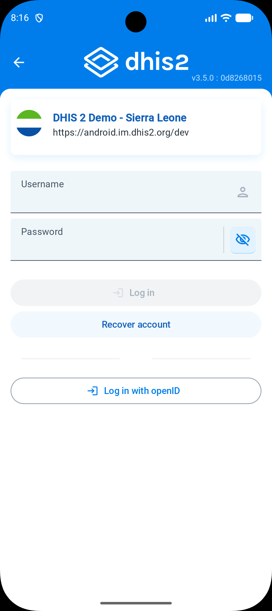

## Configure OpenID / OAuth

Since version 2.4. The DHIS2 android app supports login with an OpenID or OAuth provider. This
feature is not available by default, you need to add the configuration provided below and distribute
your own apk. OpenID has to be enabled in the web as well and the user OpenID parameter must be
configured.

Under the **app/src/main/res/raw** you will find the **openid_config** file.

```json
{
  "serverUrl": "<your server url>",
  "loginLabel": "<text to display in the open id login button>",
  "clientId": "<client id from the auth provider>",
  "redirectUri": "<redirect uri from the auth provider>",
  "discoveryUri": "<openid discovery url from the auth provider",
  "authorizationUrl": "<authorization url from the auth provider>",
  "tokenUrl": "<toker url from the auth provider>"
}
```

How you should fill this file depends on the provider you are using. The following example shows how
the file would look like using Google as the provider:

```json
{
  "serverUrl": "https://play.dhis2.org/android-current",
  "loginLabel": "Login with google",
  "clientId": "CLIEND_ID_PREFIX.apps.googleusercontent.com",
  "redirectUri": "com.googleusercontent.apps.CLIEND_ID_PREFIX:/oauth2",
  "discoveryUri": "https://accounts.google.com/.well-known/openid-configuration",
  "authorizationUrl": null,
  "tokenUrl": null
}
```

For OpenID providers it is **recommended** to use the discoveryUri parameter if possible instead of
the authorizationUrl and tokenUrl.

The next step is to include the following activity in the **AndroidManifest.xml** file. You will
need to replace the scheme so that the android app can be relaunched after a successful login.

```xml

<activity android:name="net.openid.appauth.RedirectUriReceiverActivity" android:exported="true"
    tools:node="replace">
    <intent-filter>
        <action android:name="android.intent.action.VIEW" />
        <category android:name="android.intent.category.DEFAULT" />
        <category android:name="android.intent.category.BROWSABLE" />
        <data android:scheme="<your redirect url scheme>" />
    </intent-filter>
</activity>
```

Following our example, the Google scheme would be:
`com.googleusercontent.apps.CLIEND_ID_PREFIX`

When launching the app, a new button will be displayed in the login screen.



### OpenID providers and configuration guidelines

Here you will find a list of available providers and how to get any info needed to set the *
*openid_config** file.

* [Google](https://github.com/openid/AppAuth-Android/blob/master/app/README-Google.md)
* [GitHub](https://docs.github.com/en/developers/apps/authorizing-oauth-apps)
* [ID-porten](https://docs.digdir.no/oidc_protocol_authorize.html)
* [OKTA](https://github.com/openid/AppAuth-Android/blob/master/app/README-Okta.md)
* [KeyCloak](https://www.keycloak.org/docs/latest/authorization_services/index.html#_service_authorization_api)
* [Azure AD](https://docs.microsoft.com/es-es/azure/active-directory-b2c/signin-appauth-android?tabs=app-reg-ga)
* [WS02](https://medium.com/@maduranga.siriwardena/configuring-appauth-android-with-wso2-identity-server-8d378835c10a)