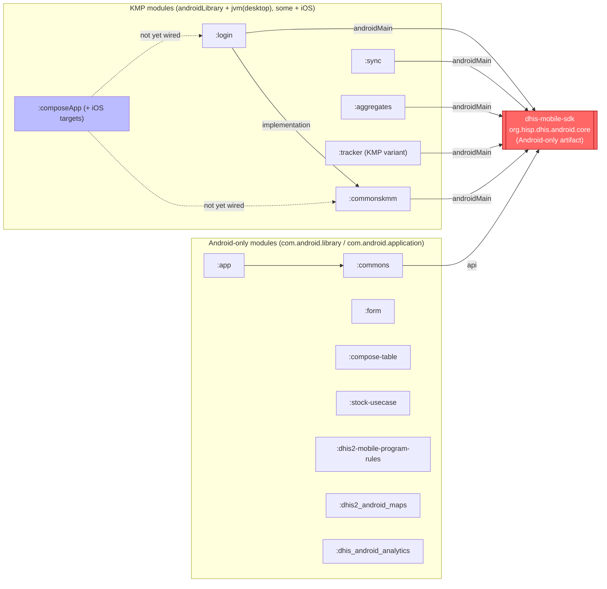
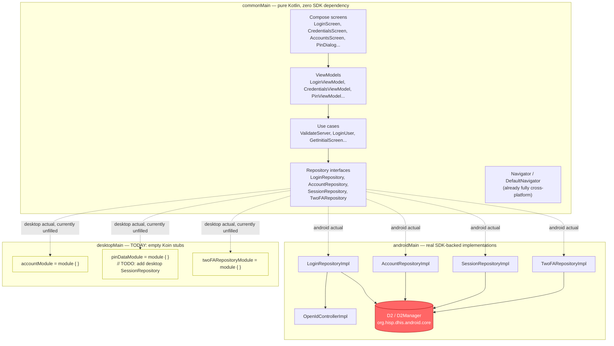
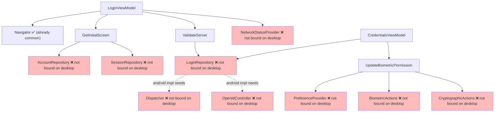

# KMP Desktop PoC: Running the Login Screen on Desktop

## Purpose

This document investigates the effort required to run and adapt the DHIS2 Android Capture App for a
**Desktop target**, as part of the broader move to Kotlin Multiplatform (KMP) / Compose Multiplatform
(targeting Android, Desktop, and iOS from shared code). The `dhis-mobile-sdk`
(`org.hisp.dhis.android.core`) is Android-only today — it is itself being migrated to KMP in parallel, on
a timeline outside this team's control. Until it ships multiplatform artifacts, any desktop work has to
mock everything the SDK provides.

The concrete, minimal goal used to scope this investigation: **get the login screen to render in a
Desktop (JVM) window**, with every SDK-backed dependency replaced by a static/no-op mock.

This is a documentation-only pass: it records what was found and designs the implementation in full, but
does not yet change any code. See [Future implementation](#future-implementation) for the exact plan to
execute next.

## Executive summary

The codebase is **unusually well-prepared** for this already:

- `:login` and `:commonskmm` are already Kotlin Multiplatform modules (`androidLibrary` + `jvm("desktop")`
  targets), not legacy Android-only modules.
- Every place the DHIS2 Android SDK is used is already isolated behind `commonMain` interfaces, with real
  implementations confined to `androidMain`. This is exactly the seam a desktop port needs.
- Desktop `actual` Koin DI modules for `:login` **already exist as empty stubs** — one even has a literal
  `// TODO: Add desktop-specific SessionRepository implementation when available` comment. The
  multiplatform seam was anticipated; it was just never filled in.
- `composeApp`, the new Compose Multiplatform app shell (Android + Desktop + iOS targets), currently
  builds and runs on desktop today (`./gradlew :composeApp:run` opens a "Hello World" window) but has zero
  dependency on `:login` or any real app code yet.

**Verdict:** getting the login screen to render on desktop with a mocked SDK is a "fill in the stub"
exercise, not an architectural redesign. The real, harder problem — a *production* desktop build with a
working SDK — remains blocked on the DHIS2 SDK's own KMP migration; this PoC does not and cannot unblock
that.

## Module landscape



Key point: in **every** KMP module, the SDK dependency is declared only in that module's `androidMain`
source set — never in `commonMain`. This was clearly a deliberate choice, and it's the foundation this PoC
builds on.

## Layered architecture inside `:login`



The same pattern holds one level down, in `:commonskmm`, for cross-cutting platform services the login
flow depends on: `NetworkStatusProvider`, `CrashReportController`, `PreferenceProvider`,
`CryptographicActions`, `BiometricActions`, and `Dispatcher`. `commonskmm`'s desktop `commonsModule` today
only binds `FeatureConfigRepository` and `ValueParser` — the rest are missing.

## Why the login ViewModel graph can't resolve on desktop today



Koin resolves this whole graph eagerly enough (constructor injection, not lazy) that **every** red node
above must have *some* binding — even `BiometricActions`/`CryptographicActions`, which the login screen PoC
will never actually exercise (biometric login can simply be disabled), still block DI resolution if left
unbound. This is why the plan mocks them too, even though "disabled" is the intended desktop behavior.

One thing that turned out **not** to be a blocker: `LoginRepository.loginWithBiometric` and
`BiometricActions.authenticate` use Kotlin context parameters (`context(context: PlatformContext)`), which
require the `-Xcontext-parameters` compiler flag. Checking `login/build.gradle.kts` and
`commonskmm/build.gradle.kts` directly confirmed this flag is already set at the top-level
`kotlin { compilerOptions {} }` block, so it already applies to the `jvm("desktop")` target — no changes
needed there.

## Required code changes (for the future implementation pass)

This is the exact change list the [future implementation](#future-implementation) section below executes.
Nothing here has been written yet — it's included so this document is a complete, self-contained record of
what "fill in the stub" means concretely.

1. **`:commonskmm`** — add desktop-only mock implementations (`DesktopNetworkStatusProvider`,
   `NoOpCrashReportController`, `InMemoryPreferenceProvider`, `NoOpCryptographicActions`,
   `NoOpBiometricActions`) and bind them, plus `Dispatcher`, in `CommonsModule.desktop.kt`.
2. **`:login`** — add desktop-only mock repositories (`FakeLoginRepository`, `FakeAccountRepository`,
   `FakeSessionRepository`, `FakeTwoFARepository`, `FakeOpenIdController`) and bind them in the three
   existing empty desktop DI stubs (`LoginModule.desktop.kt`, `PinModule.desktop.kt`,
   `TwoFAModule.desktop.kt`).
3. **`composeApp`** — depend on `:login` and `:commonskmm` from its `desktopMain` source set only (not
   `commonMain`, since neither module has an iOS target yet), add a `DesktopLoginHost` composable that
   renders the existing `LoginScreen(...)` composable, and start Koin (`commonsModule` + `loginModule`)
   before launching the desktop window in `Main.kt`.

No new external libraries are required anywhere — every type the mocks touch (`PlatformContext` via
coil3, `javax.crypto.Cipher` via the JDK, Koin, the DHIS2 design system) is already a dependency of each
module's `commonMain` and is visible from `desktopMain` through Kotlin's source-set hierarchy.

## Platform-specific constraints and blockers discovered

| # | Constraint / blocker | Detail |
|---|---|---|
| 1 | **`dhis-mobile-sdk` is Android-only** | The root blocker for real desktop functionality. Mocking it (as this PoC does) validates the UI/architecture path only — it does not unblock any actual desktop *feature* (sync, real login, data entry) until the SDK itself ships multiplatform artifacts. |
| 2 | **No desktop secure-storage design** | The mock `PreferenceProvider` is an in-memory `MutableMap` — non-persistent, resets on every launch. A real desktop build needs an OS-keychain-equivalent design (e.g. platform keystore integration or an encrypted local file store). |
| 3 | **No desktop biometric design** | `BiometricActions`/`CryptographicActions` have Android-specific real implementations (Android Keystore, `androidx.biometric`). For desktop, biometric login is disabled outright (`hasBiometric() = false`) rather than reimplemented — there's no OS-agnostic equivalent designed yet. |
| 4 | **Crash reporting is Android-only** | `CrashReportController`'s real implementation uses Sentry-for-Android (`io.sentry.android.core`). A desktop build would need its own Sentry Java/Kotlin SDK integration — out of scope for this PoC (no-op stub instead). |
| 5 | **`:login`/`:commonskmm` have no iOS targets yet** | `composeApp` already has iOS targets configured, but since `:login` and `:commonskmm` don't, `composeApp`'s dependency on them must be scoped to `desktopMain` only. A real cross-platform (not just desktop) push needs iOS targets added to these two modules first. |
| 6 | **Gradle `api`/`implementation` visibility gaps** | `:login` depends on `:commonskmm` and `navigation-compose` as `implementation` (not `api`), so they aren't exposed transitively to `composeApp`. `composeApp` needs its own explicit redeclarations of both. Worth standardizing a convention as more KMP modules get layered under `composeApp`. |
| 7 | **Beyond login: WorkManager + Room** | Not touched by this PoC, but the very next screens past login (periodic sync jobs, tracker/aggregate local storage) depend on `androidx.work.WorkManager` and Room/SQLite, both still Android-only and completely unaddressed. |
| 8 | *(confirmed not a blocker)* Kotlin context-parameters compiler flag | Already enabled for all targets including desktop in both `login/build.gradle.kts` and `commonskmm/build.gradle.kts`. |

## Effort estimate

Given the seams are already in place, the code-change portion of this PoC (items 1–3 in "Required code
changes") is small: roughly a dozen small new files (mostly no-op classes) plus edits to five existing
Kotlin files and one Gradle file. The bulk of the actual effort in a first implementation pass will be
verification (does the DI graph actually resolve, does the screen actually render, does `DHIS2Theme`
need explicit wrapping) rather than volume of code.

## Future implementation

This is the concrete plan to execute in the next pass, once this write-up has been reviewed.

### 1. `:commonskmm` — desktop actuals for platform services

New files under `commonskmm/src/desktopMain/kotlin/org/dhis2/mobile/commons/...`:
- `network/DesktopNetworkStatusProvider.kt` — `object : NetworkStatusProvider { override val
  connectionStatus = flowOf(true) }`.
- `reporting/NoOpCrashReportController.kt` — no-op `init/close/trackServer/trackError/addBreadCrumb`.
- `providers/InMemoryPreferenceProvider.kt` — full `PreferenceProvider` implementation backed by an
  in-memory `MutableMap`.
- `biometrics/NoOpCryptographicActions.kt` / `NoOpBiometricActions.kt` — `hasBiometric()` → `false`;
  cipher methods throw `UnsupportedOperationException` as a safety net.

Edit `commonskmm/src/desktopMain/kotlin/org/dhis2/mobile/commons/di/CommonsModule.desktop.kt` to add:
```kotlin
factory<Dispatcher> { Dispatcher() }
factory<NetworkStatusProvider> { DesktopNetworkStatusProvider }
factory<CrashReportController> { NoOpCrashReportController }
factory<PreferenceProvider> { InMemoryPreferenceProvider() }
factory<CryptographicActions> { NoOpCryptographicActions }
factory<BiometricActions> { NoOpBiometricActions }
```
Skip `D2ErrorMessageProvider`/`DomainErrorMapper` — only used by the Android SDK-backed impls being
replaced.

### 2. `:login` — mock repositories + fill desktop DI stubs

New files under `login/src/desktopMain/kotlin/org/dhis2/mobile/login/...`:
- `main/data/FakeLoginRepository.kt` — canned success `Result`s; `canLoginWithBiometrics`/
  `displayBiometricMessage`/`displayTrackingMessage` → `false`; reproduce the `context(context:
  PlatformContext)` receiver on `loginWithBiometric` exactly.
- `accounts/data/repository/FakeAccountRepository.kt` — empty accounts list (routes `GetInitialScreen` to
  `ServerValidation`, login's entry point).
- `pin/data/FakeSessionRepository.kt` — `isSessionLocked()` → `false`; rest no-op.
- `authentication/data/repository/FakeTwoFARepository.kt` — canned "disabled" status.
- `authentication/FakeOpenIdController.kt` — no-op `bind`/`unbind`; `handleIntent` reports failure.

Edit the desktop DI stubs to bind these (mirror `single` vs `factory` from the Android actuals; check
whether `OidcInfo` also needs a binding since `LoginScreen` calls `koinInject<OidcInfo>()`):
- `main/di/LoginModule.desktop.kt` → `LoginRepository`, `AccountRepository`, `OpenIdController`.
- `pin/di/PinModule.desktop.kt` → `SessionRepository` (replaces the existing TODO).
- `authentication/di/TwoFAModule.desktop.kt` → `TwoFARepository`. (Currently lives under
  `desktopMain/java/...` instead of `.../kotlin/...` like its siblings — move it while editing, unless a
  custom Gradle source dir config already accounts for this.)

No new Gradle dependencies needed — all referenced types (`PlatformContext` via coil3, `javax.crypto.Cipher`
via the JDK, Koin, the design system) are already declared in each module's `commonMain` and are visible
from `desktopMain` through Kotlin/Gradle's source-set hierarchy.

### 3. `composeApp` — wire dependencies + desktop entry point

Edit `composeApp/build.gradle.kts`, adding new deps **only to `desktopMain`** (not `commonMain` — `:login`
has no iOS target, so a commonMain dependency would break `composeApp`'s iOS compile):
```kotlin
val desktopMain by getting {
    dependencies {
        implementation(compose.desktop.currentOs)   // already present
        implementation(project(":login"))
        implementation(project(":commonskmm"))       // not exposed transitively through :login (implementation-scoped there)
        implementation(libs.navigation.compose)       // needed for LoginScreen's NavHostController default param to resolve at composeApp's compile classpath
    }
}
```

New file `composeApp/src/desktopMain/kotlin/org/dhis2/mobile/app/DesktopLoginHost.kt` — a composable that
calls the existing `org.dhis2.mobile.login.main.ui.screen.LoginScreen(...)` (already contains its own
internal NavHost across Loading/ServerValidation/LoginCredentials/OauthAuthentication/Accounts/
RecoverAccount), passing static `versionName`, `fromHome = false`, and no-op navigation lambdas. Verify
during implementation whether `LoginScreen` expects the caller to already be wrapped in `DHIS2Theme`
(check how `:app`'s Activity hosts it) and wrap accordingly.

Edit `composeApp/src/desktopMain/kotlin/org/dhis2/mobile/app/Main.kt`:
```kotlin
fun main() {
    startKoin { modules(commonsModule, loginModule) }
    application {
        Window(onCloseRequest = ::exitApplication, title = "DHIS2") { DesktopLoginHost() }
    }
}
```
Leave `commonMain/App.kt` and composeApp's Android/iOS targets untouched — this PoC intentionally diverges
only on the desktop entry point.

### 4. Verification

- `./gradlew :composeApp:run` — a desktop window titled "DHIS2" should open showing the login **Server
  validation** screen (since `FakeAccountRepository` returns no accounts).
- Manually walk server URL → credentials → mock login success → confirm the `onFinish`/`onNavigateToHome`
  callback fires (there's no real home screen yet, so this can be verified via a log line or breakpoint).
- `./gradlew ktlintCheck` on the touched modules.
- `./gradlew :login:testDesktopTest :commonskmm:testDesktopTest` (confirm exact desktop test task name per
  each module's Gradle config) to make sure nothing existing regresses.
