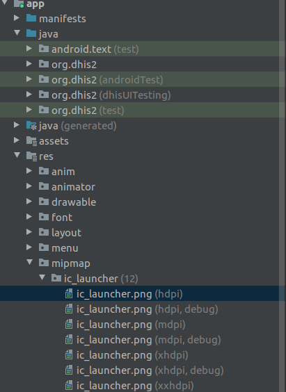
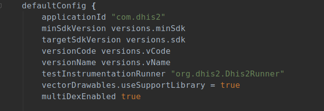
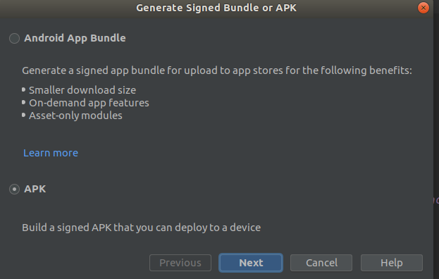
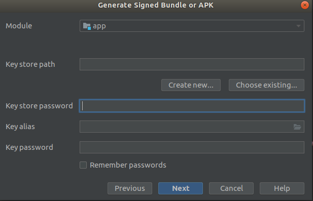
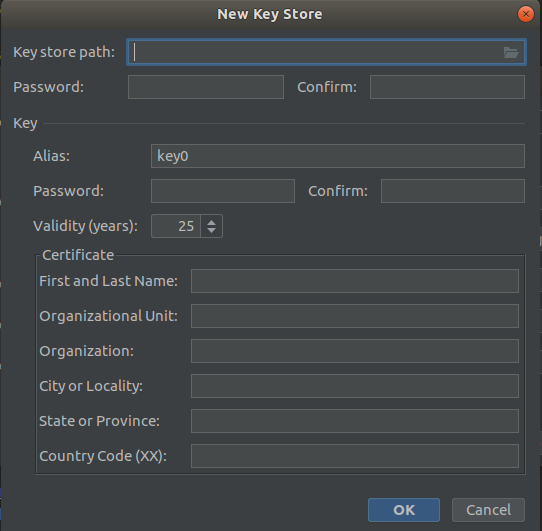
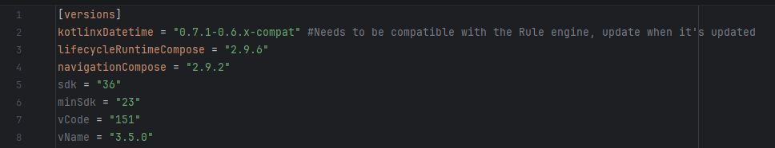

## Change the App logo

For changing the training logo go to the path **project/app/src/debug/res/mipmap-X/ic_launcher** and
copy/paste your own ic_launcher.png in all mipmap-X directories.

mipmap-X, where is X, is a specific screen density.

For the production logo, the process is the same but instead, you will find the logos in the path *
*project/app/src/main/res/mipmap-X/ic_launcher** copy/paste your own ic_launcher.png in all mipmap-X
directories

You should be able to visualize your icons in Android Studio here too.

## Change package name

Applications are identified in the app stores by their _applicationId _string which must be unique
per store. The official string is com.dhis2. If you try to upload the application to the Google Play
store you will get an error message about that. This can also happen in case you are using Mobile
Device Management tools that allow you to upload your specific applications. If these applications
are going to be stored in the Google Play store as most of them do, you will need to change the
_applicationId_.
If you would like to change the _applicationId_ go to the file build.gradle (Module:app) and scroll
down until you see _defaultConfig_

Change “com.dhis2” to the new ID that you want.

You can read more about the applicationId in the official
Android [page](https://developer.android.com/studio/build/application-id)

## How to generate a Keystore and sign the APK

By default, the Android system requires that all installed applications be digitally signed by a
certificate whose private is held by the application developer. Android uses the certificate as a
means of identifying the author of an application and establishing trust relationships between
applications. If you try to install an APK without being signed Android will prompt an alert dialog
telling you that the APK is not secure, if you proceed and click “Accept” the apk will be installed.

Be aware that If you want to upload the APK to the Google Play Store or some other stores you will
be forced to sign the APK, for Github you do not need to sign the APK. In any case, we do recommend
you sign your APK for security reasons.

For signing the APK you first need a **keystore** that can be easily generated with Android Studio.
Go to top menu “Build” > “Generated Signed Bundle / APK”

Click on “APK” and ”Next”. Then click on “Create new …”

After you click on “create new…” you will be asked to fill the following form.
**Key store path**: Choose a path where you want the Keystore to be generated.
**Password and Alias Password**: Choose two secure passwords (they do not need to be the same). The
remaining fields are direct.

Now clicks “OK” and then you will have to choose a build variant, “release” is fine, after some time
the APKs should be generated and you can find them signed in the path project/app/build/outputs/apk.

**Important: Once you have generated your Keystore please do not upload it to any public website,
also you will need to sign always with this Keystore for future updates.**

You can read more about the signing process in the official Android
documentation [page](https://developer.android.com/studio/publish/app-signing)

## Version name, code and chaning library versions

Everytime you want to provide your userbase with a new apk you will need to increase the version
code, for doing so go to the directory /gradle/libs.version.toml

Then you should increase vCode and change vName to the one you want.