# Android specific features

## Generic Features

### Login

There are two ways to access the application:

1. Manual: The user must type the corresponding URL of the server to be used and enter the username and password.

    > **Note**
    >
    > Take note that the login only possible with 2.29, 2.30 and 2.31 servers.

2. QR: The user can use a QR code instead of typing the URL. Username and password must be entered manually.

    > **Note**
    >
    > After the first login, the app will suggest URL and username of all successful connections.
    >
    > You are able to make an *offline* login only if using the same user as the last online session.
 
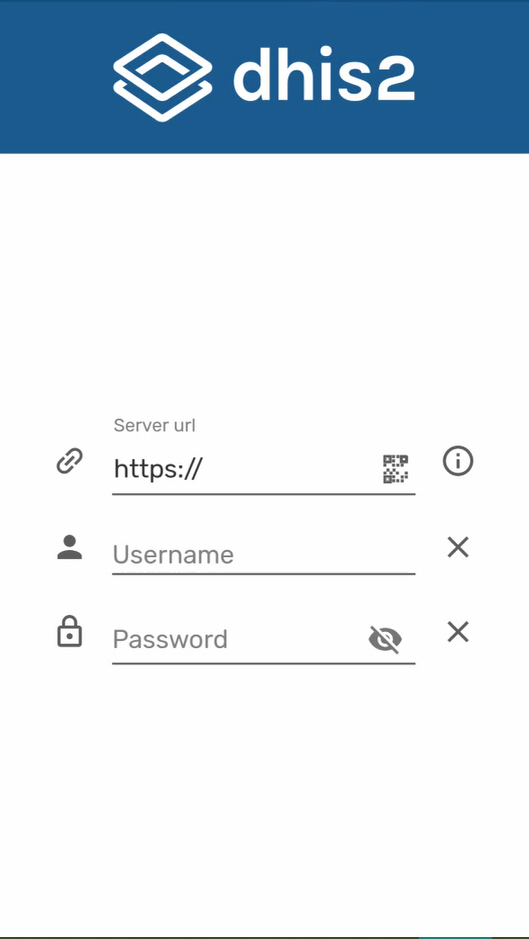{ width=25%}
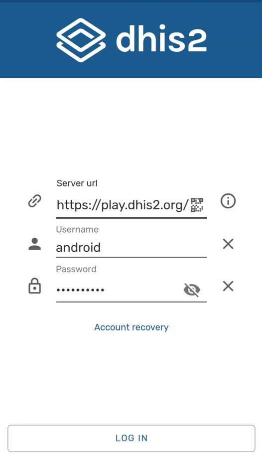{ width=25%}
 
### Account Recovery

The users will be able to restore their own password if they have the setting enabled: Enabled User Account Recovery.

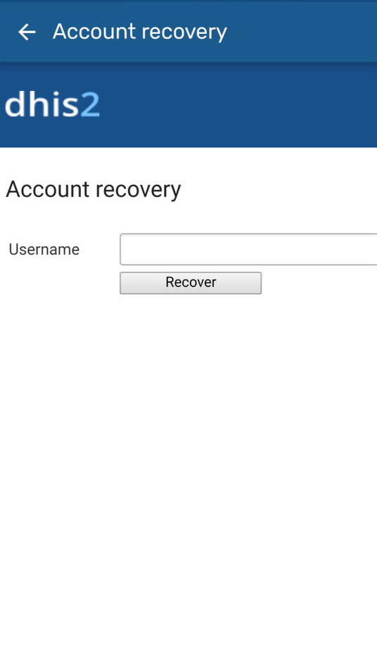{ width=25%}

### Blocking session (PIN)

User is able to lock the session using a 4 digit PIN. This allows to move to other apps in your phone without deleting the local data.
If the user forgets the PIN number, log in by entering the credentials is also available.

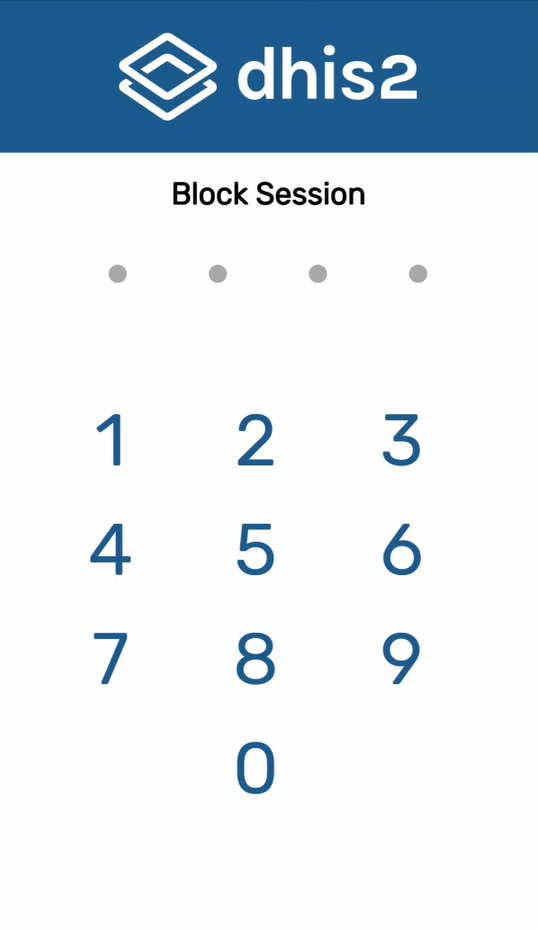{width=25%}
{width=25%}

### Instructions/ information buttons

A contextual guide opens the first time the user opens the App.

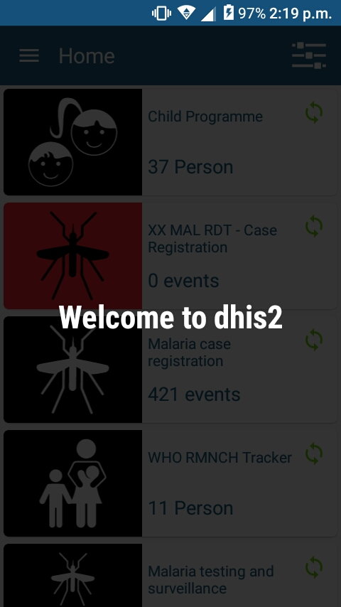{width=25%}
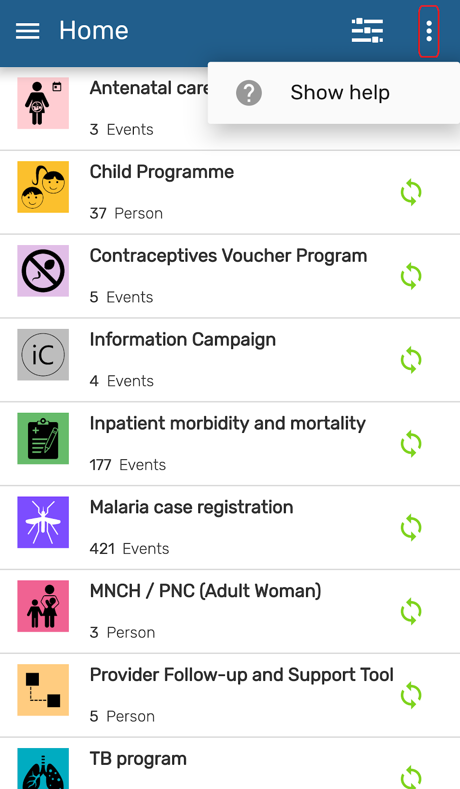{width=25%}

> **Tip**
>
>  User is able to re-open<!-- PALD: unnecessary: (trigger)--> the instructions by clicking on the three dots at the top right corner of the screen.

### Filter

<!-- PALD alternative: "The Filter allows you to narrow down the data available from the ..." -->
Allows the user to filter data from the available programs based on periods (specific day, week, month, or year) or organisation units.

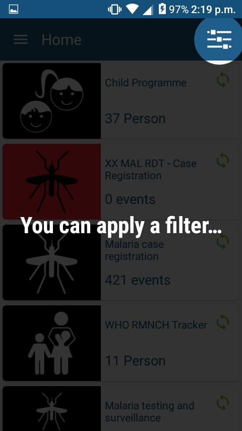{ width=25%}
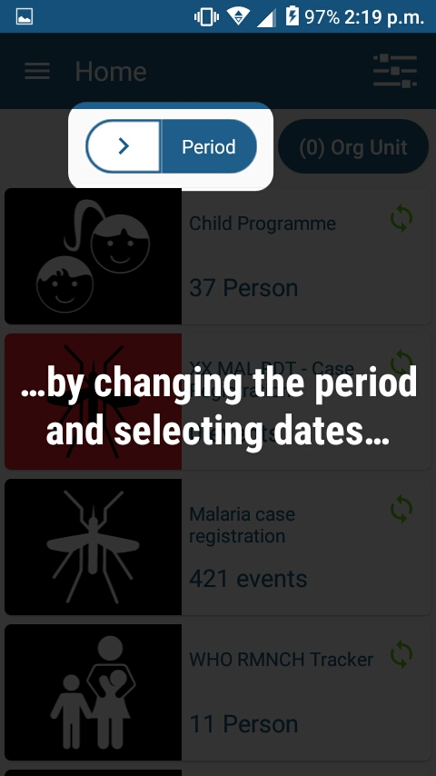{ width=25%}
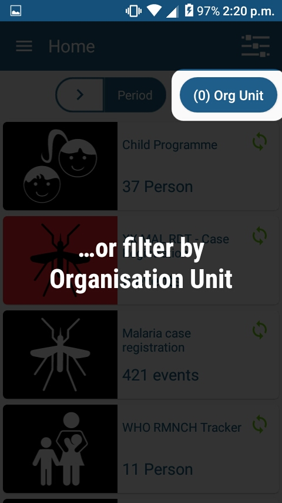{ width=25%}

### Sync Information

Allows the user to check sync information for a specific program.

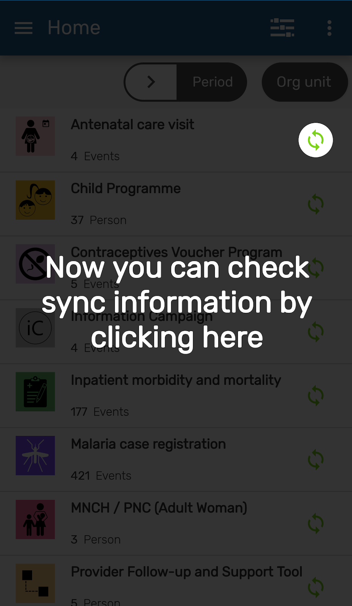{ width=25%}
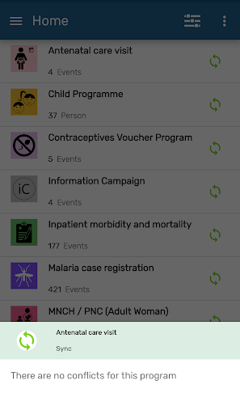{ width=25%}

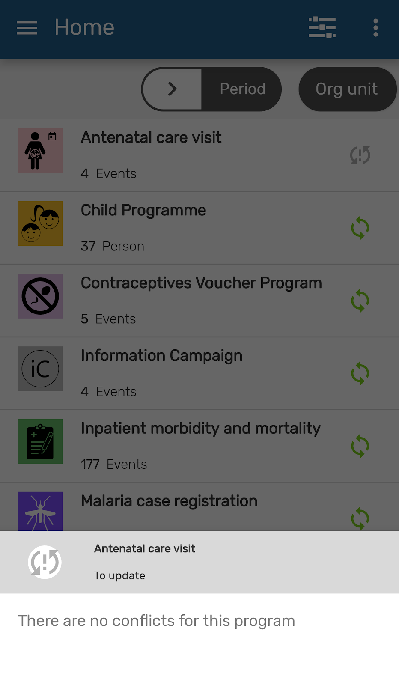{ width=25%}
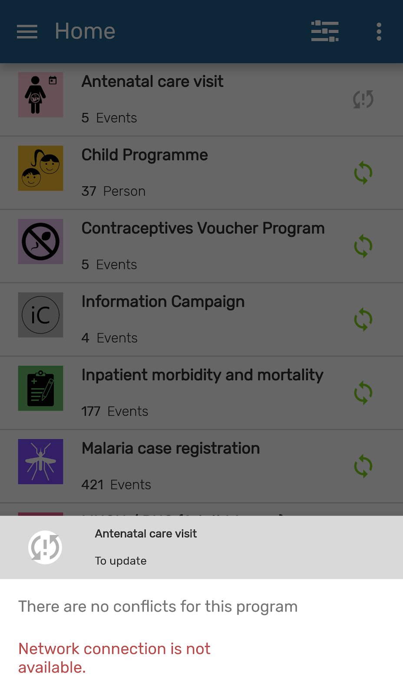{ width=25%}

### Org unit

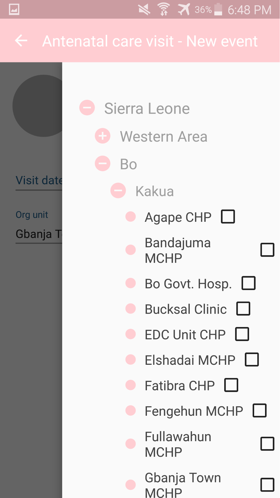{ width=25%}

The whole organisation unit tree is displayed. Organisation units not available for data entry will be colored in grey.
User must check the box to select the org unit wanted.

> **Caution**
>
>  Mobile users are not expected to access the org. unit hierarchy of a whole country. Maximum number of org units is difficult to set, as the App does not set the limit, but the resources on the device (memory, processor). We could say below 250 org units should be safe, but still believe that is a very big number for a mobile use case.

### Differentiating tracker and event programs

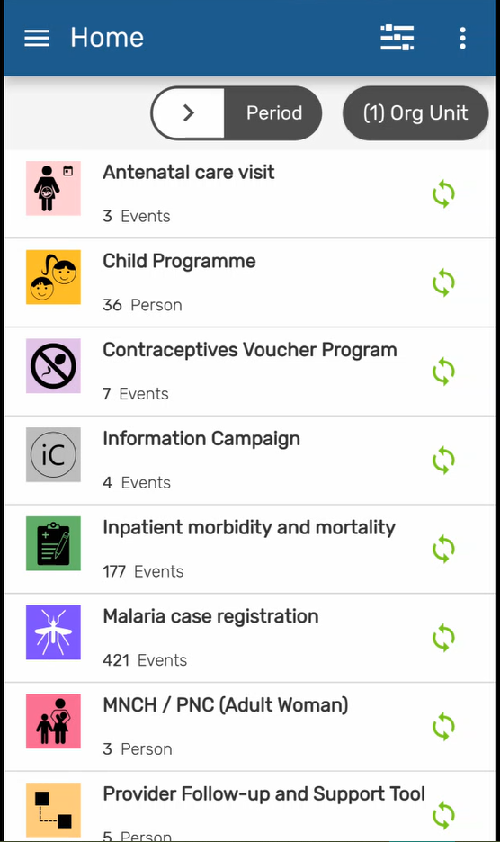{ width=25%}

> **Tip**
>
>  An easy way to differentiate program is by looking at the word at the bottom left corner. The word 'Event' will always be in event programs. In tracker will appear the name of the tracked entity type (person, patient, building, etc.).

### Sharing Data

{ width=25%}
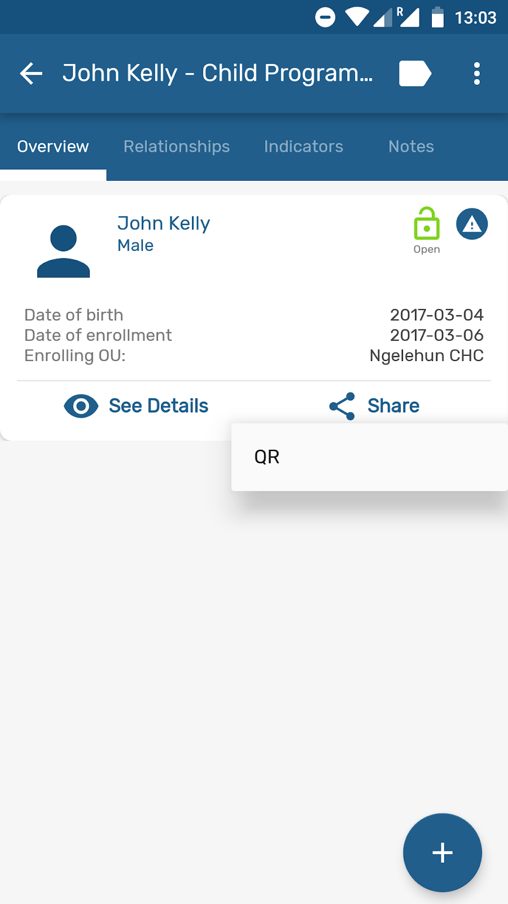{ width=25%}
