# Visual configurations

## Meta data sync error

In case of errors during the sync process, a message is displayed in the home screen which takes you to the sync error log. The sync error log gives details about the error and is prepared to be shared with admins.

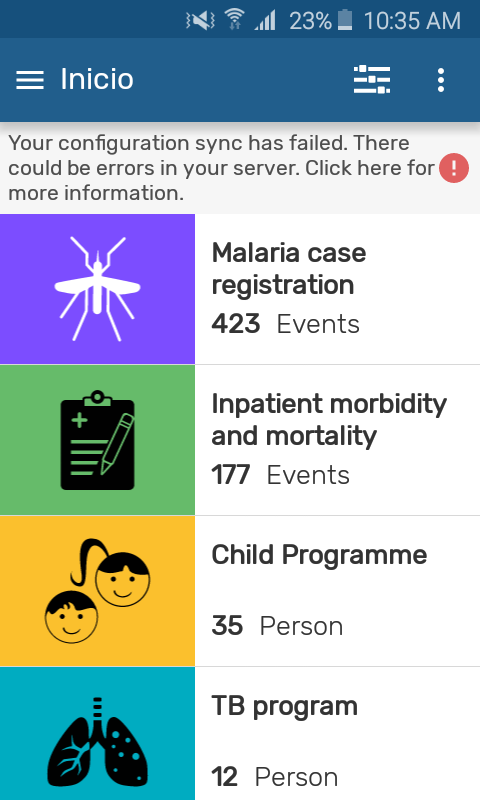{ width=25%}
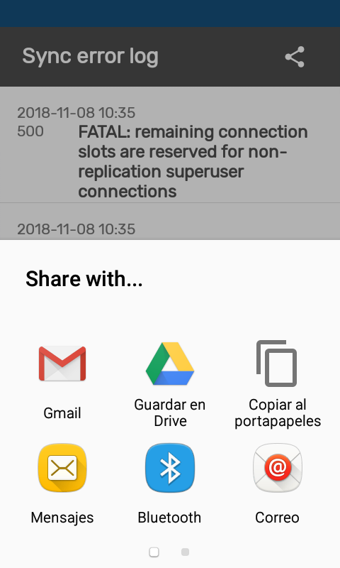{ width=25%}

You can also open the sync errors log from **Settings**:

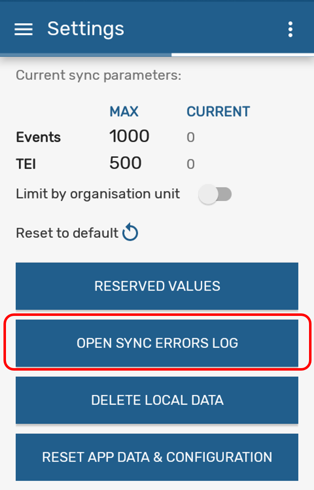{ width=25%}

## Personalize your Icon

You can set your icon in the wallpaper using the DHIS 2 App Widget. The icon will be the flag configured in your server.

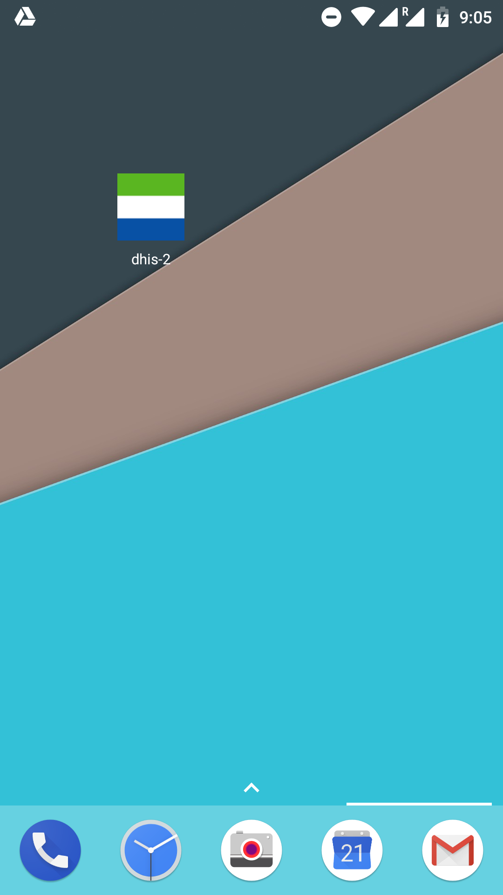{ width=25%}

> **Note**
>
> How to add a widget:
>
> - Long press in your wallpaper
> - Select Widgets
> - Look for the DHIS 2 Widget
> - Select
>
> It will add a shortcut to your app.

## Personalise the colour of the App

You can set the generic theme of the app by configuring the them in our server:

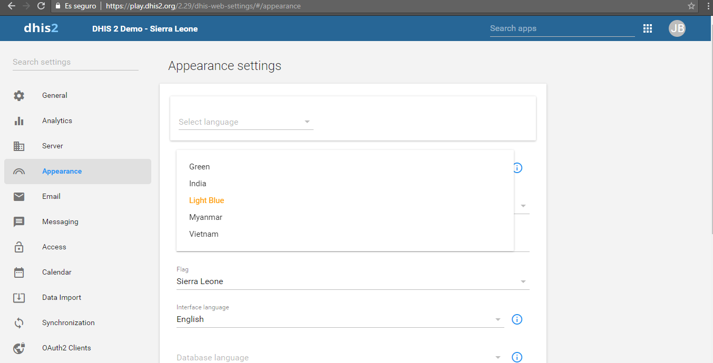{width=80% }

> **Note**
>
> How to set the server theme and flag:
>
> Go to **System Settings > Appearance > Style**
>
> - Select your style
>   - Green,
>   - India (Orange),
>   - Light Blue,
>   - Myanmar (red),
>   - Vietnam
> - Select your flag
>
>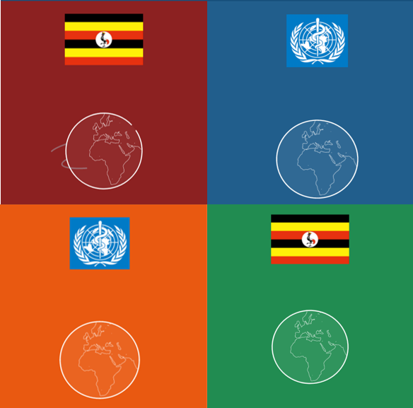{ width=25%}

## Icon library for metadata

There are currently 134 icons available that you can choose from. You can search by name in the icon picker widget. Icons are available in positive, negative and outlined shapes. We will be adding many more icons in future releases.

Icons can be associated to programs, stages, data elements and the options of an option set. This is  configurable through the Maintenance App.

> **Note**
>
> This feature is available from DHIS 2 2.30 onwards

{width=80% }

In the Android App icons render in the home screen to illustrate all the programs available to a user, or while adding an stage. For data elements and options, the icons render for single event programs, when a section contains a single DE, showing the option set as a matrix or sequence of images.

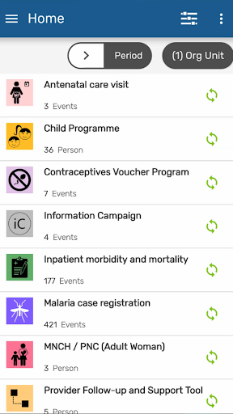{ width=25%}
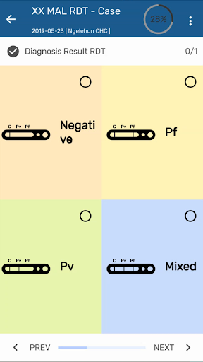{ width=25%}

> **Note**
>
> Icons will initially only render in the new Android app. The new web-based Capture App will incorporate them in the near future.

We plan to expand the collection of icons on each future version of DHIS2- for that we need your help: we are seeking ideas for new icons - please submit yours using [this form](https://www.google.com/url?q=https://drive.google.com/open?id%3D1LmfYJQAu3KyDfkY3X6ne7qSsuTa9jXZhoQHzkDxeCdg&sa=D&ust=1557433016147000).

## Colour palette for metadata

Tracker and Event capture now have the ability to render colours for programs, stages, data elements and options in option sets. A colour picker is integrated in the Maintenance App, which shows as a palette, except for options which allows the selection of any colour.

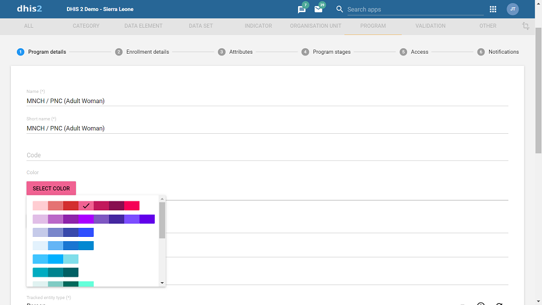{width=80% }

In the Android App, the color will be rendered as background color for programs and stages combined with an icon (if selected). For options it renders as the background colour during data entry form for single event programs. When the user selects a program with an assigned colour, that colour becomes the background theme for all screens in the domain of the program.

{ width=25%}
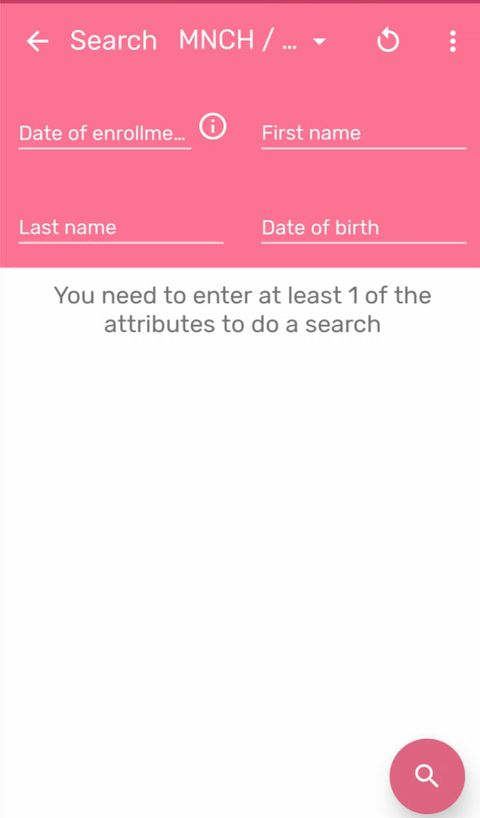{ width=25%}

> **Note**
>
> Colours will first be available in the new Android app, followed in future releases by the new web-based Capture App.

## Rendering Types for Program Sections

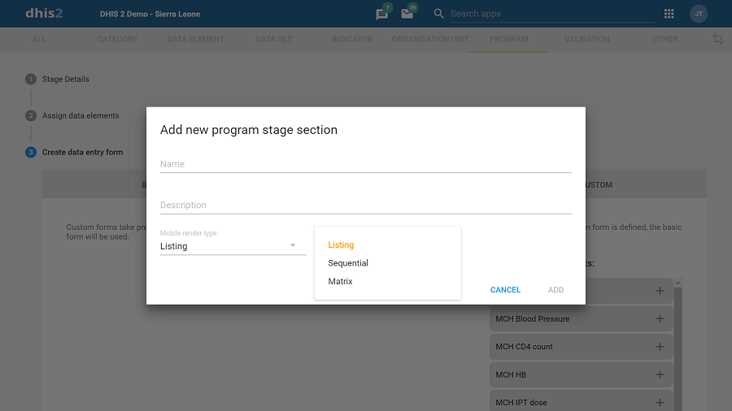{width=80% }

**Program Section**: when used in combination with icons, a Program Section with a single data element and associated Option Set can render the options in sequential or matrix layout (see screenshots).

{ width=25%}
{ width=25%}

> **Note**
>
> Render type for sections will first be available in the Android app, followed in future releases by the new web-based Capture App UI.

## Calendar (Tracker Program)

Now it is possible to use two different calendars when making a new enrollment. The one on the left is the first to appear but you can change it by clicking on the calendar icon on the lower left corner. 

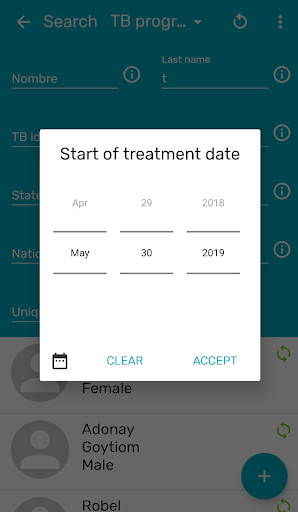{ width=25%}
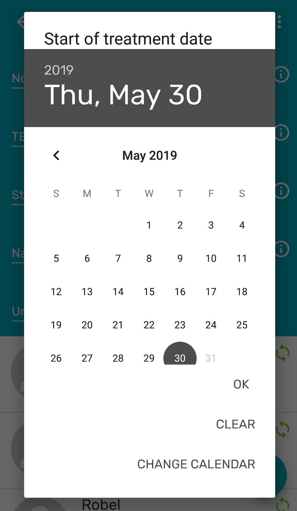{ width=25%}

> **Note**
> [ANDROAPP 2191](https://jira.dhis2.org/browse/ANDROAPP-2191).
> For Android versions 4.4,  5.1 and small devices, the Accept option is not visible in the second calendar view.

