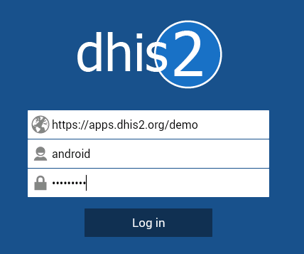
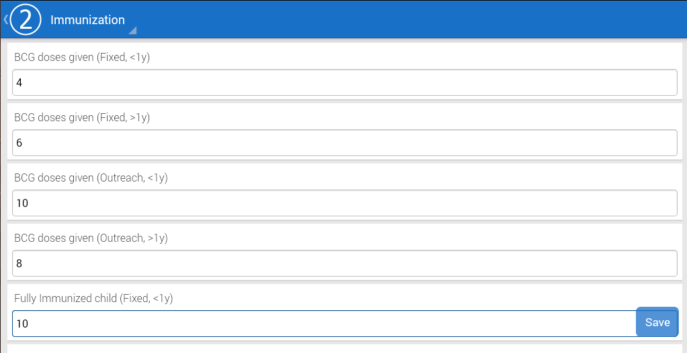

# Android aggregate data capture app

<!--DHIS2-SECTION-ID:android_aggregate-->

## Overview

<!--DHIS2-SECTION-ID:android_overview-->

The Data Capture for DHIS2 app allows you to enter data into a DHIS2
server with an Android device. The app downloads instances of forms
which are required to enter data from the server, and stores them on the
device. This means that you can enter data offline and then upload it to
the DHIS2 server when you have network coverage.

## Installation

<!--DHIS2-SECTION-ID:android_installation-->

You can easily install the Data Capture for DHIS2 app by logging into
the Google play store and searching for "[Data Capture for
DHIS2](https://play.google.com/store/apps/details?id=org.dhis2.mobile)"

## Logging in

<!--DHIS2-SECTION-ID:android_logging_in-->

After you install and launch the Data Capture app on your device, when
you launch it for the first time, you will be required to enter the
server URL address of the DHIS2 server and your user name and password.
Be sure to specify the full address of the server and protocol (either
https or http). Once you have specified all details, press "Log in" to
authenticate with the server.

## Entering and saving data

<!--DHIS2-SECTION-ID:android_entering_data-->

Once you login, you will need to select the organisation unit, dataset
and time period for which you wish to enter data. Once you have selected
all of this, press the highlighted area to proceed to the data entry
screen.

Data entry in the android app is very straight-forward. Data elements
are listed along with their category combination option. Just select the
field for which you want to enter data by clicking it and entering the
correct data value. Values will be saved locally to your device. When
you finish entering data, press "Save" and data will be saved to the
server.

