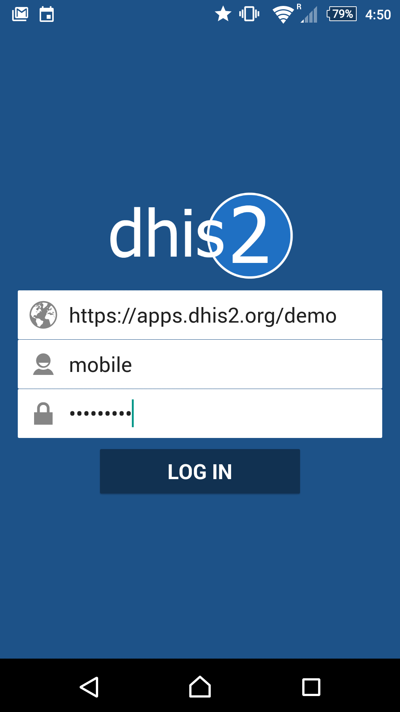
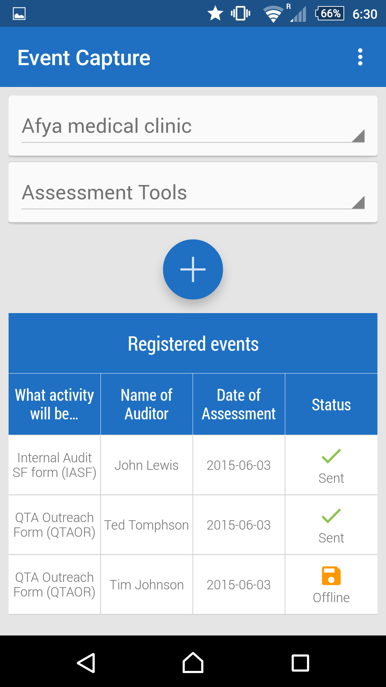
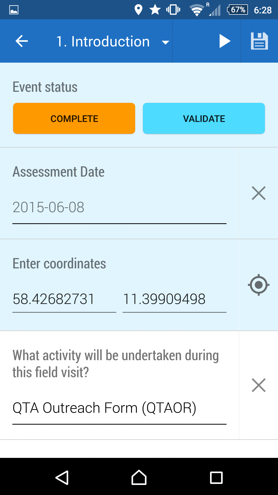
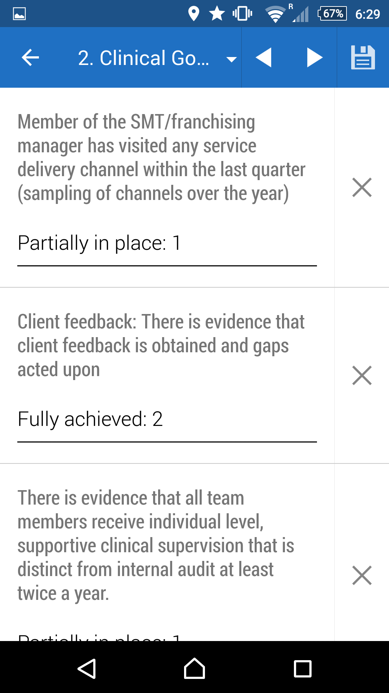

# Android Event Capture App

<!--DHIS2-SECTION-ID:android_event_capture-->

## Overview

<!--DHIS2-SECTION-ID:android_event_capture_overview-->

The event capture Android app allows you capture, modify and list
events. The event capture app works with event-based programs in DHIS2,
which handles anonymous events not linked to registered entities. These
programs are suitable for handling scenarios such as facility surveys,
hospital registry summaries and training events. However the app is not
tied to any specific domain and can potentially be utilized for any
scenario of event-based information.

The event capture app allows you to capture events offline, i.e. without
Internet connectivity. The app will automatically synchronize events
with the online DHIS2 server automatically when connectivity is present.
This makes the app suitable for environments where Internet connectivity
is scarce or unstable.

## Installing and logging in

<!--DHIS2-SECTION-ID:android_event_capture_installing-->

The event capture add can be found on Google Play under the name "Event
Capture for DHIS 2".

[Event Capture on Google
Play](https://play.google.com/store/apps/details?id=org.hisp.dhis.android.eventcapture)

You can download the APK file directly from the GitHub release page.

[Event Capture GitHub
releases](https://github.com/dhis2/dhis2-android-eventcapture/releases)

Click on the app to open it after the installation is done. This will
bring up the login screen.

In the *URL* field, enter the full URL to the DHIS2 instance (server)
for which you want to capture and manage events for. Be careful to enter
the *http://* or *https://* part of the URL as well. In the *username*
and *password* field, enter the username and password for your account
at the given DHIS2 instance. Note that you can use this login on the
online DHIS2 server as well, i.e. you will be using the same account as
you will use when logging into DHIS2 using a Web browser. After logging
in the first time, the app will download meta-data from the online
instance. This could take a few minutes so please be patient.

## Viewing events

<!--DHIS2-SECTION-ID:android_event_capture_viewing-->

The main screen will show an overview of events, as well as links to
creating new ones. Start by selecting organisation unit and program from
the selectors at the upper part of the screen.

The *+* button below the selectors will take you to the new event
screen. Below this button, all events which have been registered for the
selected organisation unit and program will be listed. Each column is
configurable, and could show various types of information from each
event. The column to the far right shows the synchronization status.
*Sent* means that the event has been uploaded to the server, whereas
*Offline* means that the event is so far only stored at your device.
Events will be synchronized automatically once an Internet connection is
present. You can swipe down on the screen in order to trigger a
synchronization attempt.

## Creating events

<!--DHIS2-SECTION-ID:android_event_capture_creating-->

Click on the *+* button to go to the new event form. The new event will
be associated with the organisation unit and program you selected
previously. The new event screen has a range of functions:

The back button in the top top-left corner will take you back to the
main screen (list of events). For programs that have specified sections,
these sections will be displayed as a selector at the centre of the top
bar. There are also right and left arrows which you can use to move
between sections. You can use this selector and arrows to quickly
navigate between form sections. The save button in the top-right corner
will save what you have entered for the event so far. Data is also saved
when you switch between sections.

The *Complete* button on the second bar will mark the event as complete.
The Validate button will trigger a check for validity of the
information you have entered based on the validation rules which have
been set up for the program.

The first form field contains a date selector and indicators the time of
when the event took place. The label is customizable and will vary from
system to system. The *Enter coordinates* field, which will be displayed
if the program is configured to store coordinates, lets you use the GPS
capability of your device to set the longitude and latitude of your
current location by pressing the circle-like symbol to its right. You
can alternatively enter the coordinates directly.

The event entry form itself will be rendered below. The type of input
field selector will depend on the type of the data element representing
the input field. For example, you will see date selectors, free text
input and numeric input fields. Data elements with predefined options
will be rendered using a special dialog where you can either click
directly on options or use a text input field to search for a specific
option (useful if there is a high number of options).

## Modifying events

<!--DHIS2-SECTION-ID:android_event_capture_modifying-->

After an event has been created you can go back to or modify the event
by simply clicking on it in the event list. This will open the event
form pre-populated with information that has been captured so far.

## Settings

<!--DHIS2-SECTION-ID:android_event_capture_settings-->

The settings screen lets you do configure synchronization frequency and
log out.

The *frequency of automatic synchronization attemps* can be set form the
drop-down, where options range from one minute to one day. This affects
the battery usage and bandwidth consumption. The default of one hour is a
sensible choice.

The *log out* button will log you out of the app, and request you to
enter the login information again. You are not intended to log out of
the application between each session. This is mostly useful when you
want to log into another DHIS2 online instance.
