# Generic features { #capture_app_generic }

## Login { #capture_app_generic_login }

There are two ways to access the application:

1. Manual: The user must type the corresponding URL of the server to be used and enter the username and password.

    > **Note**
    >
    > Take note that login is only possible with servers from version 2.29.

2. QR: The user can use a QR code instead of typing the URL but username and password must be entered manually.

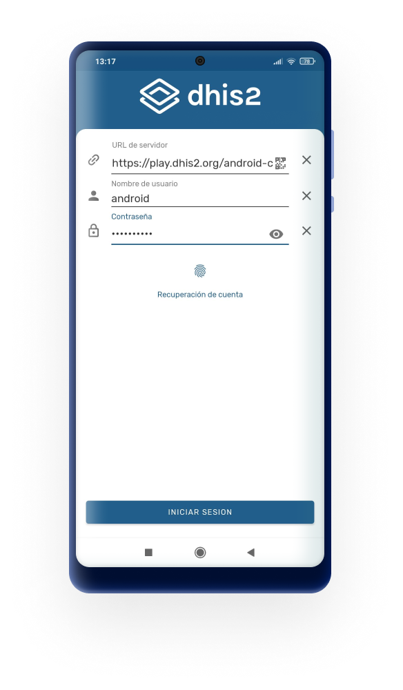{ width=25%}

> **Note**
>
> 1. After a succesful login the DHIS2 Android App will keep these values cached (URL and username) and will suggest them for future connections without having to type them.
>

After a succesful login the user should be able to perform an *offline* login only (only avaialble for the last combination of URL/Username). Offline usage gives the possiblity of using the application withou any type of connectivity. All data will still be stored and user can perform a synchornization once the connection is restablished or avaialble.
 

> **Warning**
> 
> In DHIS2 versions up to 2.30 if a user attemps an on-line login and their account has been disabled as explained in the [DHIS 2 Manual - Disable User](https://docs.dhis2.org/master/en/user/html/dhis2_user_manual_en_full.html#disable_user) all the data will be wiped from the phone. Make sure that before disabling a user all the data has been synced or that you are using this feature to remotely wipe sensitive data in case of a device getting lost.
>
> Due to a change in the login API this feature is not available in 2.31, 2.32, 2.33, 2.34, 2.35 and 2.36.

## Account Recovery { #capture_app_generic_recovery }

The users will be able to restore their own password if they have the setting enabled: Enabled User Account Recovery.

{ width=25%}

## Blocking session (PIN) { #capture_app_generic_PIN }

User is able to lock the session using a 4 digit PIN. This allows to move to other apps in your phone without deleting the local data.
If the user forgets the PIN number, log in by entering the credentials is also available.

{width=25%}
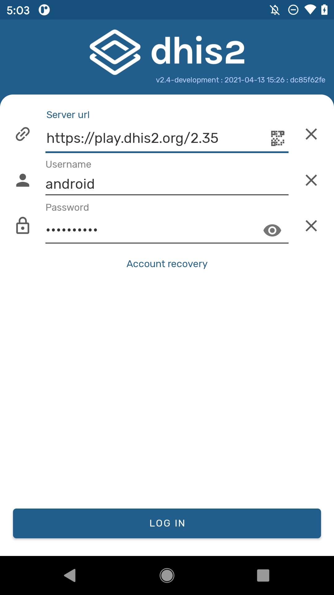{width=25%}

## Fingerprint { #capture_app_generic_fingerprint }

User is able to use the fingerprint scanner if the feature is activated in the device.

* When the fingerprint scanner is enable and not the PIN, every time the app closes, goes to background or the device is blocked, the session will be locked. Once the app is open again, the user needs to tap the fingerprint icon to activate the scanner.
* If the PIN and the fingerprint are set, when the session is locked and the user open the app again, the PIN will be asked.

{width=25%}
{width=25%}

## Instructions/information buttons { #capture_app_generic_instructions }

A contextual guide is available in Event details and TEI dashboard screen.

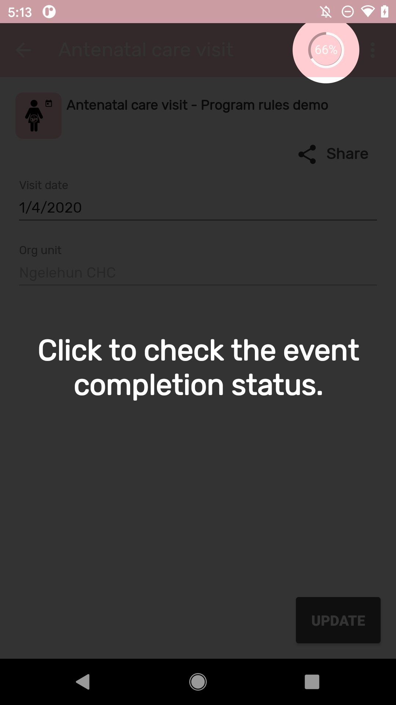{width=25%}
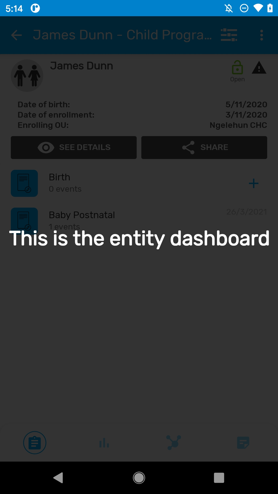{width=25%}

> **Tip**
>
>  User is able to re-open<!-- PALD: unnecessary: (trigger)--> the instructions by clicking on the three dots at the top right corner of the screen.

## Filter { #capture_app_generic_filter }

A filter can be applied in all listing screens (home, event listing, tei search and dataSets) which narrows down the data displayed. The filters available are: period, org. unit, sync state, event status, category option combination and "assigned to me".

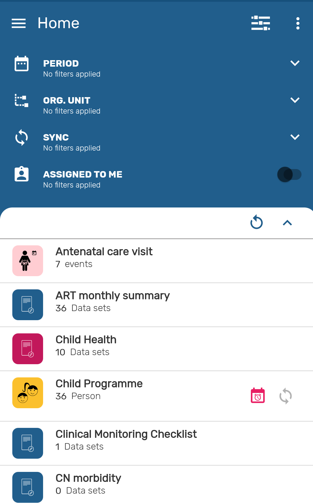{ width=25%}
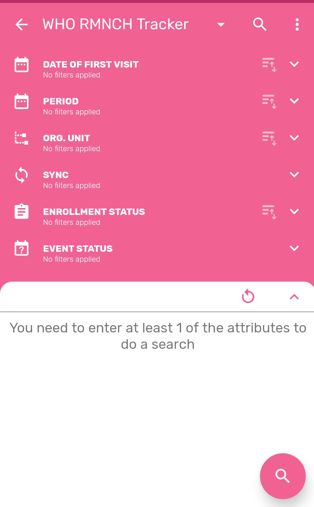{ width=25%}
{ width=25%}

Filters will adapt to the different programs and data sets.

1. Program without registration: Date, Org. Unit, Sync State, Event Status and, Category Combination.
2. Program with registration: Event Date, Date of enrollment, Org. Unit, Sync, Enrollment Status, Event Status and Assigned to me. The filter icon will show only if a list of events is available (Display front page list feature or search)
3. Data Sets: Period, Org. Unit, and Sync State.

### Assigned to me { #capture_app_generic_filter_assigned }

It is possible to filter events based on its assignment to the current user. The “Assigned to me” filter has been added to the single event program list, the TEI list and the TEI Dashboard and the map views. It will only be displayed when the active program is configured to assign events to users.

### Event Date/Date/Period { #capture_app_generic_filter_date }

Filter the Events, TEIs(based on their events) and data sets, the following periods of time are availables:
- Today
- This week
- This month
- Yesterday
- Last week
- Last month
- Tomorrow
- Next week
- Next month
- From-to
- Other (Opens a date picker)
- Anytime

### Org. Unit (Improved 2.5) { #capture_app_generic_filter_orgunit }

Allows the user to type the search or select an organisation unit from the tree. The filter will not be visible if the user has only one Organisation Unit configured.

### Sync { #capture_app_generic_filter_sync }

Filer by:
- Synced (events, TEIs, Data Sets)
- Not Synced
- Sync Error
- SMS Synced

### Event Status { #capture_app_generic_filter_event }

Filter the events by:
- Open
- Schedule
- Overdue
- Completed
- Skipped

Multiple status selection is permited. Once you open a TEI, the filter will be kept in the dashboard and show only the events with the selected status.

Events shown are up to 5 years old.

### Date of Enrollment { #capture_app_generic_filter_date_enroll }

The 'Date of Enrollment' will apply to the Enrollment date of the TEI in the program. If there is more than one enrollment date, it should sort the results by the most recent one. The label of this filter will display when available.

### Enrollment Status { #capture_app_generic_filter_enroll_status }

The filter 'Enrollment status' offers three options: Active, Completed, Cancelled. Only one option can be selected at time. If you filter by "completed" and the TEI has more than one enrollment, the app will open the "active"  enrollment. To see the completed one, select the three dot menu at the top right corner of the dashboard and select "program enrollments".

### Follow-Up (New 2.5)

The 'Follow Up' filter allowes the user to filter out the TEIs that have been marked as 'Follow-up'. TEIs can be marked to be followed up in the TEI Dashbaord.

### Filtering added in TEI Dashboard: { #capture_app_generic_filter_tei }

Filters have been added to the TEI dashboard. It is possible to filter the events of a Tracked Entity Instance enrollment per period, organisation unit, sync status, event status, and user assignment.

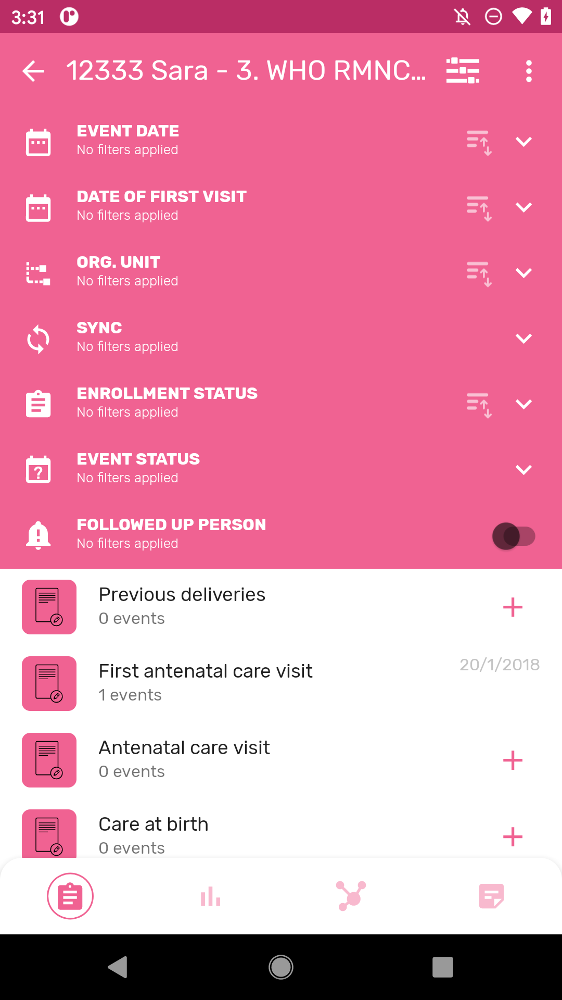{ width=25%}

## Sorting { #capture_app_generic_sorting }

Sorting has been integrated in the filter menu.

The sorting button will be on the filter bars with the following behavior:
- Only one sorting applies at a time. If the user clicks a different one, the previous one is disabled.
- The icon for applied sorting shows it is active, the others are inactive.  
- Repeated clicks keep changing the order to the reverse.

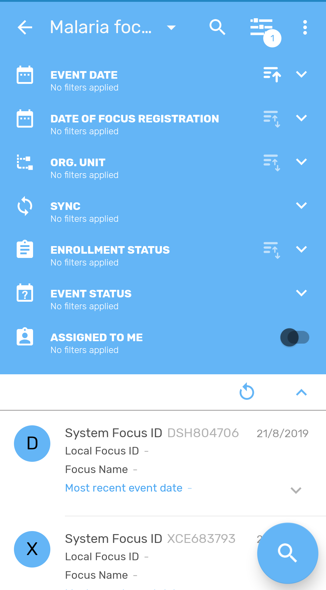{ width=25%}

### Dates (Period, Date, Event Date or Enrollment Date) { #capture_app_generic_sorting_dates }

- Event Date preceds due date, only use due date when there is no event date.
- Order from most recent to less recent. Future events (due date) goes first.

### Org. Unit { #capture_app_generic_sorting_orgunits }

- List will be sorted in alphabetical order by org unit name.

### Enrollment Status { #capture_app_generic_sorting_enrollment }
- List will be sorted in alphabetical order by status name.

{ width=25%}

## Sync Information { #capture_app_generic_sync_info }

Next to each program or data set an icon will be displayed which allows the user to check sync information. Synced records will not show display any icon. Unsynced (grey arrows), error (red arrows), warning (orange) or SMS (blue and including the SMS word inside) icons are be displayed according to the status.

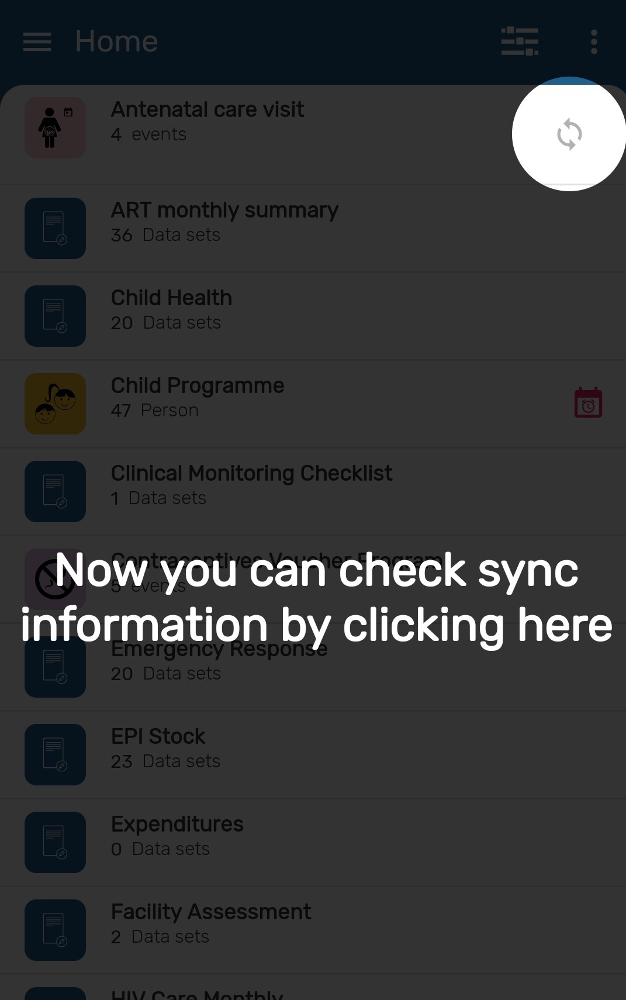{ width=20%}
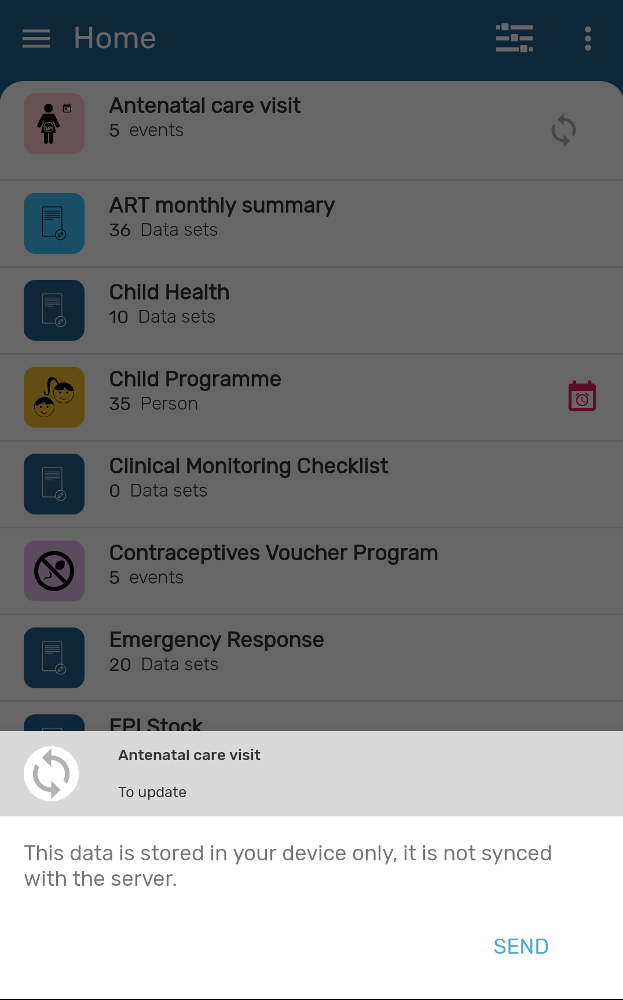{ width=20%}
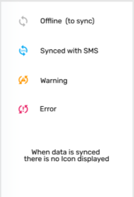{ width=20%}

### Granular Sync { #capture_app_generic_sync_granular }

Users can click on the grey arrows (which means record(s) stored online in the device) to perform a sync. These options are available at top level (programs/dataset) or individually (TEI, events, datavalues).

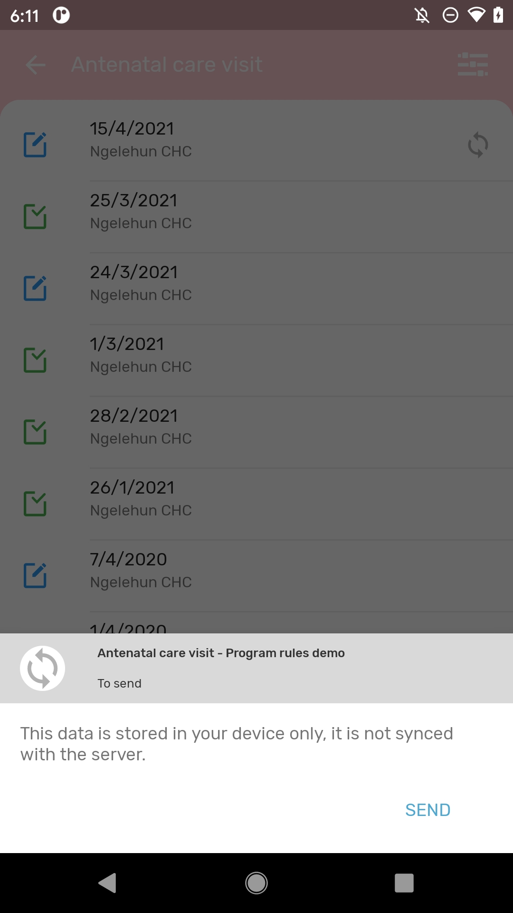{ width=25%}
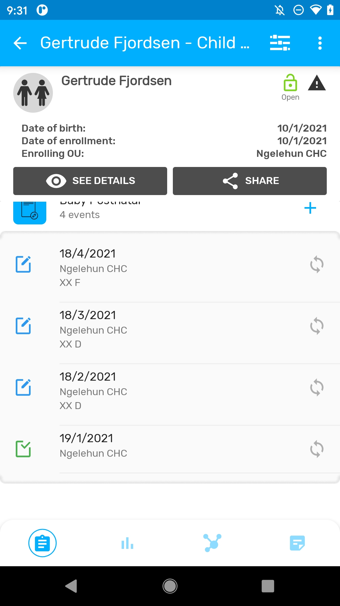{ width=25%}

### SMS Sync { #capture_app_generic_sync_sms }

When there is no Internet conection (either via WiFi or Mobile Data) but there is still mobile conectivity, users can synchronize via SMS if the gateway has been previously established in the app and properly configured at server level. The information will be sent via one or more SMS messages and the status will be updated to display either error or marked as “SMS synced”.

{ width=25%}

> **Tip**
>
>  Edit parameters related to SMS gateway in the SMS Settings (Settings Menu) or set this globally via the [#capture_app_android_settings_webapp_general](Android Settings Web App)

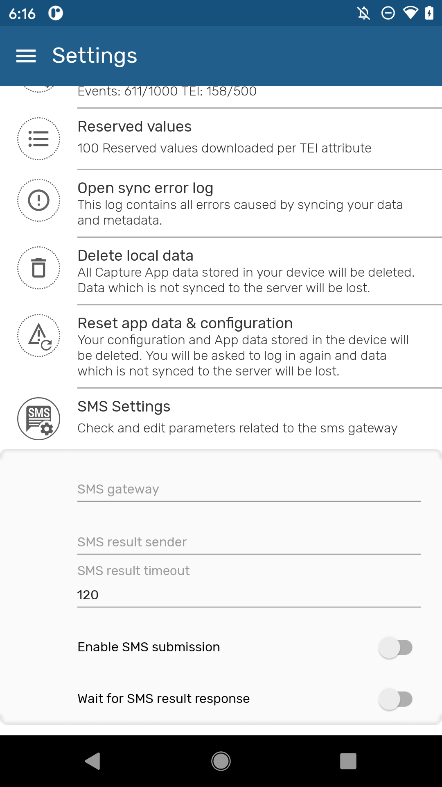{ width=25%}

> **Note**
>
>  Note that in order to user the SMS sync capabilities the SMS services needs to be enabled in the server side as described in the [https://docs.dhis2.org/master/en/dhis2_user_manual_en/mobile.html#sms-service](oficial documentation). You can also find more information on how to use different gateways in the [https://docs.dhis2.org/master/en/dhis2_android_implementation_guideline/about-this-guide.html](Android Implementation Guidelines)

### Meta data sync error { #capture_app_visual_sync_error }

In case of errors during the sync process, a message is displayed in the settings menu ('Sync data' or 'Sync configuration' section). Also, a red sync icon is displayed next to the program in the Home screen. The sync error log gives details about the error and is prepared to be shared with admins.

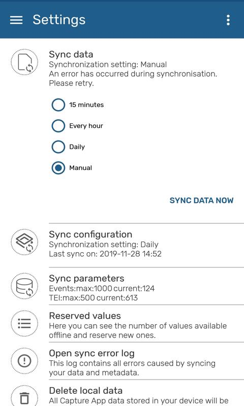{ width=25%}
{ width=25%}

You can also open the sync errors log from **Settings**:

{ width=25%}

## Org unit { #capture_app_generic_orgunit }

{ width=25%}

The whole organisation unit tree is displayed. Organisation units not available for data entry will be colored in grey.
User must check the box to select the org unit wanted.

> **Caution**
>
>  Mobile users are not expected to access the org. unit hierarchy of a whole country. Maximum number of org units is difficult to set, as the App does not set the limit, but the resources on the device (memory, processor). We could say below 250 org units should be safe, but still believe that is a very big number for a mobile use case.

## Data Sets { #capture_app_generic_datasets }

The user can now enter aggregate data for an organisation Unit, a period and a set of data elements and send it to the server.

{ width=25%}
{ width=25%}
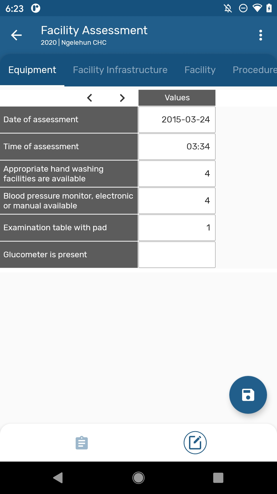{ width=25%}

## Differentiating Data Sets, Tracker and Event programs { #capture_app_generic_differentiating }

{ width=25%}

> **Tip**
>
>  An easy way to differentiate them is by looking at the word at the bottom left corner. The word 'Event' will always be in event programs. In tracker will appear the name of the tracked entity type (person, patient, building, etc.). For data sets, the word 'DataSets' will be shown next to the number of records.

## Sharing Data { #capture_app_generic_shargin }

Users can share TEI via QR codes. This allows transferring/sharing information between devices without the need of transferring via the server (useful when connecitivity might be missing). To do this users should open any TEI and click on the *SHARE* button.

{ width=25%}
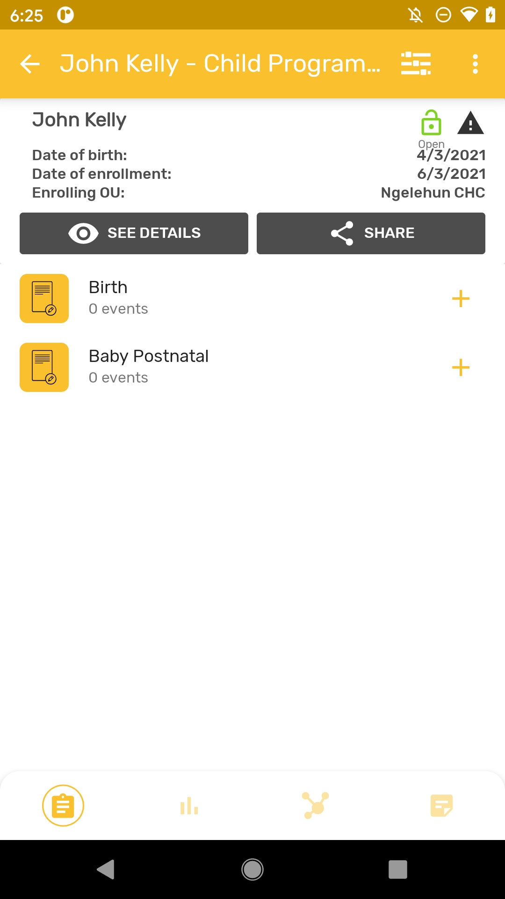{ width=25%}

## Capture Coordinates { #capture_app_generic_capture_coord }

### TEI coordinates { #capture_app_generic_capture_coord_tei }

Capture the TEI coordinates in the registration form.  Enable this feature in the TET feature type.

{ width=25%}

### Polygons { #capture_app_generic_capture_coord_polygons }

The app now supports the geoJSON format and the user is able to capture polygons.

{ width=25%}

## Images { #capture_app_generic_images }

ValueType image can be used in Android to capture data and also, depending on the program configuration to be displayed in the TEI dashboard. When this value type the first data element/attribute marked as displayed in the program configuration it will be used as the TEI profile image.

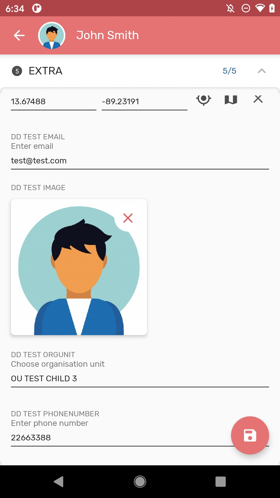{ width=25%}
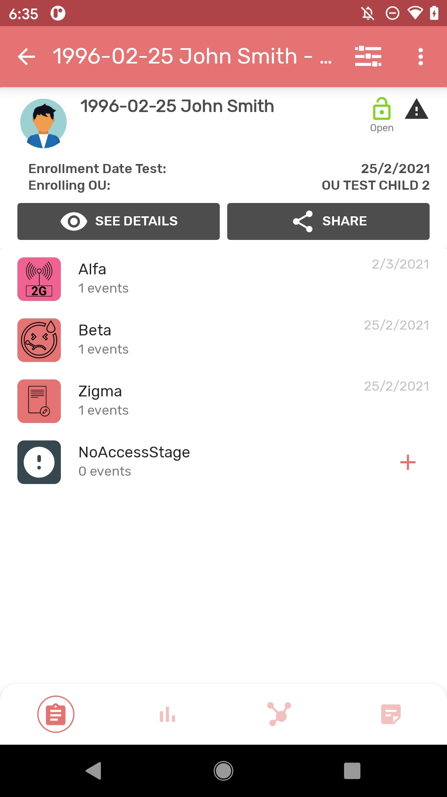{ width=25%}
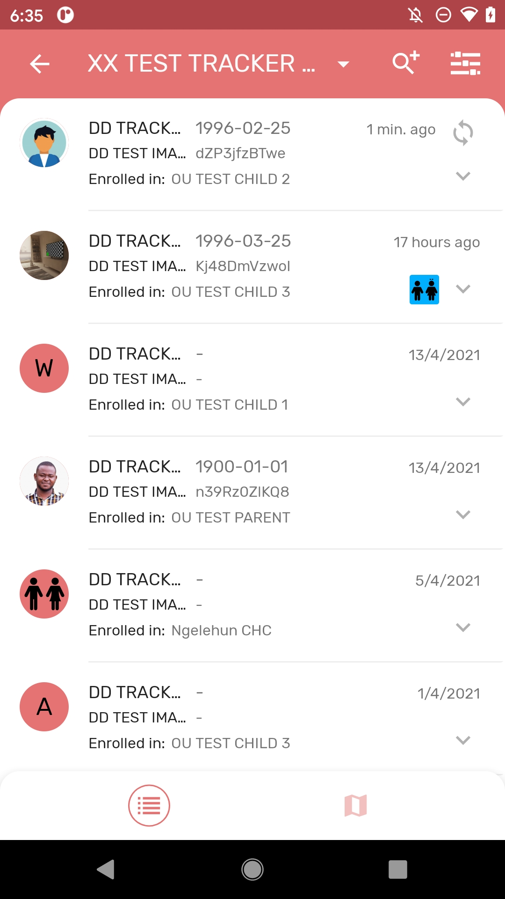{ width=25%}

Open the TEI profile image by clicking on it.

{ width=25%}

## Display events and TEIs in maps { #capture_app_generic_display_events }

When a program stage or tracked entity type have a feature type (and for programs with registration the option displayFrontPageList is enabled) the listings can be switched to display the information in a map. Make the switch by clicking on the map icon in the navigation panel.

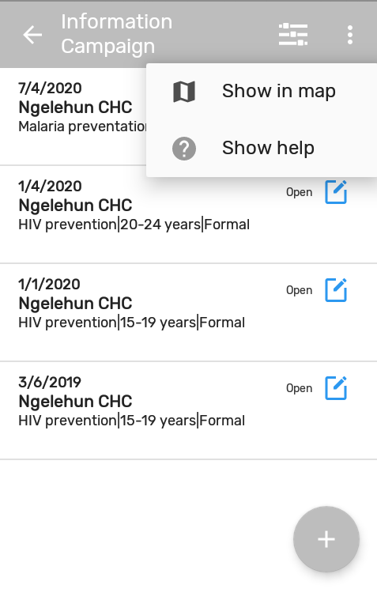{ width=25%}
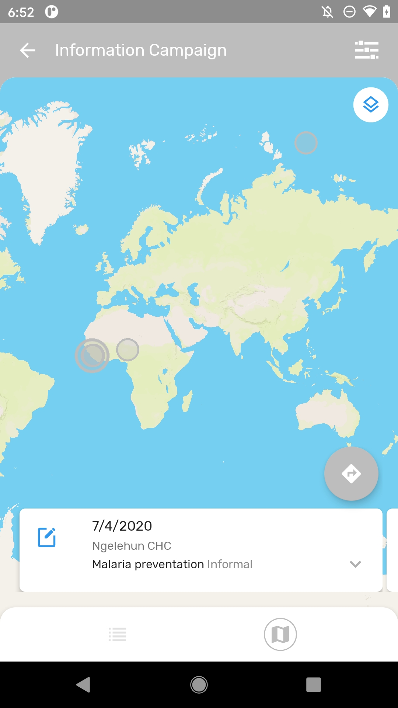{ width=25%}

If the TEI has a profile image, the map will display it.

{ width=25%}

## Personalized Calendar View (New 2.5)

In the DHIS2 Android Capture App users can switch date selection from spinner to calendar view. In this version, the app will remember the last visualization selected by the user and use it the next time the user needs to select a date.

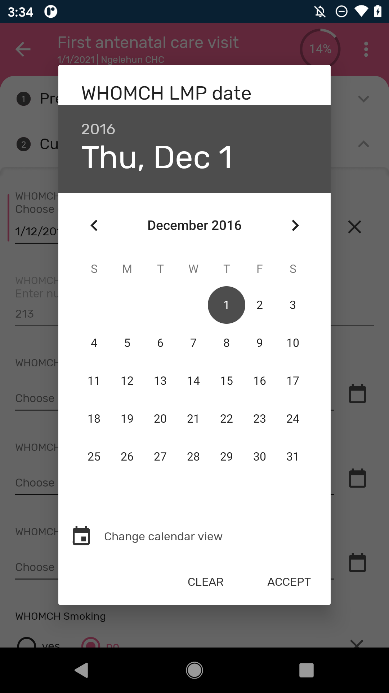{ width=25%}

## Reason for non-editable data (New 2.5)

Data can be blocked for many reasons in DHIS2, because of access restrictions or expiration among others. When an Event, TEI or Data Set are not editable the user will be able to find the reason on the "Details" section.

The following list contains all possible reasons:

* Event completion
* Enrollment completion
* Expired event
* Closed organization unit
* Organization unit out of capture scope
* No access to capture data in the program or data set
* No access to a category option in the program or data set

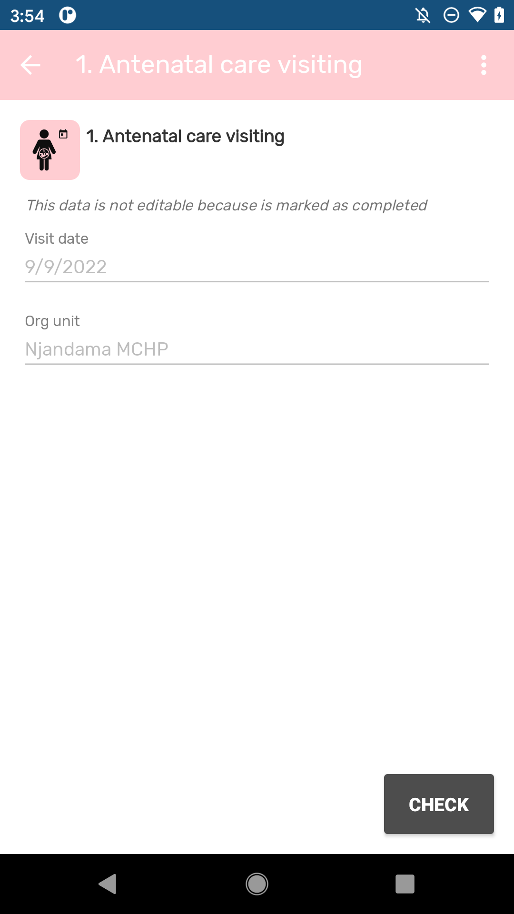{ width=25%}
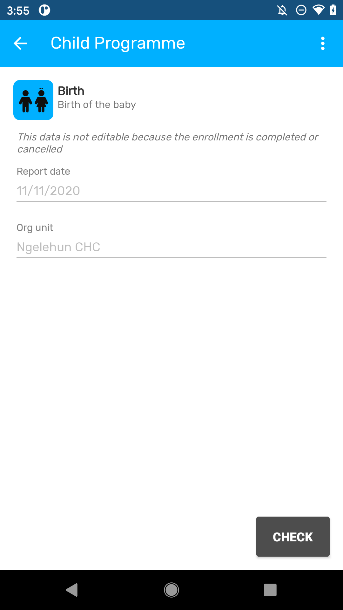{ width=25%}
