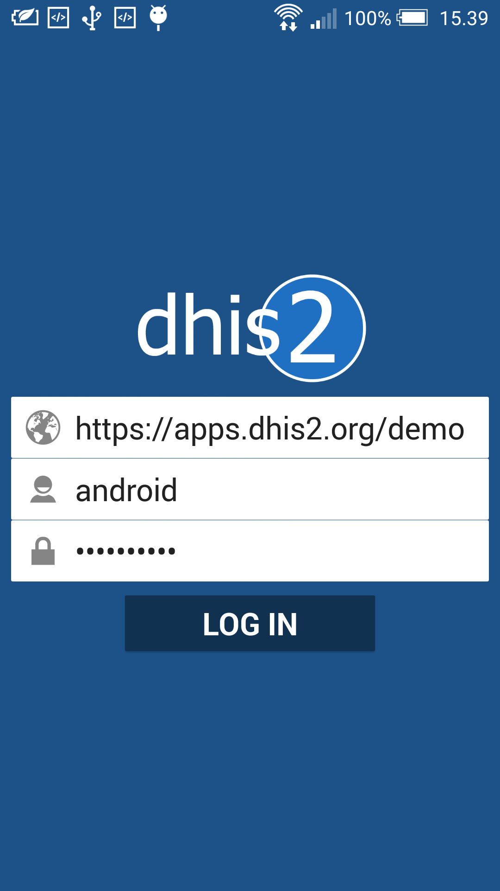
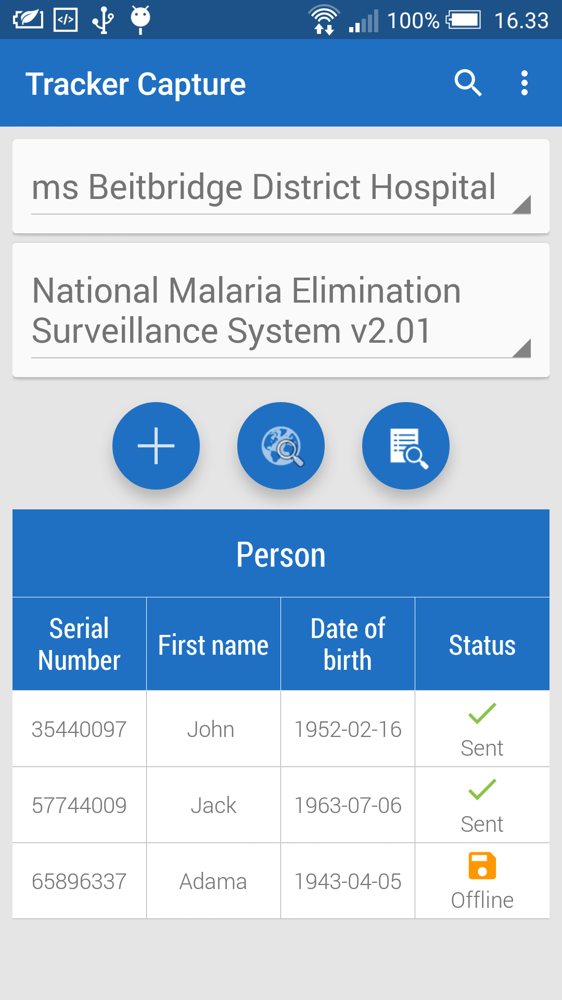
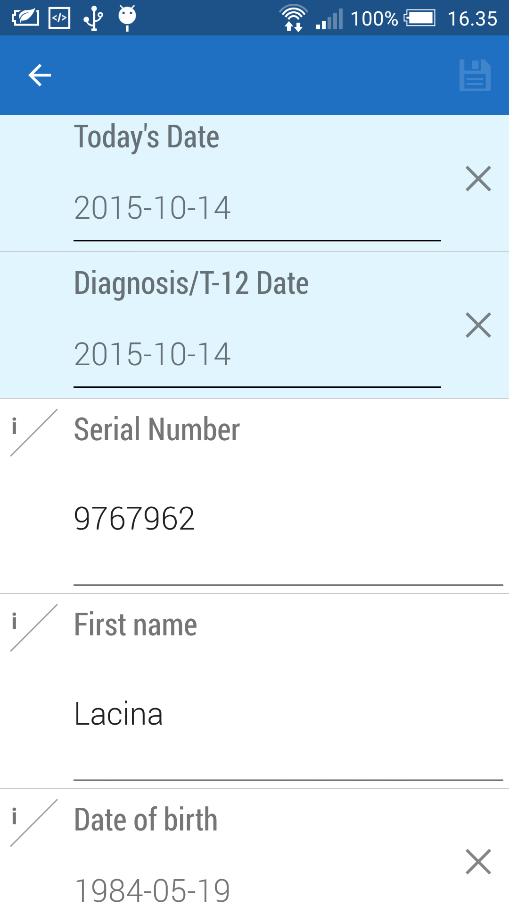
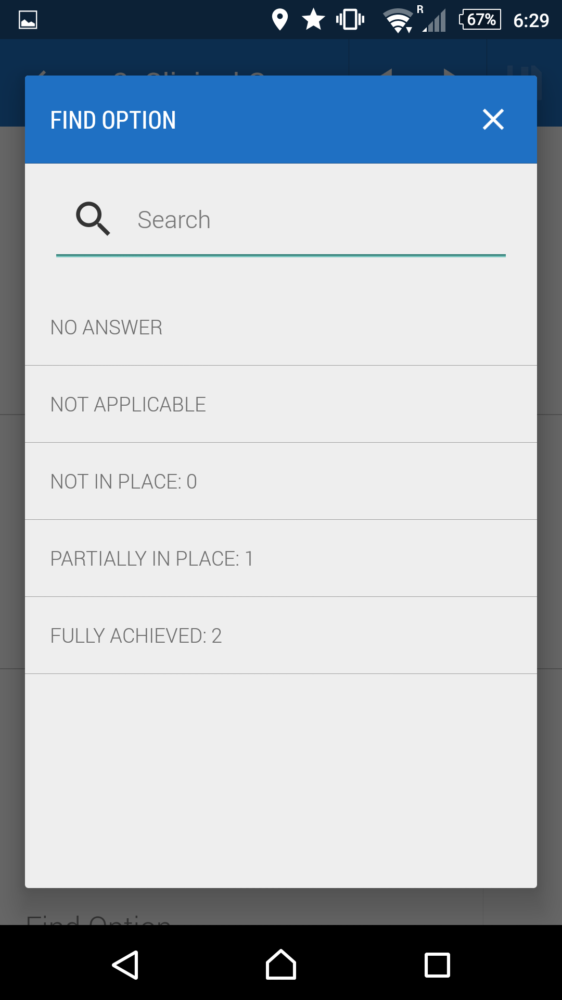
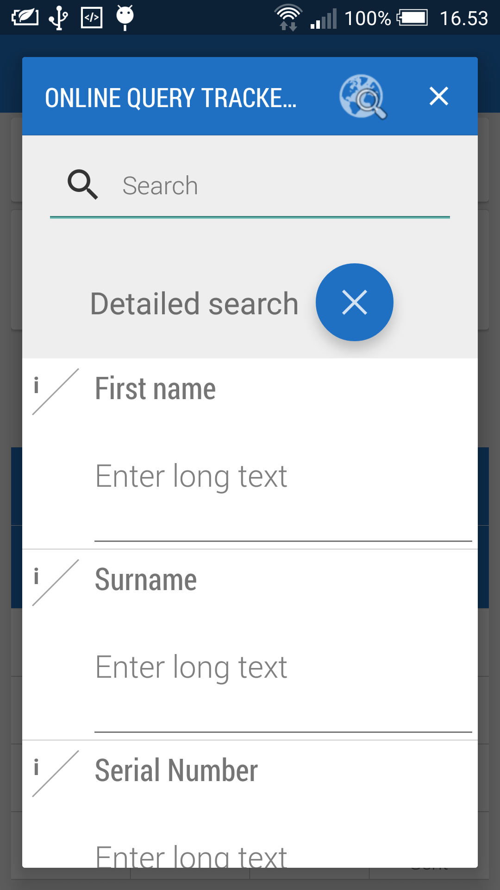
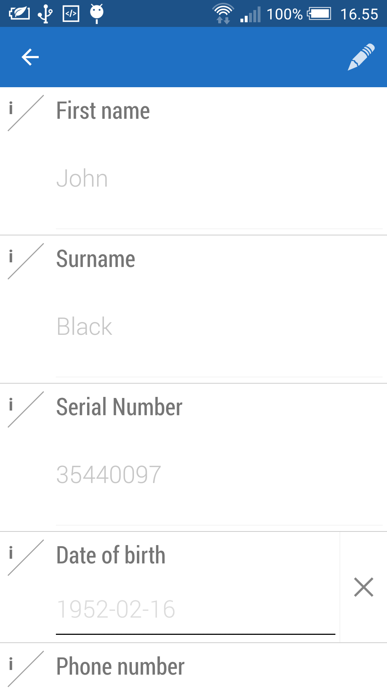
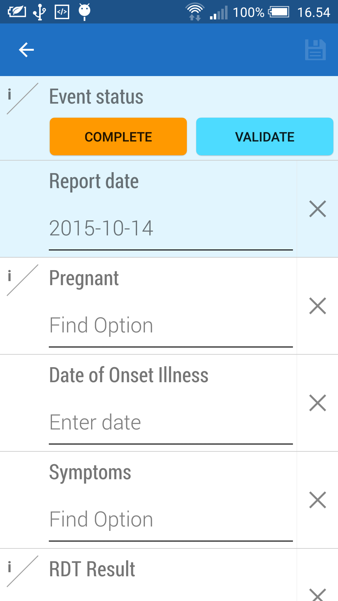
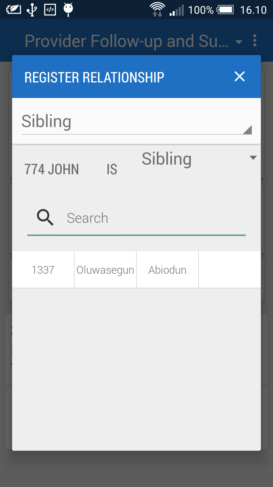
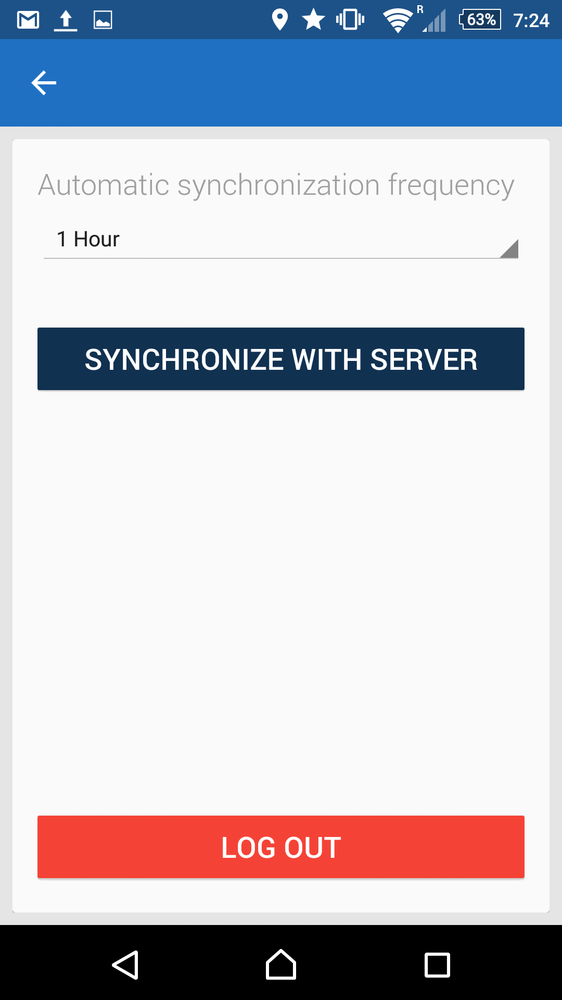

# Android Tracker Capture App

<!--DHIS2-SECTION-ID:android_tracker_capture-->

## Overview

<!--DHIS2-SECTION-ID:android_tracker_capture_overview-->

The Tracker Capture Android app allows you capture, modify and list
tracked entity instances with its enrolments and events. The Tracker
Capture app works with multiple event-based programs in DHIS2, which
handles events linked to registered entities. These programs are
suitable for handling disease programmes where multiple visits is
required. The Tracker Capture app can be used for disease programmes
such as tuberculosis and malaria. However the app is not tied to any
specific domain and can potentially be utilized for any scenario of
multiple event-based information.

The Tracker Capture app allows you to capture events offline, i.e.
without Internet connectivity. The app will automatically synchronize
events with the online DHIS2 server automatically when connectivity is
present. This makes the app suitable for environments where Internet
connectivity is scarce or unstable.

## Installing and logging in

<!--DHIS2-SECTION-ID:android_tracker_capture_installing-->

The Tracker Capture app can be found on Google Play under the name
"DHIS2 Tracker Capture".

[Tracker Capture on Google
Play](https://play.google.com/store/apps/details?id=org.hisp.dhis.android.trackercapture)

You can download the APK file directly from the GitHub release page.

[Tracker Capture GitHub
releases](https://github.com/dhis2/dhis2-android-trackercapture/releases)

Click on the app to open it after the installation is done. This will
bring up the login screen.

In the *URL* field, enter the full URL to the DHIS2 instance (server)
for which you want to capture and manage data for. Be careful to enter
the *http://* or *https://* part of the URL as well. In the *username*
and *password* field, enter the username and password for your account
at the given DHIS2 instance. Note that you can use this login on the
online DHIS2 server as well, i.e. you will be using the same account as
you will use when logging into DHIS2 using a Web browser. After logging
in the first time, the app will download meta-data from the online
instance.

## Viewing Enrollments

<!--DHIS2-SECTION-ID:android_tracker_capture_enrollments-->

The main screen will show an overview of enrollments, as well as links
to creating new ones. After the first login, there will be *no*
enrollments showing up in the list. Start by selecting organisation unit
and program from the selectors at the upper part of the screen. For
downloading existing tracker data from the server on to your device,
press the middle button.

The *+* button below the selectors will take you to the new enrollment
screen. Below this button, all enrollments which have been registered
for the selected organisation unit and program will be listed. Each
column is configurable, and could show various types of information from
each enrollment. The column to the far right shows the synchronization
status. *Sent* means that the enrollment has been uploaded to the
server, whereas *Offline* means that the enrollment is so far only
stored at your device. Locally stored data will be synchronized
automatically once an Internet connection is present. You can swipe down
on the screen in order to trigger a synchronization attempt.

## Creating and enrolling a tracked entity instance

<!--DHIS2-SECTION-ID:android_tracker_capture_creating-->

Click on the *+* button to go to the new enrollment form. The new
enrollment will be associated with the organisation unit and program you
selected previously and the tracked entity instance that you create with
this form. The new enrollment screen has a range of functions:

The back button in the top top-left corner will take you back to the
main screen (list of enrollments). The save button in the top-right
corner will automatically save what you have entered for the enrollment
so far.

The first form field contains a date selector and indicators the time of
when the enrollment took place. If your program is selected to accept
incident date, this will also be displayed. The labels is customizable
and will vary from system to system.

The enrollment data entry form itself will be rendered below. The type
of input field selector will depend on the type of the data element
representing the input field. For example, you will see date selectors,
free text input and numeric input fields. Data elements with predefined
options will be rendered using a special dialog where you can either
click directly on options or use a text input field to search for a
specific option (useful if there is a high number of options).

## Downloading tracker data from the online DHIS2 instance

<!--DHIS2-SECTION-ID:android_tracker_capture_downloading-->

From the main screen press the middle button for querying the server.
Since this task requires an Internet connection, please make sure that
you have one. This task will query the server with the organisation unit
and programme that you have selected from the main screen. After you
have pressed this button a dialog appears. In this dialog you can either
specify your search by pressing the *detailed search* button. The
detailed search queries the server for tracked entity instances that
contains the values that you have specified in your query. When you are
finished with your query, press the globe for displaying the results
from the server. If you want to display all tracked entity instances
from the selected organisation unit and programme, you can simply press
the globe button without entering any details. Depending on your
Internet connection, this task can take some time so please be patient.
A new dialog will present a list of results from your query containing
tracked entity instances. Select the tracked entity instances that you
want to download by tapping on them (A green tick on the right side will
indicate that you have selected the tracked entity instance). After you
have selected all your tracked entity instances that you want to
download, press the download button, that has an icon with a downwards
arrow, at the top of the dialog screen. The tracked entity instances
will be downloaded in the background and the synchronization wheel will
be displayed. When a tracked entity instance is finished downloading it
will appear in the list at the bottom of the main screen.

## Modifying enrollment and tracked entity instance attribute values

<!--DHIS2-SECTION-ID:android_tracker_capture_modifying-->

After an enrollment has been created you can go back to or modify the
event by simply clicking on it in the enrollment list. This will open an
overview screen of the enrolled tracked entity instance with information
that has been captured so far. To change the tracked entity instance
attribute values that has been captured, simply press the profile box
and a new screen will appear. By default the data entry rows will be
disabled. To enable the data entry rows press the edit button in the
top-right corner. This form will save whenever you do any changes. To
change enrollment details, press the Enrollment box from the overview
screen. To make the rows editable, press the edit button in the
top-right corner. Data is automatically saved whenever changes is done.
In the Overview screen you can also choose to complete or terminate the
enrollment for the tracked entity instance. When an enrollment is
completed or terminated, you will not be able to modify the data

## Creating new events for Enrollment

<!--DHIS2-SECTION-ID:android_tracker_capture_new_events-->

In the main screen click on any enrollment in the list to go into the
Overview screen. This screen displays the information of the enrollment
and the tracked entity instance with its relationships and active
events. Some events is auto generated with the enrollment and therefore
is already displayed in the list. This is customizable from the server
side. Click on the *new* button to generate a new event and go to the
event form. The new event will be associated with the enrollment that
you selected previously. The new event screen has a range of functions:

The back button in the top top-left corner will take you back to the
main screen (list of events). For programs that have specified sections,
these sections will be displayed as a selector at the centre of the top
bar. There are also right and left arrows which you can use to move
between sections. You can use this selector and arrows to quickly
navigate between form sections. The save button in the top-right corner
will save what you have entered for the event so far. Data is also saved
when you switch between sections.

The *Complete* button on the second bar will mark the event as complete.
The Validate button will trigger a check for validity of the
information you have entered based on the validation rules which have
been set up for the program.

The first form field contains a date selector and indicators the time of
when the event took place. The label is customizable and will vary from
system to system. The *Enter coordinates* field, which will be displayed
if the program is configured to store coordinates, lets you use the GPS
capability of your device to set the longitude and latitude of your
current location by pressing the circle-like symbol to its right. You
can alternatively enter the coordinates directly.

The event entry form itself will be rendered below. The type of input
field selector will depend on the type of the data element representing
the input field. For example, you will see date selectors, free text
input and numeric input fields. Data elements with predefined options
will be rendered using a special dialog where you can either click
directly on options or use a text input field to search for a specific
option (useful if there is a high number of options).

## Create relationships

<!--DHIS2-SECTION-ID:android_tracker_capture_relationships-->

Relationships let you create links between different tracked entity
instances. This could be useful in cases where you want to map the
relationships between parents and children or persons with malaria
breeding sites. To add a new relationship, first press the 'new' button
on the relationship box. Now a dialog is presented where you can choose
which relationship you want to create from the 'Select relationship
type' input field. Below there is a list of tracked entity instances
that are already enrolled in the same programme and thus can be chosen.
After choosing a tracked entity instance and confirming the relationship
then it will show up in the Overview screen.

## Settings

<!--DHIS2-SECTION-ID:android_tracker_capture_settings-->

The settings screen lets you do configure synchronization frequency and
log out.

The *frequency of automatic synchronization attemps* can be set form the
drop-down, where options range from one minute to one day. This affects
the battery usage and bandwidth consumption. The default of one hour is a
sensible choice.

The *log out* button will log you out of the app, and request you to
enter the login information again. You are not intended to log out of
the application between each session. This is mostly useful when you
want to log into another DHIS2 online instance.
