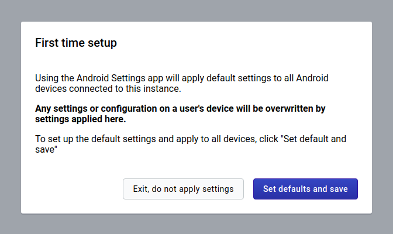
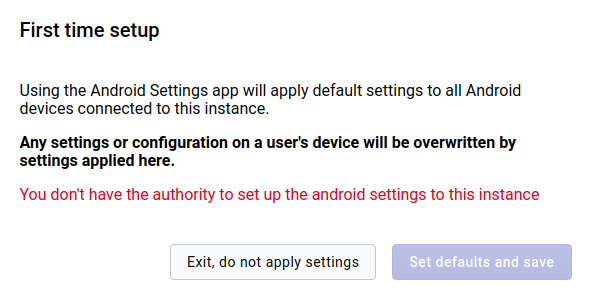

# Android Settings App

## Overview

This section focuses on the Android Settings app implementation.

The Android Settings web app allows admins to configure synchronization parameters for the DHIS2 Android Capture App, encrypt the local database of the android devices, and run tests on the size of data and metadata synchronized by a given android user. The configuration parameters defined within this app will overwrite the settings of all android devices using the DHIS2 Android Capture App.

Please note that in this version of the app, only users with 'ALL' authority are able to define those parameters in the configuration. Other users having access to the app can see the value of the parameters, but cannot edit them. 

## General download sync settings

Includes configurations such as how often the android app will synchronize metadata and data, number of reserved values to download per TEI, and encrypt the device database.

**Metadata sync:** You can choose how often you want to sync your metadata. e.g. Sync metadata every 24 hours.

**Data sync:** You can choose how often you want to sync your data. e.g. Syncing data every 6 hours. 

**SMS Gateway:** This section allows you to edit the SMS gateway phone number.

**Reserved values:** This will specify the number of reserved values per TEI attribute to download in your device.

**Encrypt device database:** 

> **Warning**
>
> This is a critical action and will affect the local database of all android devices synchronizing with the server (it won't affect the server DHIS2 database).
>
> By default the android app database is not encrypted, but a system admin can check the *Encrypt device database* to encrypt the metadata and data stored in every device. Encrypting the database will have an impact on the database volume and performance of the app. Also note that at the moment of selecting or unselecting this option no data is lost (even if it hasn't been previously synchronized with the server)

 
**Disable all settings:** By clicking this button the user will remove all android confiuration settings, so no configuration will be applied to the Android Capture app.  

## Program download sync settings

It allows admin users to specify the sync parameters for Programs. This section has two parts, global and specific settings. 

### Global settings

Global settings apply to all programs that an android user has access to. 

**TEI to download:** Maximum number of TEIs to download from the server.

**TEI download period:** It downloads the TEIs that have been updated within a period. e.g. TEIs that have been updated within last month

**Event to download:** Maximum number of Events to download.

**Event download period:** It downloads Events which event date belongs to a specific period.

### Specific settings

This section allows the admin users to specify the behaviour of a particular program/s when syncing the data. The specific configuration overwrites the general settings for the programs listed in this section.  To add a setting for a specific program:
 
- Click on *Add a Program-specific setting*, a Dialog will appear. 
- Bellow "Values per Program" title you can click and find a list of programs.
- Clicking on a program will show up the different parameters to configure. The number of parameters depends on the program type (with or without registration). 

**Settings for Program Without Registration**

**Settings for a Program With Registration**

In the case that any specific settings have been saved, a table will show up a summary with the specific configuration per program, and the options to edit or delete these settings.

### Reset all values

By clicking on *Reset all values*, the user will restore the default settings values of the program section. Please note that in this case it means no specific settings per program. 

To save any configuration, the user needs to click on the *Save* button (this button is disabled for the users who doesn't have the 'ALL' authority)

## Data set download sync settings

It allows admin users to specify the sync parameters for DataSets. It has two parts.

### Global settings

The first part is for global settings that apply to all data sets an android user has access to. 

**Number of Periods:** Maximum number of periods to download.

### Specific Settings

To add a specific setting:
 - Click on *Add a Data set specific setting*, you will find a dialog with a list of data sets, 
 - Click on a data set and this field will be autocompleted with the default value based on the dataset period type.

## User Sync Test

This section checks the amount of data and metadata a user would sync to their device. You cannot only run this test on the user that is currently login but also with other users that you have access to. This test shows up the number of organisation units that the user has access to, data sets, programs, and program rules linked to the organisation units, and the metadata and data download size.

> **Note:** 
>
> The values that are highlighted in red, are because the value is considered greater than the maximum recommended value.

## Installation

You can easily install the Android Settings App by logging into the DHIS2 and going to **App Management**.

- Click on the *Upload* (arrow) button.
- Select the app build .zip

## Log in and first time setup

After you install and launch the Android Settings App when you launch it for the first time, you will be required to set and save the default values of the configuration. This will apply default settings to all android devices connected to the instance. 

> **Warning** 
>
> In case the user doesn't have ALL authorities or permissions you won't be able to *save or update* the configuration, but the user will have view access once it's created.

## Enter and save configuration parameters

### Datastore

All settings are stored in [Datastore](https://docs.dhis2.org/master/en/developer/html/webapi_data_store.html) in JSON format.

Datastore structure:

| Item        | Description | Data type |
| ----------- | ----------- | --------- |
| Namespace   | Namespace for organization of entries | String |
| Key         | Key for identification of values | String |
| Value       | Value holding the information for the entry | JSON |

### Save configuration parameters

At the form footer of all settings sections, you can find a *Save* button.

Only when you click on this button all changes made on the current section are saved on Datastore, and they will apply to the Android Capture Apps when they synchronize their configuration.
 
**Unsaved changes:** 
 
In case you want to go to another section, and you still have unsaved changes, an alert will be displayed before navigating away from the current section. In case you accept leaving the page your unsaved changes will be lost.

 
#### Reset all values to default

You can restore your settings at any time. At the form footer of all settings sections, you can find a *Reset all values to default* button.

Your will be only restored on Datastore and apply after clicking on *Save*. 
