# Android Settings App

## Overview

This document focuses on the Android Settings app implementation.

The Android Settings is a web app that allows us to configure the different synchronization parameters for the DHIS2 Android Capture App, in addition to that, it allows us to run tests on the size of data synchronized by user.

The document is divided into sections, which are intended to describe all the features that have been implemented on the web app.

## General download sync settings

Includes configurations such as how often the synchronizations will be made for metadata and data, reserved values downloaded per TEI, and encrypt the device database.

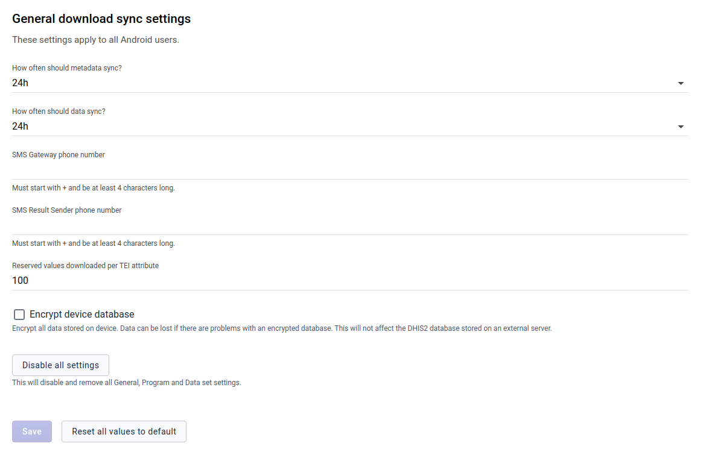

**Metadata sync:** You can choose how often you want to sync your metadata. e.g. Sync metadata every 24 hours.

**Data sync:** You can choose how often you want to sync your data. e.g. Syncing data every 6 hours. 

**SMS Gateway:** This section allows you to edit the SMS gateway phone number.

**Reserved values:** This will specify the number of reserved values per TEI to download in your device.

**Encrypt device database:** This is a critical action and will not affect the DHIS2 database.
Decrypt device database will reduce the level of protection of the data.
Encrypt device database that could have an impact on the database volume and performance. 

**Disable all settings:** This is an option when you don’t want the configurations you generate on the web app to be applied to the Android Capture app. By clicking this button you will disable all General, Program, and data set settings and remove namespace and key names from Datastore.

## Program download sync settings

This section has two parts, global and specific settings. 

### Global settings

Global settings apply to all programs an android user has access to. Some of these settings are maximum TEI and event to download and update period.

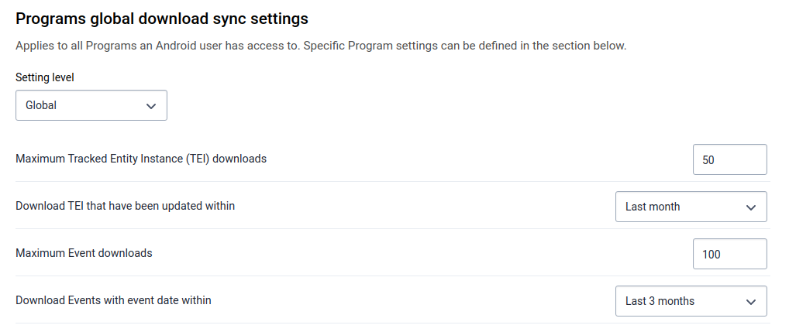

**TEI to download:** Maximum number of Tracked Entity Instance to download.

**TEI download period:** Download TEI that have been updated within a period. e.g. TEI that have been updated within last month

**Event to download:** Maximum number of Events to download.

**Event download period:** Download Events with event date within a specific period.

### Specific settings

To add a setting for a specific program:
 
- Click on *Add a Program-specific setting*, a Dialog will appear. 
- Bellow "Values per Program" title you can click and find a list of programs.
- Click on a program, and it will show you settings taking into account the program type (With or without registration). 

**Settings for Program Without Registration**

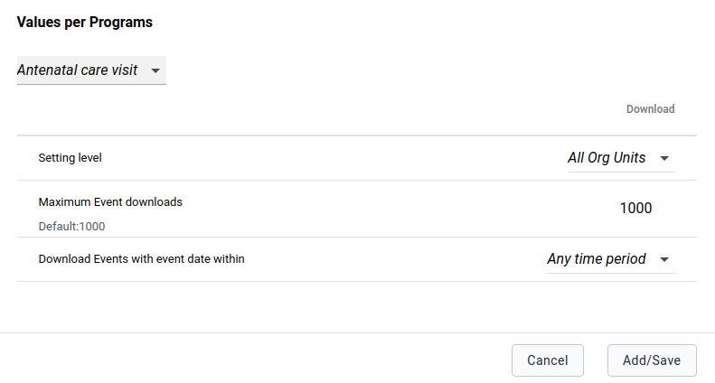

**Settings for a Program With Registration**

When you save a specific setting a table only with this kind of settings will appear, the table will show a summary of the specific program setting and options to edit or delete those settings for the program.

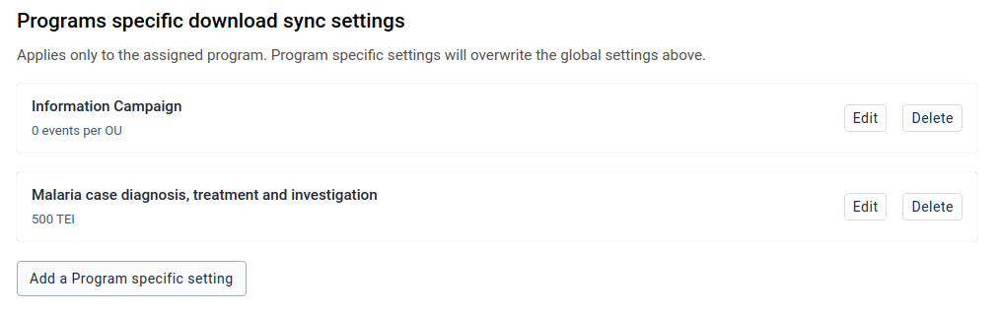

### Reset all values

By clicking on *Reset all values*, you will restore your default settings values, in this case means no specific settings. To save it on Datastore and apply it to Android Capture App, you need to click on *Save*.

## Data set download sync settings

It is very similar to **Program settings** section, it has two parts.

### Global settings

The first part is for global settings that apply to all data sets an android user has access to. 

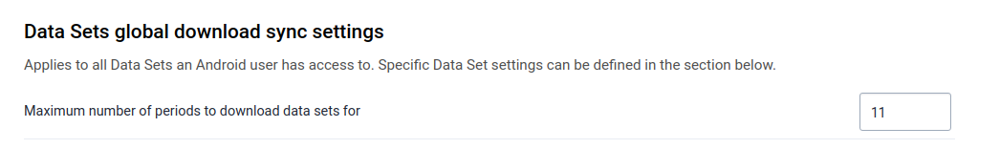

**Number of Periods:** Maximum number of periods to download.

### Specific Settings

To add a specific setting:
 - Click on *Add a Data set specific setting*, you will find a dialog with a list of data sets, 
 - Click on a data set and this field will be autocompleted with the default value based on the dataset period type.

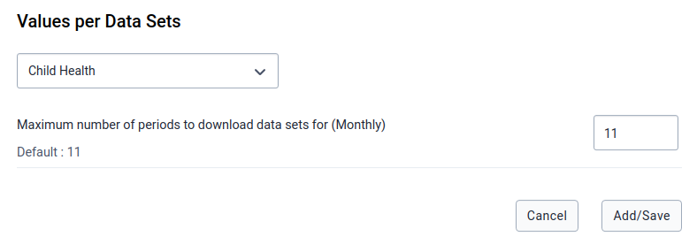

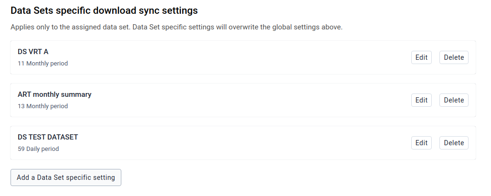

## User Sync Test

This section checks the amount of data a user would sync to their device. You cannot only run this test on the user that is currently login but also with other users. This test will show you the number of OU that the user has access to, data sets, programs, and program rules linked to OU, and the metadata and data download size.

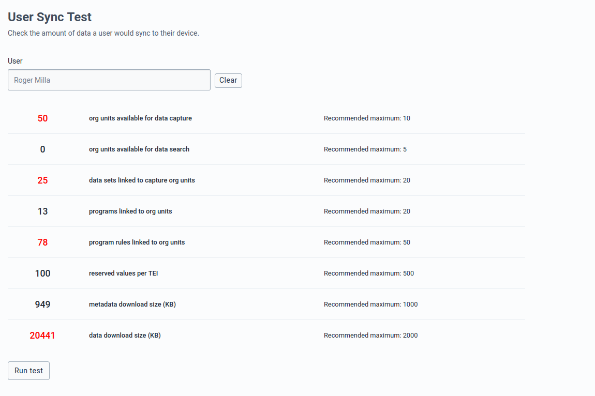

> **Note:** The values that are highlighted in red, are because the value is considered greater than the maximum recommended value.

## Installation

You can easily install the Android Settings App by logging into the DHIS2 and going to **App Management**.

- Click on the *Upload* (arrow) button.
- Select the app build .zip

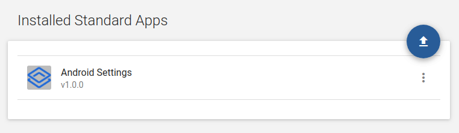

## Log in and first time setup

After you install and launch the Android Settings App when you launch it for the first time, you will be required to create a namespace and key names on the DataStore, and save all settings default values in those key names; to do that you need to click on *Set defaults and save* button.

## Enter and save configuration parameters

### Datastore

All settings are stored in [Datastore](https://docs.dhis2.org/master/en/developer/html/webapi_data_store.html) in JSON format.

Datastore structure:

| Item        | Description | Data type |
| ----------- | ----------- | --------- |
| Namespace   | Namespace for organization of entries | String |
| Key         | Key for identification of values | String |
| Value       | Value holding the information for the entry | JSON |

### Save configuration parameters

At the form footer of all settings sections, you can find a *Save* button.

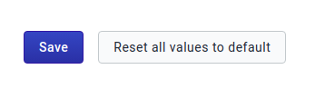

Only when you click on this button all changes made on the current section are saved on Datastore, and they will apply to the Android Capture Apps when they synchronize their configuration.
 
**Unsaved changes:** 
 
In case you want to go to another section, and you still have unsaved changes, an alert will be displayed before navigating away from the current section. In case you accept leaving the page your unsaved changes will be lost.

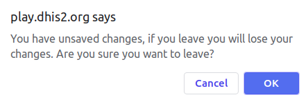
 
#### Reset all values to default

You can restore your settings at any time. At the form footer of all settings sections, you can find a *Reset all values to default* button.

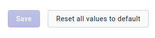

Your will be only restored on Datastore and apply after clicking on *Save*. 