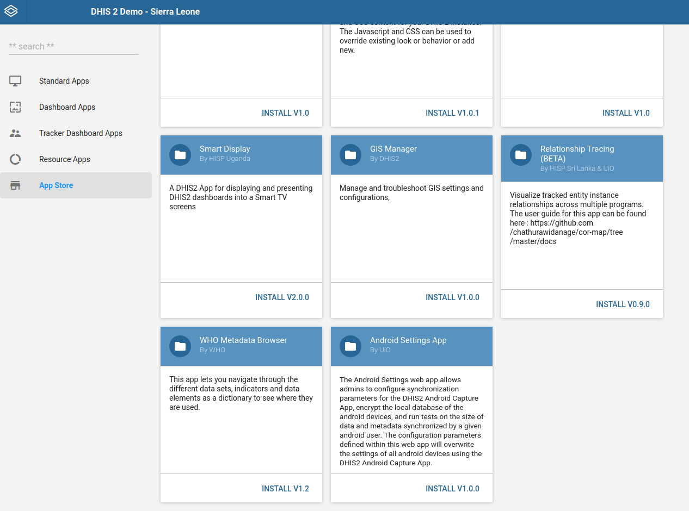

# Android Settings Web App { #capture_app_andoid_settings_webapp }
## Overview { #capture_app_andoid_settings_webapp_overview }

This section focuses on the Android Settings Web App implementation.

The Android Settings Web App allows admins to configure synchronization parameters for the DHIS2 Android Capture App, encrypt the local database of the android devices, and run tests on the size of data and metadata synchronized by a given android user. The configuration parameters defined within this web app will overwrite the settings of all android devices using the DHIS2 Android Capture App.

Please note that in this version of the web app, only users with 'ALL' authority are able to define those parameters in the configuration. Other users having access to the web app can see the value of the parameters, but cannot edit them. 

## General download sync settings { #capture_app_andoid_settings_webapp_general }

Includes configurations such as how often the android app will synchronize metadata and data, number of reserved values to download per TEI, and encrypt the device database.

> **Warning**
> This version includes a **manual** option for metadata and data sync, so admins can decide if the app will synchronize metadata and data only when requested by the android app user (instead of being scheduled).
>
> This option is only available from Android App 2.3.0 onward.

**Metadata sync:** Admin users can choose how often the metadata will sync. e.g. Sync metadata every 24 hours.

**Data sync:** Admin users can choose how often the data will sync. e.g. Syncing data every 6 hours. 

**SMS Gateway:** This section allows admin users to edit the SMS gateway phone number.

**Reserved values:** This will specify the number of reserved values per TEI attribute to download in the devices.

**Encrypt device database:** 

> **Warning**
>
> This is a critical action and will affect the local database of all android devices synchronizing with the server (it won't affect the server DHIS2 database).
>
> By default, the android app database is not encrypted, but an admin can check the *Encrypt device database* to encrypt the metadata and data stored in every device. Encrypting the database will have an impact on the database volume and performance of the android app. Also note that at the moment of selecting or unselecting this option no data is lost (even if it hasn't been previously synchronized with the server)

 
**Disable all settings:** By clicking this button the user will remove all android configuration settings, so no configuration will be applied to the Android Capture app (if this is the case the sync parameters applied are the ones defined in the Android Capture app).

## Program download sync settings { #capture_app_andoid_settings_webapp_program }

It allows admin users to specify the sync parameters for Programs. This section has two parts, global and specific settings. 

### Global settings { #capture_app_andoid_settings_webapp_program_global }

Global settings apply to all programs that an android user has access to. 

**TEI to download:** Maximum number of TEIs to download from the server.

**TEI download period:** It downloads the TEIs that have been updated within a period. e.g. TEIs that have been updated within last month

**Event to download:** Maximum number of Events to download.

**Event download period:** It downloads Events which event date belongs to a specific period.

### Specific settings { #capture_app_andoid_settings_webapp_program_specific }

This section allows the admin users to specify the behaviour of a particular program/s when syncing the data. The specific configuration overwrites the general settings for the programs listed in this section.  To add a setting for a specific program:
 
- Click on *Add a Program-specific setting*, a Dialog will appear. 
- Bellow "Values per Program" title a user can click and find a list of programs.
- Clicking on a program will show up the different parameters to configure. The number of parameters depends on the program type (with or without registration). 

**Settings for Program Without Registration**

**Settings for a Program With Registration**

In the case that any specific settings has been saved, a table will show up a summary with the specific configuration per program, and the options to edit or delete these settings.

### Reset all values { #capture_app_andoid_settings_webapp_program_reset_all }

By clicking on *Reset all values*, the admin user will restore the default settings values of the program section. Please note that in this case it means no specific settings per program. 

To save any configuration, the admin user needs to click on the *Save* button (this button is disabled for the users who doesn't have the 'ALL' authority)

## Data set download sync settings { #capture_app_andoid_settings_webapp_data }

It allows admin users to specify the sync parameters for DataSets. It has two parts.

### Global settings { #capture_app_andoid_settings_webapp_data_global }

The first part is for global settings that apply to all data sets an android user has access to. 

**Number of Periods:** Maximum number of periods to download.

### Specific Settings { #capture_app_andoid_settings_webapp_data_specific }

To add a specific setting:
 - Click on *Add a Data set specific setting*, the will find a dialog with a list of data sets, 
 - Click on a data set and this field will be autocompleted with the default value based on the dataset period type.

## User Sync Test { #capture_app_andoid_settings_webapp_user_sync_test }

This section checks the amount of data and metadata a user would sync to his/her device. You can run this test on any user that you have access to. This test shows up the number of organisation units, data sets, program rules, programs, etc. that an android user has access to (so the resoruces that the android app will download) , and the metadata and data download size (approx estimation). Please note that a user doesn't need to have the 'ALL' authority to run this test.

> **Note:** 
>
> The values that are highlighted in red, are because the value is considered greater than the maximum recommended value.

## Installation { #capture_app_andoid_settings_webapp_installation }

A user can easily install the Android Settings Web App by logging into the DHIS2 and going to **App Management**.

- Click on **App Store**
- Go to *Android Settings App*
- Click on *Install V1.0.0*

## Log in and first time setup { #capture_app_andoid_settings_webapp_login }

After a user install and launch the Android Settings Web App for the first time, the web app will require to set and save the default values of the configuration. This will apply default settings to all android devices connected to the instance. 

> **Warning** 
>
> Only users will 'ALL' authority are able to *save or update* the configuration, but any user will have view access once it's created.

## Enter and save configuration parameters { #capture_app_andoid_settings_webapp_enter_and_save }

### Datastore { #capture_app_andoid_settings_webapp_datastore }

Internally all settings are stored in [Datastore](https://docs.dhis2.org/master/en/developer/html/webapi_data_store.html) in JSON format.

Datastore structure:

| Item        | Description | Data type |
| ----------- | ----------- | --------- |
| Namespace   | Namespace for organization of entries | String |
| Key         | Key for identification of values | String |
| Value       | Value holding the information for the entry | JSON |

### Save configuration parameters { #capture_app_andoid_settings_webapp_save_config }

At the form footer of all settings sections, admin users can find a *Save* button.

Only when an admin user clicks on this button all changes made on the current section are saved on the Datastore. These changes will apply to the Android Capture Apps when they synchronize their configuration.
 
**Unsaved changes:** 
 
In case an admin user wants to go to another section when there are still some unsaved changes, an alert will be displayed before navigating away from the current section. In case the user accepts leaving the page, the unsaved changes will be lost.

 
#### Reset all values to default { #capture_app_andoid_settings_webapp_reset_all }

An admin user can restore the settings at any time. There is a *Reset all values to default* button at the form footer of all settings sections. 

The default values will be only restored on Datastore and applied after clicking on *Save*. 
