# Android Settings Web App { #capture_app_andoid_settings_webapp }
## Overview { #capture_app_andoid_settings_webapp_overview }

This section focuses on the Android Settings Web App implementation.

The Android Settings Web App allows admins to configure synchronization parameters for the DHIS2 Android Capture App, encrypt the local database of the android devices, customize the appearance of Programs, Data sets, and Home screen, and add TEI Analytics items. The configuration parameters defined within this web app will overwrite the settings of all android devices using the DHIS2 Android Capture App.

Please note that in this version of the web app, only users with 'ALL' authority are able to define those parameters in the configuration. Other users having access to the web app can see the value of the parameters, but cannot edit them. 

> **Warning**
>
> This version comes with improvements and disruptive features, so previous versions are no longer supported, the settings stored there will be removed.

## General settings { #capture_app_andoid_settings_webapp_general }

Includes configurations such as the Matomo URL and project ID, the number of reserved values to download per TEI, and encrypt the device database.

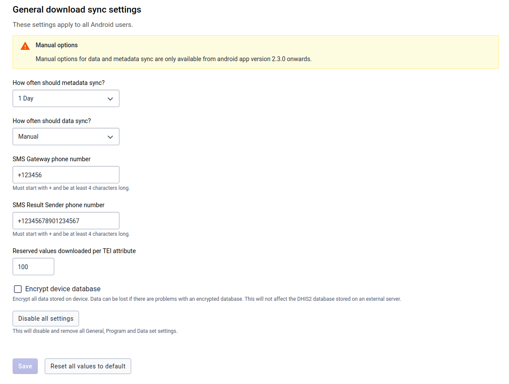

**Matomo configuration:** If you already have a Matomo instance, add the Matomo URL and the project ID.

**Mobile configuration:** This section allows admin users to edit the SMS gateway ad result sender phone number.

**Reserved values:** This will specify the number of values per TEI attribute reserved to download in the devices.

**Encrypt device database:** 

> **Warning**
>
> This is a critical action and will affect the local database of all android devices synchronizing with the server (it won't affect the server DHIS2 database).
>
> By default, the android app database is not encrypted, but an admin can check the *Encrypt device database* to encrypt the metadata and data stored in every device. Encrypting the database will have an impact on the database volume and performance of the android app. Note that at the moment of selecting or unselecting this option, no data is lost (even if it hasn't been previously synchronized with the server)

**Disable all settings:** By clicking this button, the user will remove all android configuration settings. No configuration will be applied to the Android Capture app (if this is the case, the sync parameters applied are the ones defined in the Android Capture app).

## Synchronization { #capture_app_andoid_settings_webapp_synchronization }

It offers additional parameters to control metadata/data synchronization.

### Global { #capture_app_andoid_settings_webapp_synchronization_global }

**Metadata sync:** Admin users can choose how often the metadata will sync. e.g. Sync metadata every 24 hours.

**Data sync:** Admin users can choose how often the data will sync. e.g. Syncing data every 6 hours.

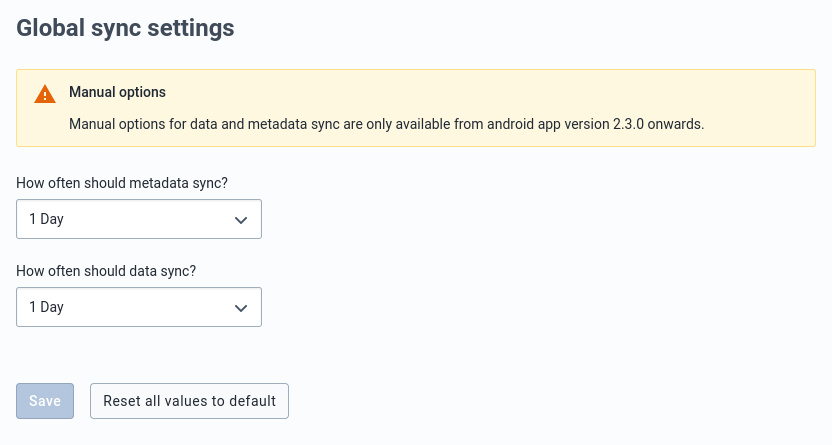

### Program { #capture_app_andoid_settings_webapp_synchronization_program }

This section controls the program data synchronization parameters. It has a section to define global or default parameters to be used in the synchronization of all programs.

#### Global settings { #capture_app_andoid_settings_webapp_synchronization_program_global }

Global settings apply to all programs that an android user has access to.

**TEI to download:** Maximum number of TEIs to download from the server.

**TEI download period:** It downloads the TEIs that have been updated within a period. e.g. TEIs that have been updated within last month

**Event to download:** Maximum number of Events to download.

**Event download period:** It downloads Events which event date belongs to a specific period.

#### Specific settings { #capture_app_andoid_settings_webapp_synchronization_program_specific }

This section allows the admin users to specify the behaviour of a particular program/s when syncing the data. The specific configuration overwrites the general settings for the programs listed in this section. To add a setting for a specific program:
 
- Click on *Add a Program-specific setting*, a Dialog will appear. 
- Bellow "Values per Program" title, click and find a list of programs.
- Clicking on a program will show the different parameters to configure. The number of parameters depends on the program type (with or without registration).

**Settings for Program Without Registration**

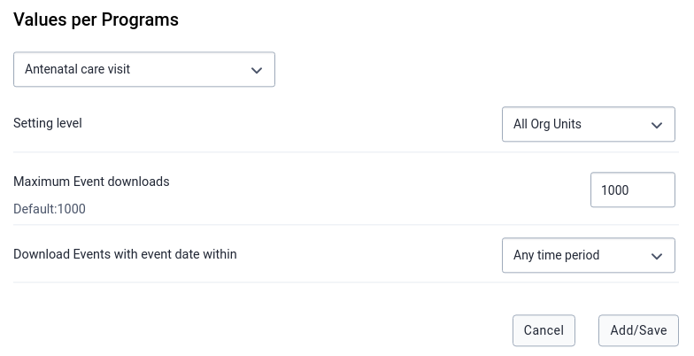

**Settings for a Program With Registration**

In the case that any specific settings has been saved, a table will show a summary with the specific configuration per program, and the options to edit or delete these settings.

> **Caution**
>
> Using specific settings per program might have unexpected results in the number of TEIs downloaded and the total amount might exceed the one defined in the Global Settings. This is due to how the appliation download the TEIs from the server. The Android client will first download a max number of TEIs from the server based on the Organistation Units where the user has access and based on the lastUpdate field. Afterwards it will download a max munumber of TEIs from the specific programs. Therefore, if the TEIs downloaded from the Global setting (500 in the example above) have been updated more recently than any of the TEIs from a specific program (500 for Malaria case diagnosis, treatment and investigation) the Android client will end up downloading 1000 TEI.
> 
> This might look confusing at first, but once understood can be used to ensure a minium (and maximum) number of TEIs for a specific program will be downloaded which can be very useful in specific implementations.
>
> Imagine an implementation where it must be ensured that the Android user has all the TEIs of a specific program in a server where the same user has access to other Organisation Units where other TEIs might be enrolled in another program. The program is called Community Care and it has 17 TEIs which have been updated very long time ago. The administrator can ensure that the 17 TEIs will be donwloaded by setting anything in Global Settings (if needed to reduce bandwidth a very low value should be set) and a at least 17 for the specific program as show in the image below:
>
> 
>
> When the initial synchronization is triggered the Android device will first download the last TEIs updated on the server (which according to our example do not belong to the specific program) and secondly up to 20 TEI from the specific program resulting in the following (notice all the TEIs for the program were downloaded):
>
> 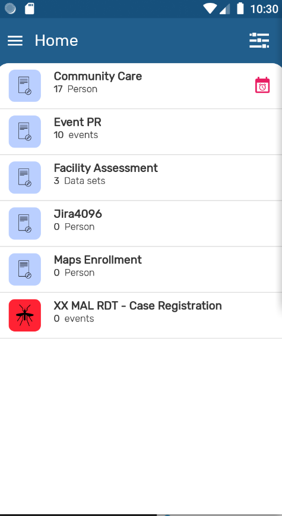
>
> And by going to the settings it can be appreciated how the total number of TEIs is the expected 37, 20 from the Global Setting, and 17 from the program specific.
>
> 
>

#### Reset all values { #capture_app_andoid_settings_webapp_synchronization_program_reset_all }

By clicking on *Reset all values*, the admin user will restore the default settings values of the program section. Please note that in this case it means no specific settings per program. 

To save any configuration, the admin user needs to click on the *Save* button (this button is disabled for the users who don't have the 'ALL' authority)

### Data set { #capture_app_andoid_settings_webapp_synchronization_data }

This section controls the aggregated data synchronization parameters.

#### Global settings { #capture_app_andoid_settings_webapp_synchronization_data_global }

The first part is for global settings that apply to all data sets an android user has access to. 

**Number of Periods:** Maximum number of periods to download.

#### Specific Settings { #capture_app_andoid_settings_webapp_synchronization_data_specific }

To add a specific setting:

 - Click on *Add a Data set specific setting*, a dialog with a list of data sets will appear.
 - Click on a data set, and this field will be autocompleted with the default value based on the dataset period type.

### User Sync Test { #capture_app_andoid_settings_webapp_synchronization_user_sync_test }

This section checks the amount of data and metadata a user would sync to his/her device. You can run this test on any user that you have access to. This test shows up the number of organisation units, data sets, program rules, programs, etc., that an android user has access to (so the resources that the android app will download), and the metadata and data download size (approx estimation). Please note that a user doesn't need to have the 'ALL' authority to run this test.

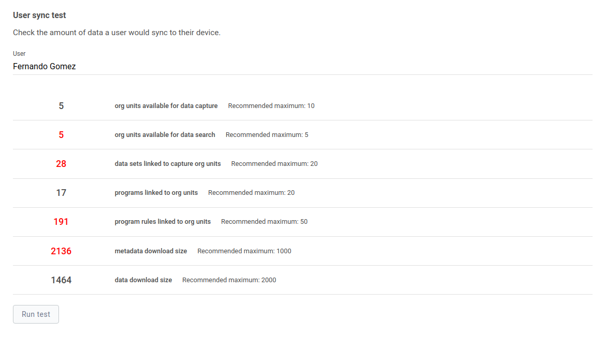

> **Note:** 
>
> The values that are highlighted in red are because the value is considered greater than the maximum recommended value.

## Appearance { #capture_app_andoid_settings_webapp_appearance }

These settings give control over the appearance of the data entry and list forms.

- Filter: it defines the filters that can be enabled in the different app menus.
- Completion spinner: it turns on/off the completion spinner that shows the progress in the data entry form.

These settings refer to visual components, so they must be consumed by the app.

### Home screen { #capture_app_andoid_settings_webapp_appearance_home_screen }

It allows the admin user to enable or disable the option to show the filters related to Date, Organisation Unit, Sync Status, and Assigned to me on the Home screen.

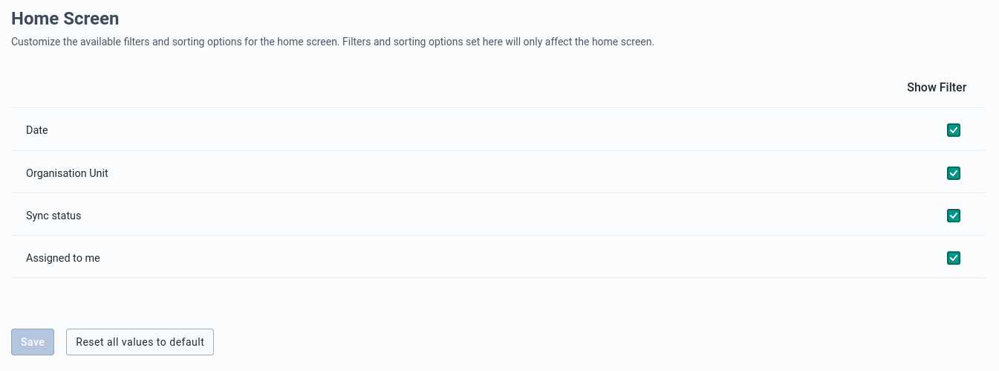

### Program { #capture_app_andoid_settings_webapp_appearance_program }

It allows the admin user to specify which filters should be shown and enable or disable the option to show the completion percentage of the data entry form.

#### Global settings { #capture_app_andoid_settings_webapp_appearance_program_global }

Global settings apply to all programs that an android user has access to.

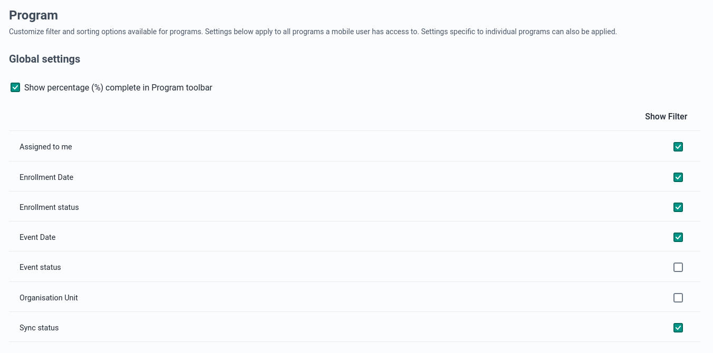

#### Specific settings { #capture_app_andoid_settings_webapp_appearance_program_specific }

This section allows to admin user to customize the filter and percentage completion appearance option. To add a specific setting:

- Click on *Add a Program Settings*, and a dialog will appear.
- Click on the dropdown that will show a list of programs.
- Clicking on a program will show the different filters to configure. The category combo filter depends on the category combo name.

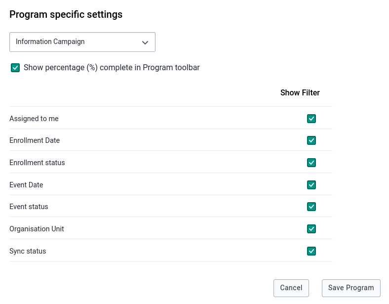

If any specific settings have been saved, a table will summarize the particular configuration per program, and the options to edit or delete these settings.

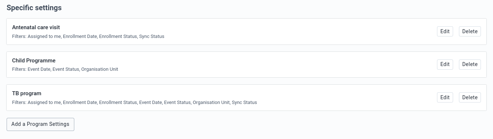

### Data set { #capture_app_andoid_settings_webapp_appearance_data }

It allows admins to enable/disable filters for the data set section

#### Global settings { #capture_app_andoid_settings_webapp_appearance_data_global }

The first part is for global settings that apply to all data sets an android user has access to.

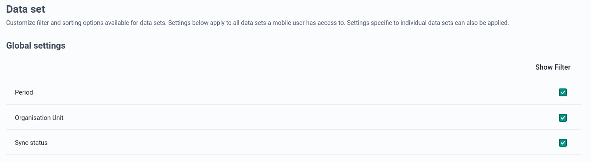

#### Specific settings { #capture_app_andoid_settings_webapp_appearance_data_specific }

To add a specific setting:

- Click on *Add a Data set Settings*. A dialog box will pop up with a dropdown with a list of data sets.
- Click on a data set, and a list of options to enable or disable filters will be displayed.

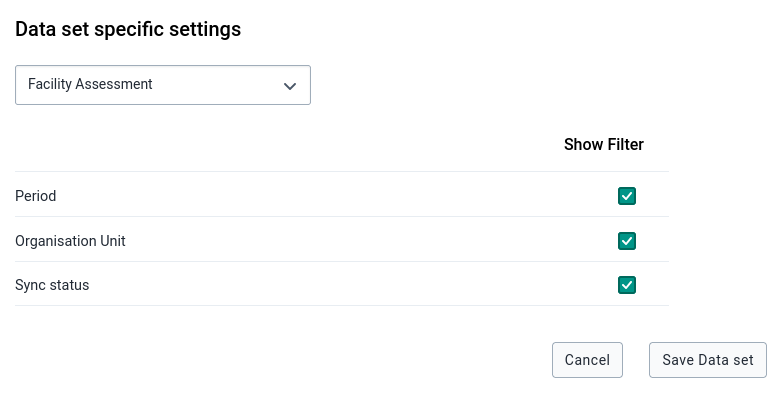

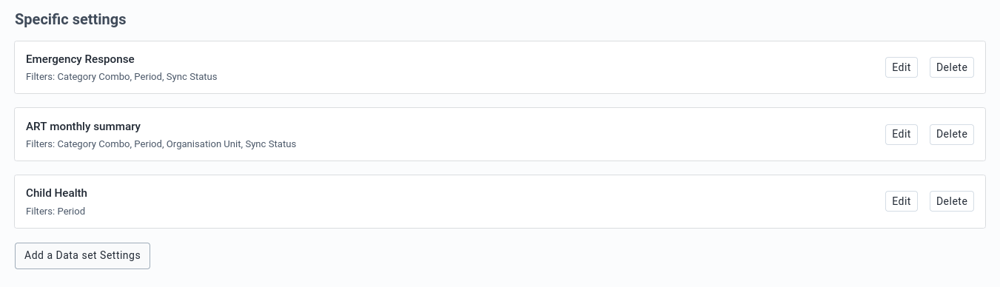

## Analytics { #capture_app_andoid_settings_webapp_analytics }

Analytics settings define the TEI analytics items (charts, tables) that will be displayed to the user. The scope of the analysis is the TEI, so the visualizations will be displayed in the TEI dashboard of the android app.

Any item defined in the settings app will overwrite the default behaviour of the android app, only showing the items defined in the settings app. The purpose of this section is to define visualizations to show evolution of dataelements and program indicators over time. Based on that, it will only take into cosideration dataelements that belongs to a repeatable program stage, or programindicators which formula contains at least one dataelement that belongs to a repeatable program stage.

To create a **TEI Analytics** item:

- Click on *Add TEI Analytics*. A dialog box will pop up with a small form.
- Choose a program and a repeatable program stage, and fill the form. The **Short name** is the only optional field.
- If an item visualization other than WHO Nutrition has been chosen, the next fields to select are the period type (monthly, weekly, daily), an element type (Program Indicator, Data Element), and an element that will be based on the element type previously selected. Remember that these elements are related to the program and repeatable program stage chosen at the beginning.

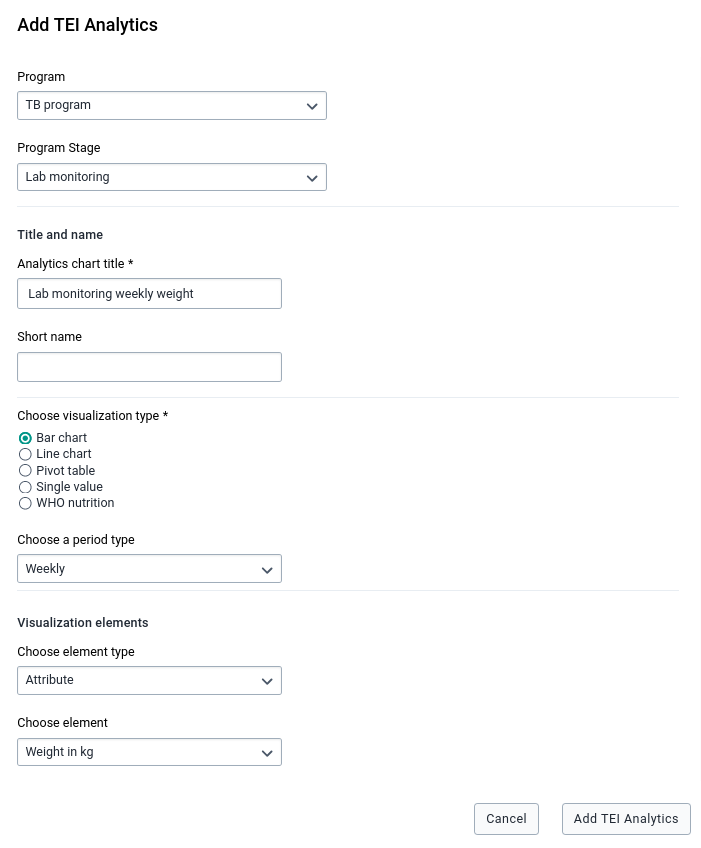

To create a **WHO Nutrition Analytics** item:

- Select a program, a program stage, and WHO nutrition as visualization type.
- Choose a WHO visualization type that can be Height for Age (HFA), Weight for Age (WFA) or Weight for Height (WFH).
- Select the trackedentityattribute that represents the gender. You have then to specify the option for Male 'Male title' and the option for Female 'Female title'. Normally they will be option codes.
- Choose the dataelement/programindicator that will be displayed in the Horizontal (x) axis
- Choose the dataelement/programindicator that will be displayed in the Vertical (y) axis

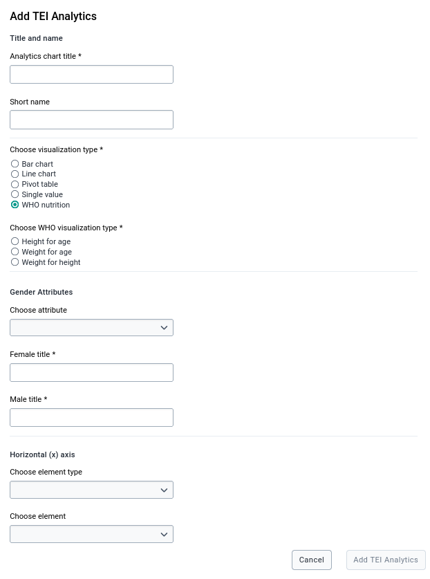

If any TEI Analytics item has been created, a table will show the item's title and program name, and action buttons to delete or edit that item.

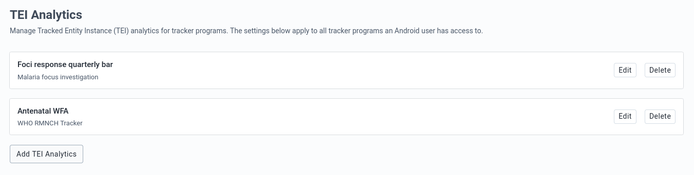

## Installation { #capture_app_andoid_settings_webapp_installation }

A user can easily install the Android Settings Web App by logging into the DHIS2 and going to **App Management**.

- Click on **App Store**
- Go to *Android Settings App*
- Click on *Install V2.0.0*

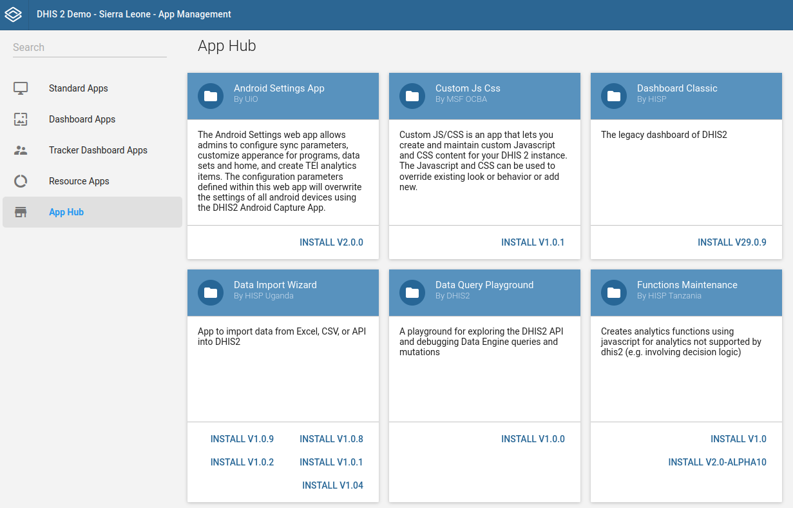

## Log in and first time setup { #capture_app_andoid_settings_webapp_login }

After a user installs and launches the Android Settings Web App for the first time, the web app will require setting and saving the default values of the configuration. This will apply default settings to all android devices connected to the instance.

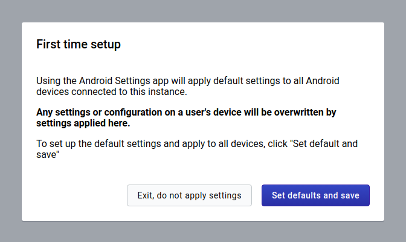

> **Warning**
>
> Be aware that previous versions are deprecated, so you will start with a new default configuration.

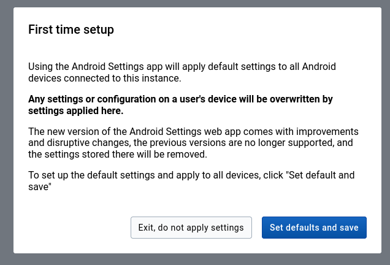

> **Warning** 
>
> Only users will 'ALL' authority are able to *save or update* the configuration, but any user will have view access once it's created.

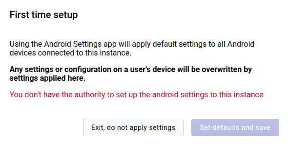

## Enter and save configuration parameters { #capture_app_andoid_settings_webapp_enter_and_save }

### Datastore { #capture_app_andoid_settings_webapp_datastore }

Internally all settings are stored in [Datastore](https://docs.dhis2.org/master/en/developer/html/webapi_data_store.html) in JSON format.

Datastore structure:

| Item        | Description | Data type |
| ----------- | ----------- | --------- |
| Namespace   | Namespace for organization of entries | String |
| Key         | Key for identification of values | String |
| Value       | Value holding the information for the entry | JSON |

### Save configuration parameters { #capture_app_andoid_settings_webapp_save_config }

At the form footer of all settings sections, admin users can find a *Save* button.

Only when an admin user clicks on this button, all changes made on the current section are saved on the Datastore. These changes will apply to the Android Capture Apps when they synchronize their configuration.
 
**Unsaved changes:** 
 
In case an admin user wants to go to another section when there are still some unsaved changes, an alert will be displayed before navigating away from the current section. In case the user accepts leaving the page, the unsaved changes will be lost.

 
#### Reset all values to default { #capture_app_andoid_settings_webapp_reset_all }

An admin user can restore the settings at any time. There is a *Reset all values to default* button at the form footer of all settings sections. 

The default values will be only restored on Datastore and applied after clicking on *Save*. 
