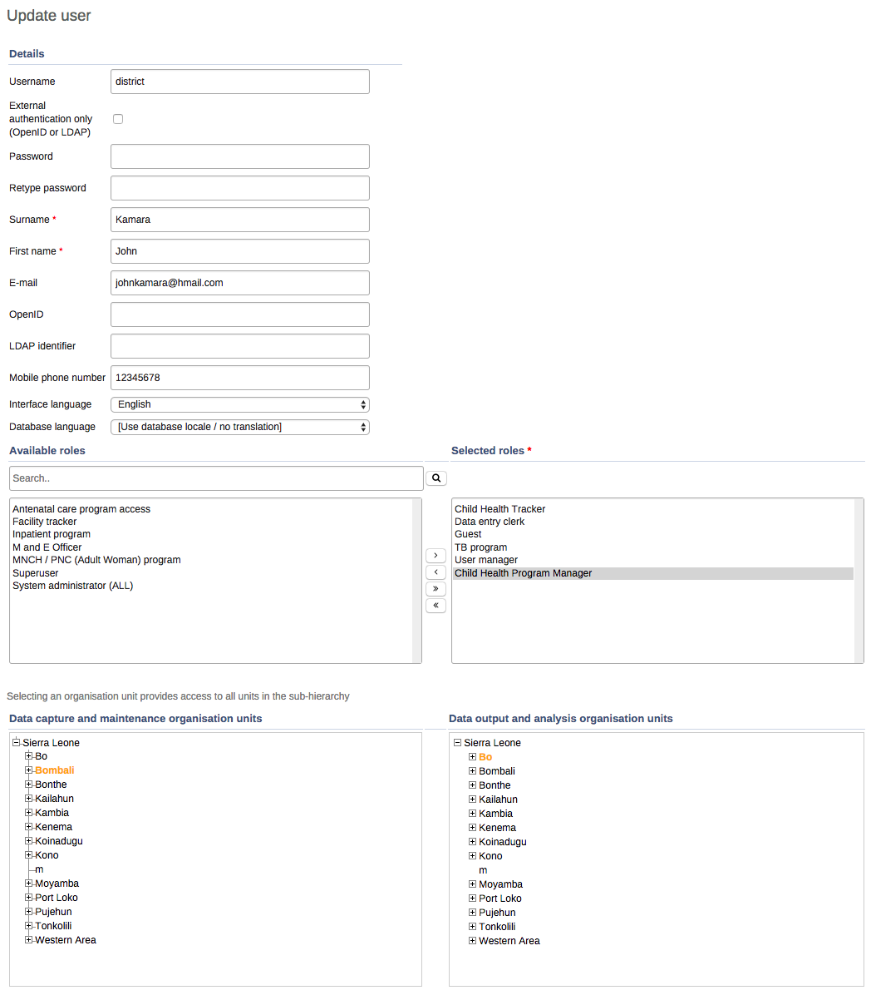
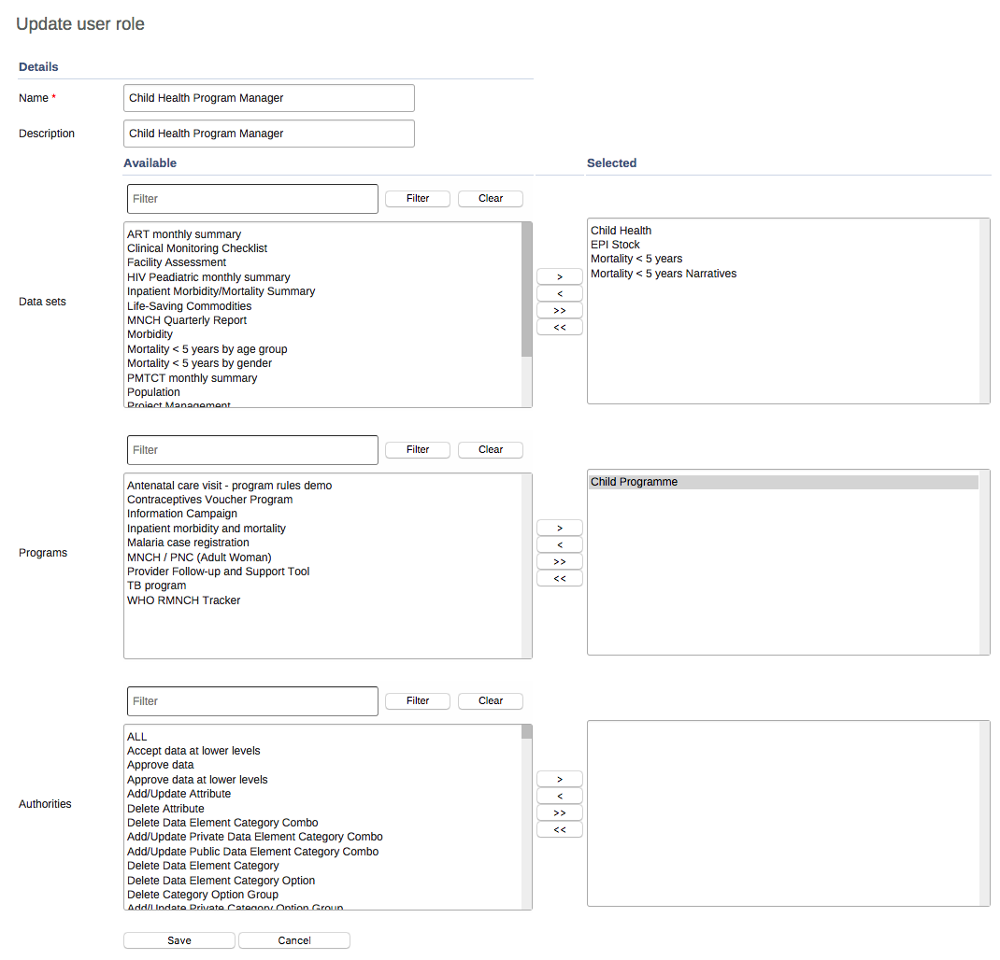
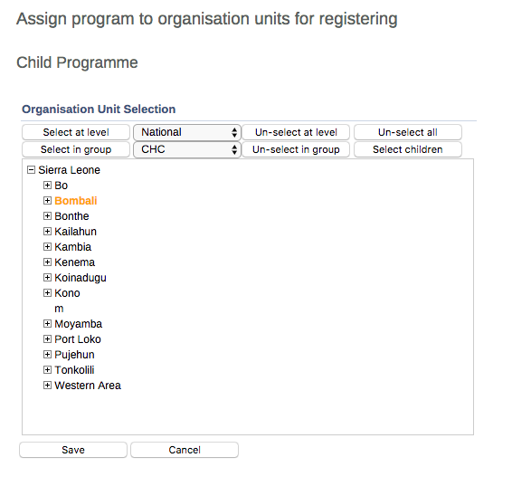
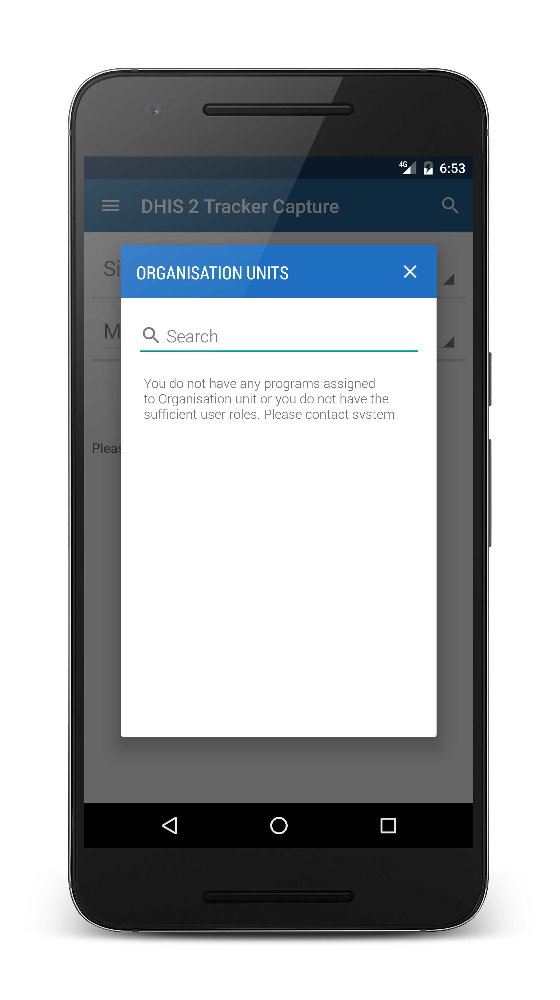

# Configure DHIS2 programs to work on Android apps

<!--DHIS2-SECTION-ID:android_config_program-->

To use event programs and tracker programs on the Android **Event
Capture** and **Tracker Capture** apps, you must configure both the
programs and the users' profiles on your DHIS2 web instance. You do this
in the **Users** and **Program** web apps.

> **Note**
> 
>   - To work on an Android device you must assign the same **Data
>     capture and maintenance organisation units** as the organisation
>     units you've assigned the program to.
> 
>   - In the Android apps you want to save as much data as possible.
>     Therefore, the user can only download and capture data against the
>     **Data capture and maintenance organisation units**. You configure
>     these organisation units in the **Users** app.
> 
>   - If you select the top organisation unit as the **Data capture and
>     maintenance organisation units**, the user can only download and
>     capture data on the top organisation unit.
> 
>   - To give the user access to download and capture data on all
>     organisation units, you must assign all organisation units as
>     **Data capture and maintenance organisation units**.

1.  In the **Users** app, create a new or update an existing user with
    the following settings:
    
      - **Available roles**: Assign a user role that allow the user to
        access programs.
    
      - **Data capture and maintenance organisation units**: Select the
        organisation units that are relevant for your program.
        
        The **Data capture and maintenance organisation units** control
        for which organisation units the user can do data entry. You
        must assign at least one data capture and maintenance
        organisation unit to each user.
    
    
    

2.  In the **Users** app, assign programs to the user role you selected
    in the previous
    step.
    
    
    

3.  In the **Program** app, assign your programs to the same
    organisation units as the **Data capture and maintenance
    organisation units** you selected in the **Users**
    app.
    
    
    

4.  Open the relevant Android app and log in with the user you created.

5.  Pull down to synch with the DHIS2 web instance.
    
    The app downloads all programs and organisation units the user has
    access to.

> **Note**
> 
> 
> 
> 
>   - Error message: "You don't have any programs assigned to the
>     organisation unit"
> 
>   - Solution: In the **Program** app, assign programs to the relevant
>     organisation units.

See also:

[Manage
programs](https://ci.dhis2.org/docs/master/en/user/html/manage_tracker_programs.html)

[Manage users, user roles and user
groups](https://ci.dhis2.org/docs/master/en/user/html/mgt_user_role_group.html)

