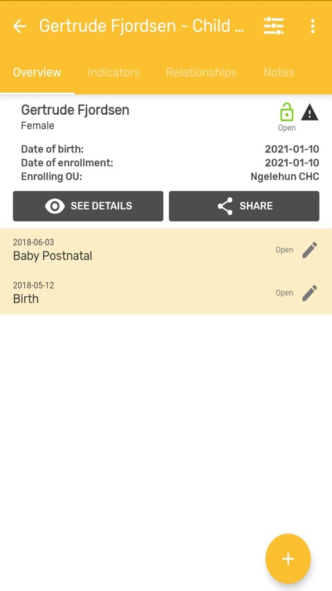
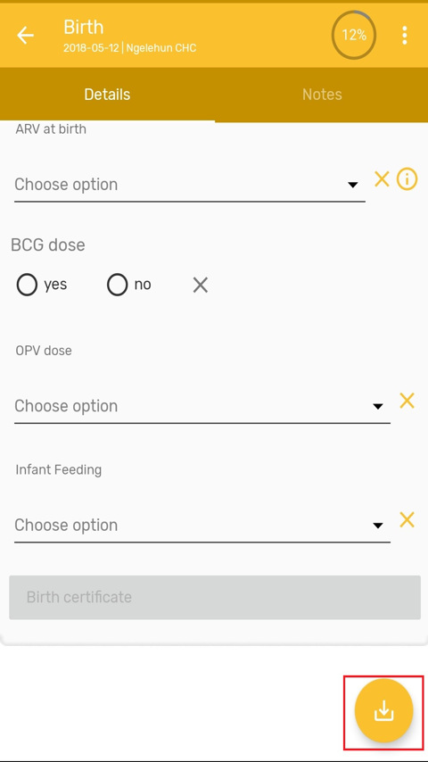
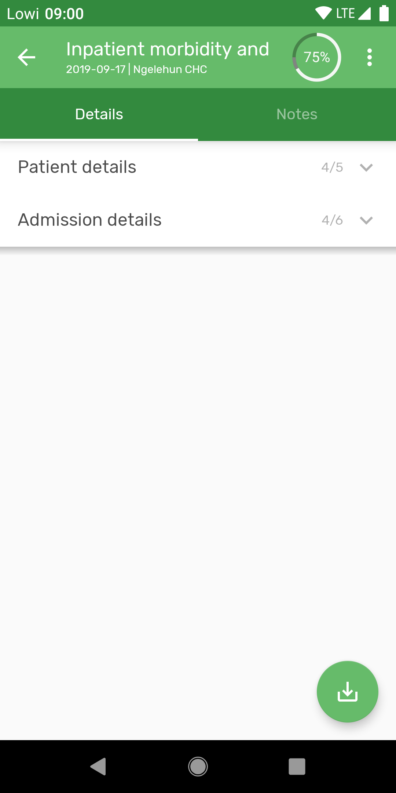
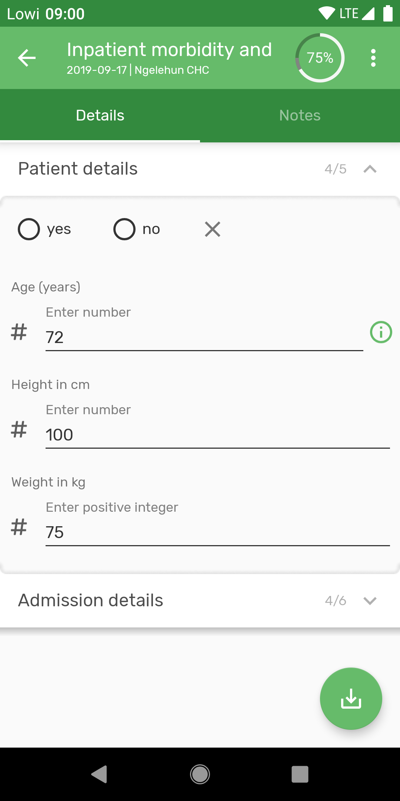
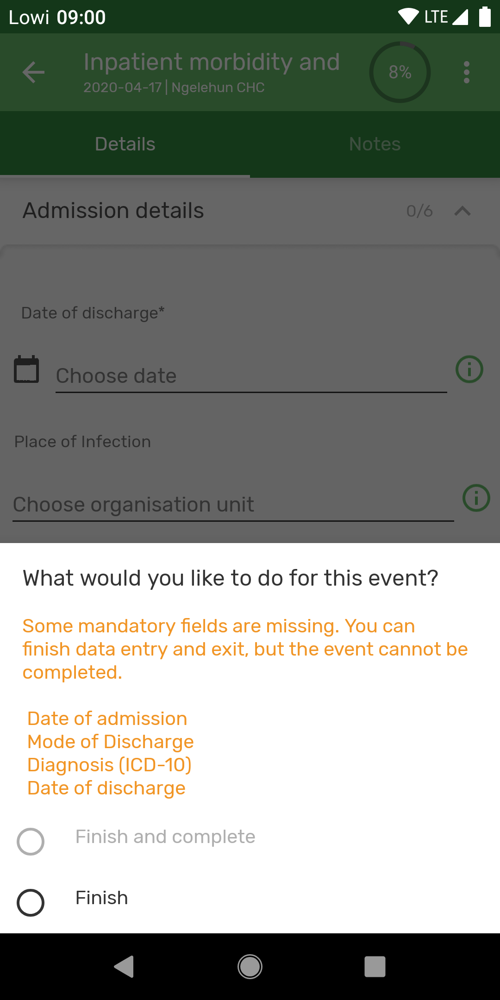
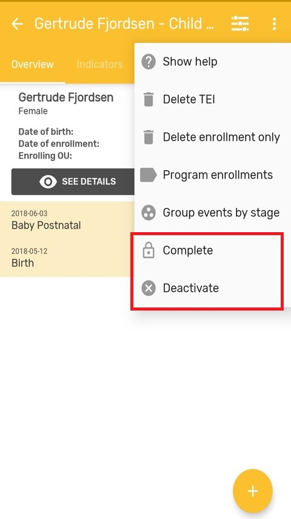
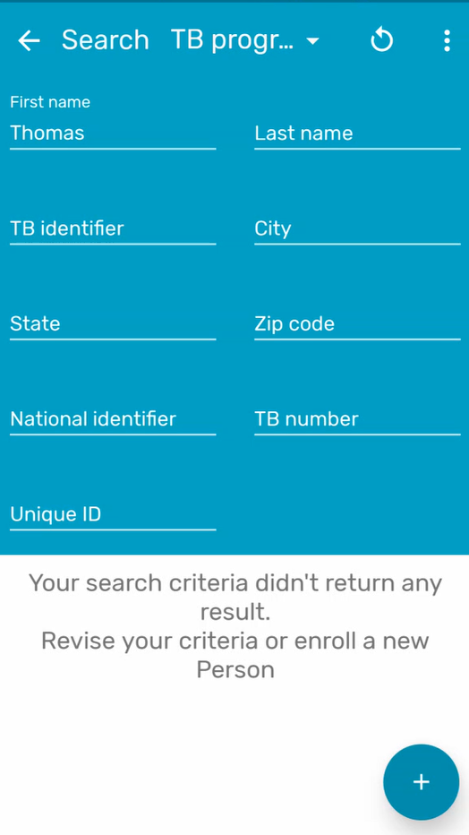
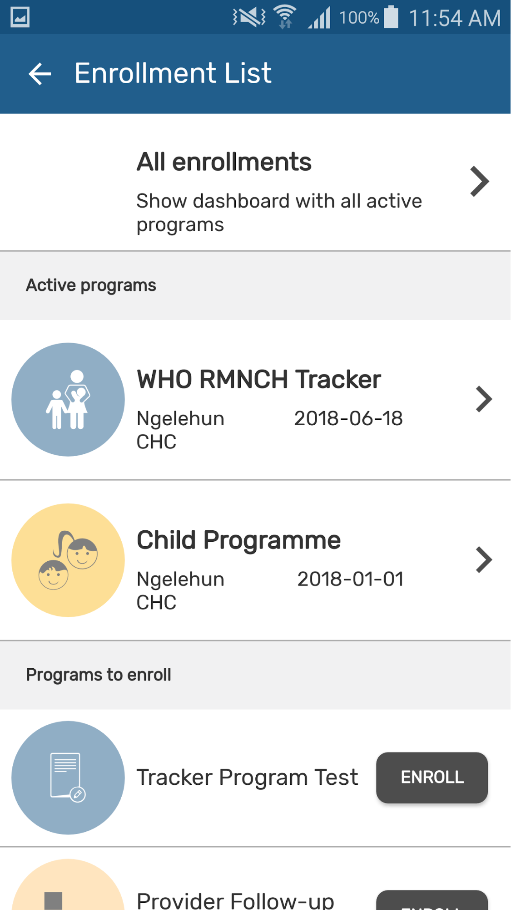
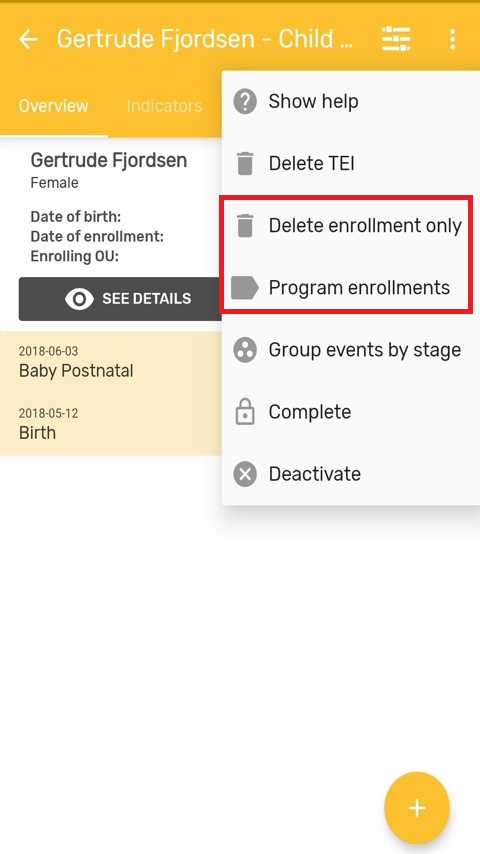
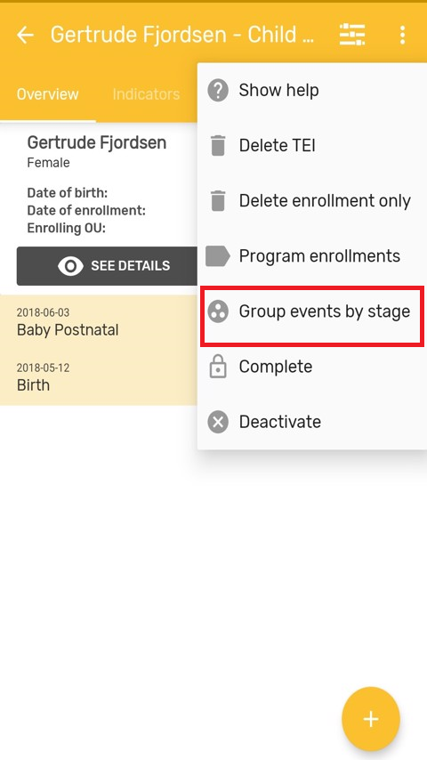

# Programs

<!-- DHIS2-SECTION-ID:programs -->

## Programs in Android

<!-- DHIS2-SECTION-ID:programs_android -->

### Complete/Re-open event

<!-- DHIS2-SECTION-ID:programs_android_complete -->

User must enter the event and then click the complete icon in the bottom right corner.

{ width=25%}
{ width=25%}

Two options will be presented:

1. Finish and Complete
2. Finish

{ width=25%}

> **Note**
>
> To verify if an event is completed look at the color of the box, it must be grey; and also have the label 'Event Completed' on it. It applies the same legend set than the web UI.

> **Note**
>
> The app needs to take into consideration if the user has the correct authority (‘Uncomplete events’) to reopen a completed event.

### Field completion percentage

<!-- DHIS2-SECTION-ID:programs_android_percentage -->

The percentage of data completed in each event is shown in the top right corner of an event when it is opened after first registration.

{ width=25%}

> **Note**
>

### Sections Navigation

<!-- DHIS2-SECTION-ID:programs_android_sections -->

The display for sections has been redesigned for a more simple user experience. In addition, the sections in enrollment form are now supported and are aligned with the design of the event sections.

{ width=25%}
{ width=25%}

### Error messages

<!-- DHIS2-SECTION-ID:programs_android_error -->

The app will now list the name of the mandatory fields missing when the user tries to complete an event or enrollment. The sections containing the missing fields will be highlighted to help the user find the missing fields.

{ width=25%}

### Event Notes

<!-- DHIS2-SECTION-ID:programs_android_notes -->

It is possible to add notes to events in single event programs and program stage events. Notes are available in a new tab at the data entry form.

{ width=25%}
{ width=25%}

## Program with registration in Android

<!-- DHIS2-SECTION-ID:programs_registration -->

### Complete/Deactivate Enrollment

<!-- DHIS2-SECTION-ID:programs_registration_complete -->

To complete or deactivate an enrollment, click on three dot menu in the right upper corner and select "Complete" or "Deactivate".

{ width=25%}

### Reset Search Fields

<!-- DHIS2-SECTION-ID:programs_registration_reset -->

All tracker programs will take the user to the search screen. The search fields are used to look up for a specific entity, and the circled arrow at the top right corner to reset the search. All fields will be blank for the user to do a new search.

At first, the user is obligated to do a search. if there are no coincidences, the search button will change to an ‘Add’ button for the user to create a new enrollment.

{ width=25%}
{ width=25%}

### Search screen for all Tracked Entity Type

<!-- DHIS2-SECTION-ID:programs_registration_search -->

User is able to search across all program of one tracked entity type (TET). In the Search screen there is a drop down which shows all the programs available for the active TET (active TET is defined by the selection of the program in the home screen). That drop down should also have an option with TET name. (for example: person)

When the user selects that option, the search fields available will only be the TET attributes (no program specific attributes).
Search restrictions do not apply, because they belong to the programs.

{ width=25%}
{ width=25%}

The search will return the found TEI's in the local database and also those in the Search OU of the user (when user is online). For those found online, the user will have to select them and the whole record will be downloaded.

> **Note**
>
>  When configuring search org. units, make sure that your capture org. units are contained in your search org. units, to do that capture org. units have to be selected as well as search org. units.

### TEI Dashboard across programs

<!-- DHIS2-SECTION-ID:programs_registration_tei_dashboard -->

User can see the TEI dashboard without any program by selecting the TEI in the list if the search was without program.

The dashboards will show the list of active enrollments.

{ width=25%}
{ width=25%}

### TEI enrollment history and new enrollment

<!-- DHIS2-SECTION-ID:programs_registration_tei_enrollment -->

User is able to see the complete historical record of the TEI. Clicking on the top right corner menu, select "Program Enrollments" and a list of Active enrollments will be displayed, followed by a list of past enrollments (completed or cancelled), followed by the programs in which the TEI could be enrolled.
User can also return to the 'TEI Dashboard without any program' by selecting 'All enrollments'.

Users should be able to navigate to the different enrollments from the list.

{ width=25%}
{ width=25%}

### Delete TEI's & Enrollments

<!-- DHIS2-SECTION-ID:programs_registration_tei_delete -->

To delete a TEI or an enrollment, select In the TEI dashboard, the three dots menu.

Local TEI or Enrollment will be deleted from the database. Records that has been previously synced with the server will be marked for deletion if the user has the authority:

F_ENROLLMENT_CASCADE_DELETE 
F_TEI_CASCADE_DELETE

They will show in the TEI search list, but will not be accessible.

{ width=25%}

### Group view of Program stages in TEI Dashboard

<!-- DHIS2-SECTION-ID:programs_registration_tei_group -->

The TEI Dashboard offers now the possibility to change the list of events from the chronological view to a stage grouping view. The stage grouping view will group and collapse the events per program stage. Each program stage group can be expanded by the user and the events will be displayed chronologically.

{ width=25%}
{ width=25%}

## Supported features Overview

<!-- DHIS2-SECTION-ID:programs_supported -->

The following is a comprehensive list of all features available for Programs with and without registration in DHIS2, and notes on whether or not these have been implemented in the Android Capture app.

In the notes, ‘admin’ refers to someone who develops and configures a DHIS2 system, and ‘user’ refers to someone who uses apps to capture data, update it, and review reports.

|Legend|Description|
|:--:|:------|
||Feature implemented|
||Feature not implemented&nbsp;(will be ignored)|
||Not applicable|
||Work in progress. Feature not completely implemented yet or with unexpected behaviour already reported.|

### Program

<!-- DHIS2-SECTION-ID:programs_supported_program -->

|Feature|Description of feature|Program with registration|Program without registration|Notes on implementation|
|-|---|:-:|:-:|---|
|Data entry method for option sets|Enables an admin to choose how options will be displayed on-screen across the entire program (ie either as drop-down lists or as radio buttons)|||This will be replaced by the new rendering options.|
|Combination of categories (Attribute CatCombo)|Allows an admin to attach a Category (set of Options) to the Program, requiring users to categorize each enrolment. (This is called an Attribute Category Combination in DHIS 2.)||||
|Data approval workflow|If an admin selects a pre-configured Data Approval Workflow, this will be used to enforce an &lsquo;approval&rsquo; or &lsquo;acceptance and approval&rsquo; cascade, enabling users to sign-off and lock data.||||
|Display front page list|If this option is ticked, the landing page displays a list of active enrolments once an Org Unit and Program have been chosen. (Attributes shown are those ticked as &lsquo;display in list&rsquo;.)||||
|First stage appears on registration page|When this option is chosen, then during Program enrolment, the screen for the first Program Stage is also shown (enrolment and the first event are captured together on one screen).||| In Android, this is implemented by opening automatically the event after enrollment is completed, instead of adding the form to the same screen.|
|Completed events expiry days|Enables admins to lock data-entry a certain number of days after an event has been completed.||||
|Expiry period type + expiry days|Enables admins to set a period (eg weekly, monthly), and to lock data-entry a certain number of days after the end of the period.||||
|Allow future enrolment dates|If ticked, this enables a user to enter future Enrolment dates during enrolment in a Program; otherwise users are restricted to today or past dates.||||
|Allow future incident dates|If ticked, this enables a user to enter future Incident dates during enrolment in a Program; otherwise users are restricted to today or past dates.||||
|Only enrol once (per tracked entity instance lifetime)|If ticked, prevents a TEI (eg person) from being enrolled in this Program more than once.||||
|Show incident date|If ticked, both Enrolment and Incident dates are shown to the user for data capture; otherwise, only the Enrolment date is shown/captured.||||
|Description of incident date|Allows an admin to customize the label that is used for the incident date.||||
|Description of enrolment date|Allows an admin to customize the label that is used for the enrollment date.||||
|Capture coordinates (enrolment)|Enables users to capture geographical coordinates during enrolment in the program.||||
|Capture Polygon (enrolment) |Enables users to capture locations (enclosed areas) during enrolment in the program.||||
|TEI Coordinates |Enables users to capture geographical coordinates for the TEI during the enrolment in the program.||||
|Relationships: create and update|Enables users to create and update relationships.||||
|Relationships - shortcut link to add a relative|This enables admins to add a link for one specific relationship to the Dashboard, enabling users to directly create a linked TEI (eg "child" patient).||||
|Attributes: display in list|This setting determines whether an Attribute can be viewed in lists such as search results, and whether it can be seen in the shortlist of Attributes shown under "Profile" in the Dashboard.|||The first three attributes will be shown||
|Attributes: mandatory|This enables an admin to mark an Attribute as "mandatory";, meaning the enrolment can&rsquo;t be saved until a value is captured.||||
|Attributes:  date in future|For date Attributes, this enables an admin to either prevent or allow future dates to be captured.||||
|Registration form - default|The default data entry form simply lists all attributes defined for the TEI.||||
|Registration form - custom|This enables an admin to define a custom layout (using HTML) for the registration form.|-||Custom layouts are not supported in the Android App||
|Program notifications|You can set up automated notifications for when program enrolments or completions occur, or at a set interval before/after incident or enrolment dates. These can be sent as internal DHIS 2 messages, emails or SMSs.|||This functionality is executed on the server side, once data is received. Will not work when the app is working offline.||
|Activate/deactivate enrolment|Deactivating a TEI dashboard will cause the TEI to become &ldquo;read-only&rdquo;. This means you cannot enter data, enrol the TEI or edit the TEI profile.||||
|Complete allowed only if validation passes|Select check box to enforce that an event created by this program is only completed when all validation rules have passed.||||
|Org unit opening/closing dates|Enables an admin to set opening and closing dates for an Org Unit, which blocks users from adding or editing events outside of these dates.||||
|Data sharing levels/Can capture data|Enables the user to add new event, edit data and delete events in the program.||||
|Data sharing levels/Can view data|Enables the user to see list of events within the program.||||
|Data sharing levels/No access|The user will not be able to see the program||||

### Program stage

<!-- DHIS2-SECTION-ID:programs_supported_program_stage -->

|Feature|Description of feature|Program with registration|Program without registration|Notes on implementation|
|-|---|:-:|:-:|---|
|Event form - default|The default data entry form simply lists all attributes belonging to a program registration||||
|Event form - section forms|Sections forms allow you to split existing forms into segments||||
|Event form - custom|Define a custom event form as a HTML page.|||Custom layouts are not supported in the Android App.|
|Program stage notifications|You can set up automated notifications for when the program stage is completed, or at a set interval before/after scheduled event dates. These can be sent as internal DHIS 2 messages, emails or SMS messages.|||This functionality is executed on the server side, once data is received. Will not work when the app is working offline.|
|Repeatable|If Repeatable Is ticked, this stage can be repeated during one program enrollment. If t is not, then the stage can only happen once during a program enrollment.||||
|Repeatable|If Repeatable Is ticked, this stage can be repeated during one program enrollment. If t is not, then the stage can only happen once during a program enrollment.||||
|Repeatable + Standard interval days|The system will suggest the due date as the calculation of the last event + standard interval dates.||||
|Period type|Enables an admin to configure a set of periods (e.g. weeks or months) for each event in the program stage, instead of just a date. When creating events, users are then asked to choose a period (instead of a date) for each new event they create within that program stage.||||
|Auto-generate event|If ticked, a "booking" is generated for this Program Stage upon enrolment, based on the "Scheduled days from start".||||
|Generate events based on enrolment date (not incident date)|Check on it for auto-generating due dates of events from program-stages of this program based on the enrollment date. If it is not checked, the due dates are generated based on incident date.||||
|Open data entry form after enrolment + report date to use|If selected, once an enrolment is complete, an event&rsquo;s data entry form should open directly afterwards.||||
|Ask user to complete program when stage is complete| If selected, upon completing the program stage the user should be asked to complete the program. (This setting is ignored if "Ask user to create new event" is also ticked.)||||
|Ask user to create new event when stage is complete|If selected, when the Program Stage is completed the user is prompted to book.||||
|Hide due date|Only shows the actual date for events, hiding the due date.||||
|Capture coordinates (event)/Feature Type-Point|Enables the user to capture geographical coordinates when each event is created  particularly useful in devices that have GPS (eg Android), as instead of having to type in coordinates, the user can automatically populate them with the press of a button.||||
|Capture Polygon (event)/Feature Type-Polygon |Enables users to capture locations (enclosed areas) when each event is created. A Polygon must contain at least 4 points.||||
|Description of report date|Allows an admin to customize the label that is used for the event&rsquo;s date.||||
|Data elements-compulsory|This enables an admin to mark a data element as "compulsory", meaning an event can not be saved until a value is captured.||||
|Data elements-allow provided elsewhere|On the form, this places a tick-box next to the selected data element, and enables previous data to be pulled into the data element.||||
|Data elements-display in reports|Displays the value of this data element into the single event without registration data entry function.||||
|Data elements-date in future|For date Data Elements, this enables an admin to either prevent or allow future dates to be captured.||||
|Data elements-render options as radio|Enables an admin to choose how options will be displayed on-screen for each Data Element (i.e. either as drop-down list or as radio buttons).||||
|Block entry form after completed|Prevents all edits to events after they have been completed.||||
|Event comments|Enables the user to add overall comments to an event. These comments are cumulative (new comments are added below existing comments).||||

### Program with registration: Tracked entity dashboard

<!-- DHIS2-SECTION-ID:programs_supported_program_registration -->

|Feature|Description of feature|Status|Notes on implementation|
|-|---|:-:|---|
|Messaging|Enables users to send ad-hoc free-text messages to TEIs (e.g. patients) via SMS or email.|||
|Mark for follow-up (button with exclamation triangle)|Enables a user to mark a TEI (e.g. patient) as requiring follow-up.|||
|Display TEI audit history|Enables a user to see a history of all edits to Attributes for this TEI (e.g. patient).|-||
|Inline Program Indicators|If a program indicator "display in form" box is ticked, the indicator appears on the Tracker Capture dashboard, and is updated live as data capture occurs.||||
|Delete events|Enables the user to delete an event.|||
|Schedule events|In the event generation dialogue, the user should also see the option to schedule an event. The process is like creating an event, but the user will be sent back to the TEI dashboard after the event is scheduled.|||
|Referral of patients|In the event generation dialogue, the user should also see the option to refer a patient. The process is like creating/scheduling an event, but the user can change the org unit and has to specify if is a one-time or permanent referral. One time will just create the event in the specified OU.|||
|Reset search fields|User is able to clean up the search fields by pressing on the rounded arrow icon on the top right corner of the search screen.|||
|Search screen for all TE Type|User is able to search across all program of one tracked entity type (TET). In the Search screen there is a drop down which shows all the programs available for the active TET (active TET is defined by the selection of the program in the home screen). That drop down should also have an option with TET name. (Person in our server). When the user selects that option, the search fields available will only be the TET attributes (no program specific attributes). All search restrictions do not apply, because they belong to the programs.|||
|TEI Dashboard without program|User can see the TEI dashboard without any program by selecting the TEI in the list if the search was without program. The dashboards will show the TET attributes in the details card followed by a list of active enrollments.|||
|TEI enrollment history and new enrollment|User is able to see the complete historical record of the TEI. By clicking on the top right corner icon they will see a list of Active enrolments, followed by a list of past enrolments (completed or cancelled), followed by the programs in which the TEI could be enrolled. Users should be able to navigate to the different enrolments from the list.|||

### Program without registration: Single event program

<!-- DHIS2-SECTION-ID:programs_supported_program_no_registration -->

|Feature|Description of feature|Status|Notes on implementation|
|-|---|:-:|---|
|Events listing (grid)|A listing of existing events that is displayed once a program is selected.|||
|Sort and filter events in grid|Allows the user to sort listed events, or to filter events based on keywords or specific ranges of dates/numbers.||Events are sorted chronologically. The user can filter by period and organisation unit.||
|Edit events in grid|Allows the user to directly edit the data elements shown in the events listing/grid.|||
|View event audit history|Enables the user to see a history of all changes to the event&rsquo;s data elements.|||
|Show/hide columns (in event list/grid)|Enables the user to modify the data elements shown in the event listing/grid (applies to that user only).|||
|Field completion percentage|The percentage of data completed in each event is shown in the top right corner of an event when it is opened after first registration. The percentages should be adapted to the effects of the program rules in the forms.||The percentage of completion does not take into account the not-supported value types in the forms.||
|Delete events|Enables the user to delete an event.|||
