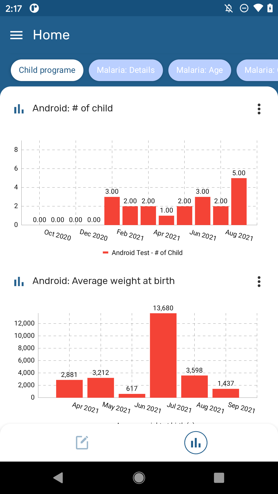
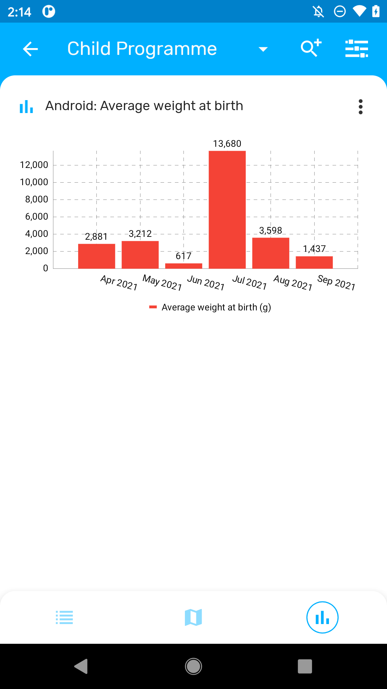
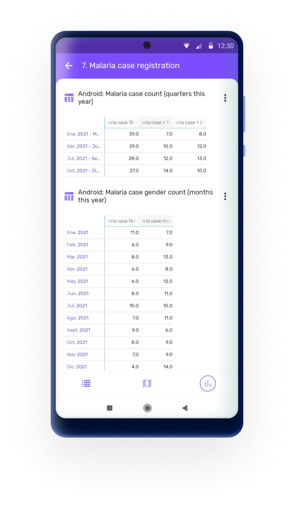
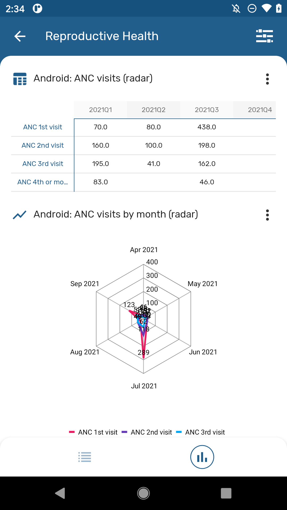
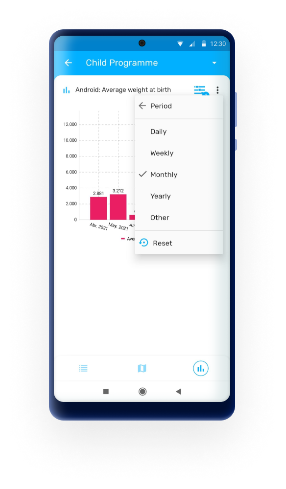
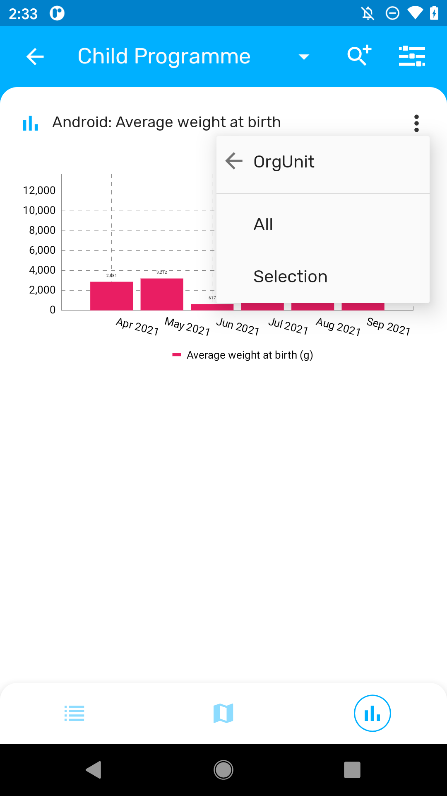
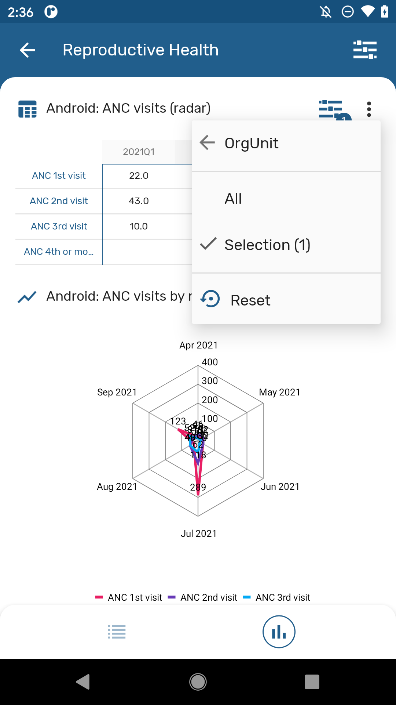
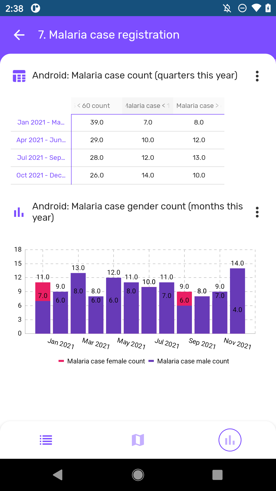

# Local Analytics { #capture_app_local_analytics }

## Local Analytics (NEW 2.5) { #capture_app_local_analytics }

The DHIS2 Android App can now render analytics that have been created in the Data Visualizer app in DHIS2. Analytics to be displayed require to be configured using the Android Settings WebApp where administrators will be able to decide the charts and tables to be displayed for end users.

To configure analytics open the Android Settings WebApp on your DHIS2 server and follow the steps below:

   1. Select Home, Program or Data set from the Analytics menu
   2. Click on the  "Add Visualization" button
   3. Search by typing the name of the visualization and select it by clicking on it
   4. Add an alternative title, otherwise, the app will display the name of the visualization

{ width=25%}
{ width=25%}

Analytics are created and configured using the web tools, however, the data aggregation happens offline using only data stored in the device.  

{ width=25%}
{ width=25%}
{ width=25%}

### Analytics Types and Filters { #capture_app_local_analytics_types }

The analytics supported in the Android App are:

   - Pivot Tables
   - Column Chart
   - Line Chart
   - Pie Chart
   - Radar chart
   - Single Value

For each visualization object, the user will be able to filter in the app by:

  * Period: Daily, Weekly, Monthly, Yearly, This Quarter, Last Quarter, Last 4 Quarters and Quarter this year.
  * OrgUnit: Select "All" to display all the org units available to the user or "Selection" to specify one or multiple org units.

{ width=25%}
{ width=25%}
{ width=25%}

A reset button will be displayed if a filter is applied. Select Reset to display the default visualization.

{ width=25%}

Users can also change The anlytics type between chart, table or single value.

{ width=25%}
{ width=25%}

### Groups { #capture_app_local_analytics_groups }

All these visualizations can be organised and displayed in groups. Groups are also configured using the Android Settings Webapp following the steps below:

   1. Open the Android Settings App
   2. Click to Add a new visualization in the Analytics Menu (Home, Program or Data set)
   3. Select a visualization
   4. Mark the "Use a group visualization" checkbox
   5. Create or select a created group
   6. Save the visualization

You can name your different groups, they will be displayed as a button in the top bar of the analytics screen.

{ width=25%}

### Limitations { #capture_app_local_analytics_limitations }

Android uses tables and charts created using the web Visualizer app, however only the configuration parameters of the object are used by the Android App: data elements, indicators, chart type, title, periods...; all the aggregations are calculated offline by the android application. The results will be based on the data stored in the device at that exact moment. 

Since the aggregations and calculations displayed are calculated in the device, the implementation of analytics is limited compared to web. In summary the compatible and suported objects and features are:

   - Well formed analytic objects (series, categories, filters)
   - User has view access
   - Limitations for Pivot Tables
      - Number of header lines: 1
      - Number of header columns: 1
   - Limitations for Charts
      - Number of Series: No limit (but remember you are rendering in a small screen)
      - Number of Categories (doesn’t apply for pie chart): No limit

There are many more restrictions which apply to Android Analytics regarding the many configuration options available in the Web Visualizer as well as the supported functions and calculations related to indicators and program indicators. [This table](https://docs.google.com/spreadsheets/d/1127cz7M0K4fux5CU0V54V2Z77NZWCr0BTrZ6jcCec4Q) summarises all supported features. 
