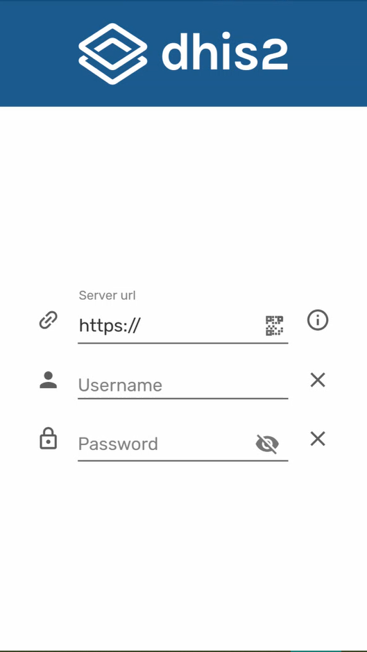
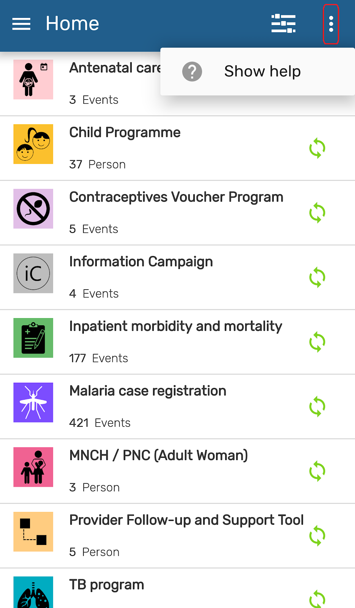
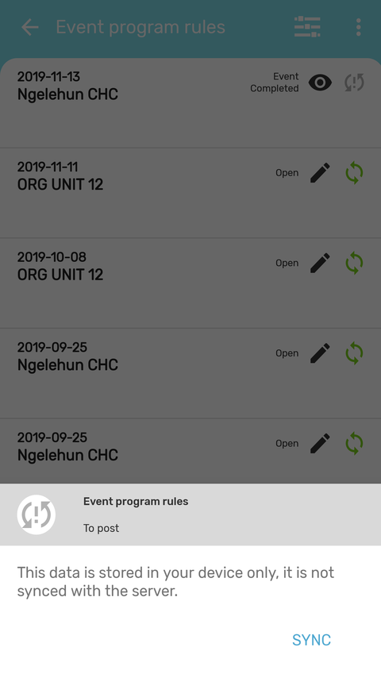
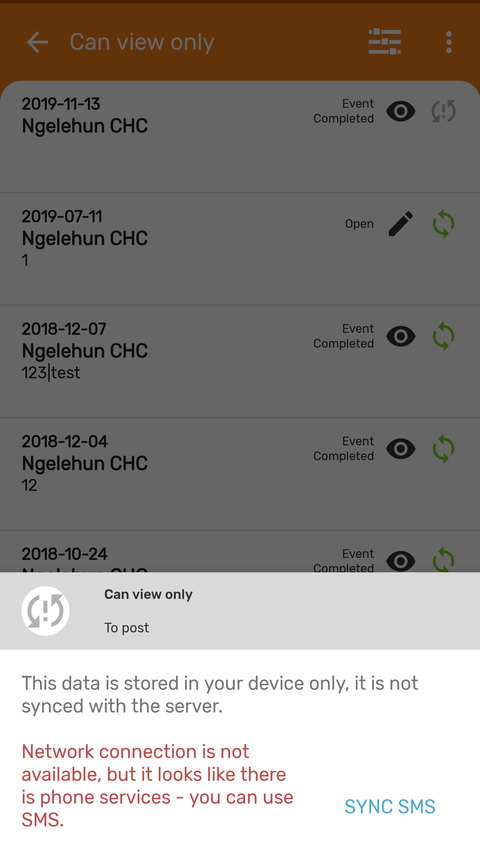
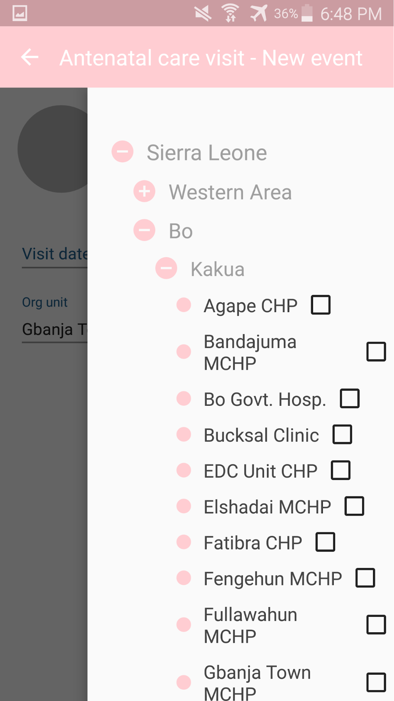
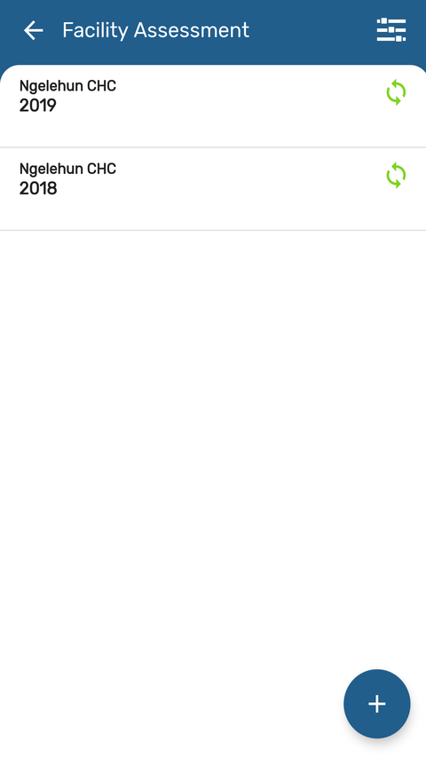
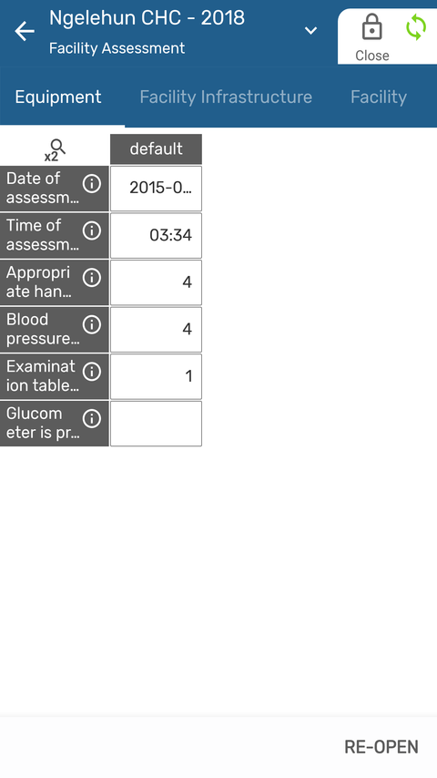
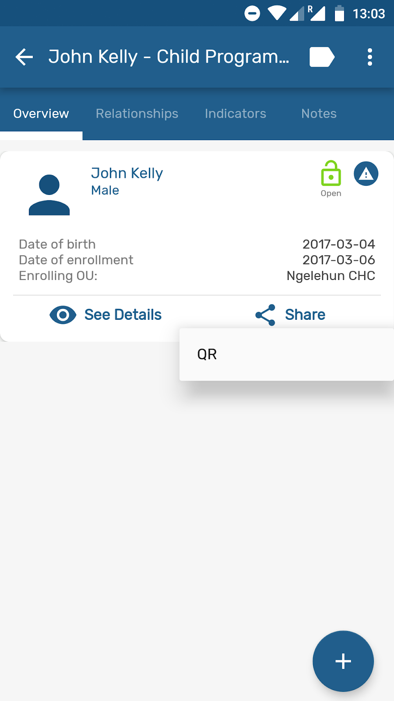
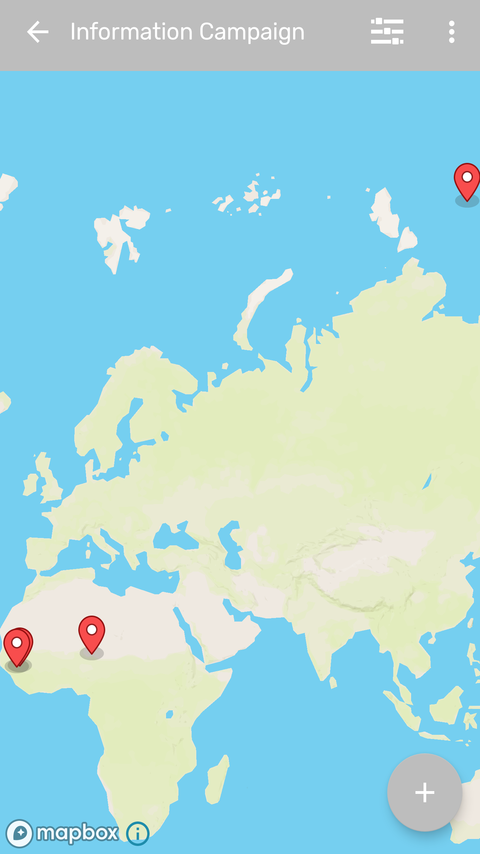
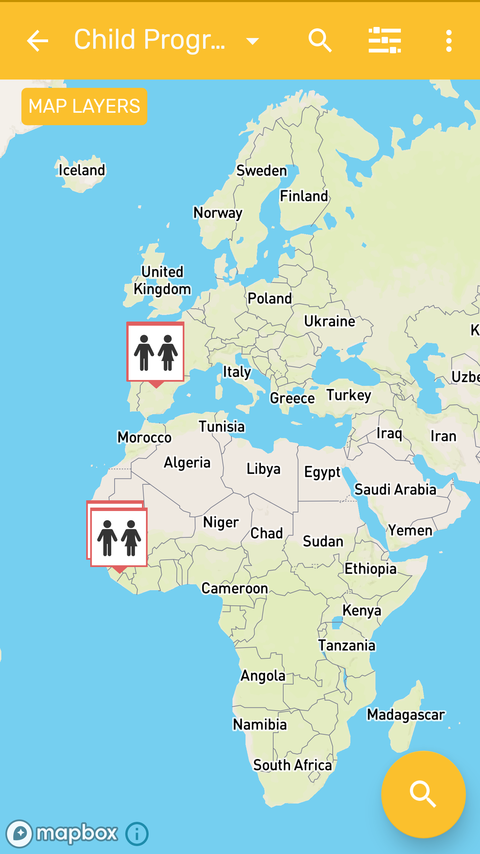

# Generic features

## Login

There are two ways to access the application:

1. Manual: The user must type the corresponding URL of the server to be used and enter the username and password.

    > **Note**
    >
    > Take note that the login only possible with 2.29, 2.30 and 2.31 servers.

2. QR: The user can use a QR code instead of typing the URL. Username and password must be entered manually.

    > **Note**
    >
    > After the first login, the app will suggest URL and username of all successful connections.
    >
    > You are able to make an *offline* login only if using the same user as the last online session.
 
{ width=25%}
{ width=25%}

> **Warning**
> 
> If a user attemps an on-line login and their account has been disabled as explained in the [DHIS 2 Manual - Disable User](https://docs.dhis2.org/master/en/user/html/dhis2_user_manual_en_full.html#disable_user) all the data will be wiped from the phone. Make sure that before disabling a user all the data has been synced or that you are using this feature to remotely wipe sensitive data in case of a device getting lost.

## Account Recovery

The users will be able to restore their own password if they have the setting enabled: Enabled User Account Recovery.

{ width=25%}

## Blocking session (PIN)

User is able to lock the session using a 4 digit PIN. This allows to move to other apps in your phone without deleting the local data.
If the user forgets the PIN number, log in by entering the credentials is also available.

{width=25%}
{width=25%}

## Fingerprint

User is able to use the fingerprint scanner if the feature is activated in the device.

* When the fingerprint scanner is enable and not the PIN, every time the app closes, goes to background or the device is blocked, the session will be locked. Once the app is open again, the user needs to tap the fingerprint icon to activate the scanner.
* If the PIN and the fingerprint are set, when the session is locked and the user open the app again, the PIN will be asked.

{width=25%}
{width=25%}

## Instructions/ information buttons

A contextual guide opens the first time the user opens the App.

{width=25%}
{width=25%}

> **Tip**
>
>  User is able to re-open<!-- PALD: unnecessary: (trigger)--> the instructions by clicking on the three dots at the top right corner of the screen.

## Filter

<!-- PALD alternative: "The Filter allows you to narrow down the data available from the ..." -->
The app has new and improved filters for all listing screens (home, event listing, tei search and dataSets).

Filter by period, org. Unit, sync state, event status, category option combination and "assigned to me".

>**User Assignment**
>
>Events can be assigned to users. This must be configured in the server and enabled per program. The app will show the events assigned to the user but will not prevent from other users to complete that same event.

{ width=25%}
{ width=25%}

Filters will adapt to the different programs and data sets. 
1. Program without registration: Period, Org. Unit, Sync State, Event Status and, Category Combination.
2. Program with registration: Period, Org. Unit, and Sync State.
3. Data Sets: Period, Org. Unit, and Syn State.

## Sync Information

Allows the user to check sync information for a specific program.

{ width=25%}
{ width=25%}

{ width=25%}
{ width=25%}

### Granular Sync

Allows to sync individual records (Program, Event, TEI, DataSet, DataValues) with the server.

{ width=25%}

### SMS Sync

When there is no internet conexion, it allows to send a record though several SMS messages.
The record is marked as “SMS synced”.

{ width=25%}

> **Tip**
>
>  Edit parameters related to SMS gateway in the SMS Settings (Settings Menu)

{ width=25%}

## Org unit

{ width=25%}

The whole organisation unit tree is displayed. Organisation units not available for data entry will be colored in grey.
User must check the box to select the org unit wanted.

> **Caution**
>
>  Mobile users are not expected to access the org. unit hierarchy of a whole country. Maximum number of org units is difficult to set, as the App does not set the limit, but the resources on the device (memory, processor). We could say below 250 org units should be safe, but still believe that is a very big number for a mobile use case.

## Data Sets

The user can now enter aggregate data for an organisation Unit, a period and a set of data elements and send it to the server.

{ width=25%}
{ width=25%}
{ width=25%}

## Differentiating Data Sets, Tracker and Event programs

{ width=25%}

> **Tip**
>
>  An easy way to differentiate them is by looking at the word at the bottom left corner. The word 'Event' will always be in event programs. In tracker will appear the name of the tracked entity type (person, patient, building, etc.). For data sets, the word 'DataSets' will be shown next to the number of records.

## Sharing Data

{ width=25%}
{ width=25%}

## Capture Coordinates

### TEI coordinates

Capture the TEI coordinates in the registration form.  Enable this feature in the TET feature type.

{ width=25%}

### Polygons

The app now supports the geoJSON format and the user is able to capture polygons.

{ width=25%}

## Images

ValueType image has been implemented app side.
This allows to pick an image for a data element or attribute and send it to the server.
For TEIs, the first data element/attribute with this value type and marked as displayed in list will be used as the TEI profile image.

{ width=25%}
{ width=25%}
{ width=25%}

## Display events and TEIs in maps

When a program stage or tracked entity type have a feature type (and for programs with registration the option displayFrontPageList is enabled) the listings can be switched to display the information in a map.

{ width=25%}
{ width=25%}
{ width=25%}

## Event Notes

Notes are available in every program event. Click on "+" to add a new note.

{ width=25%}
{ width=25%}