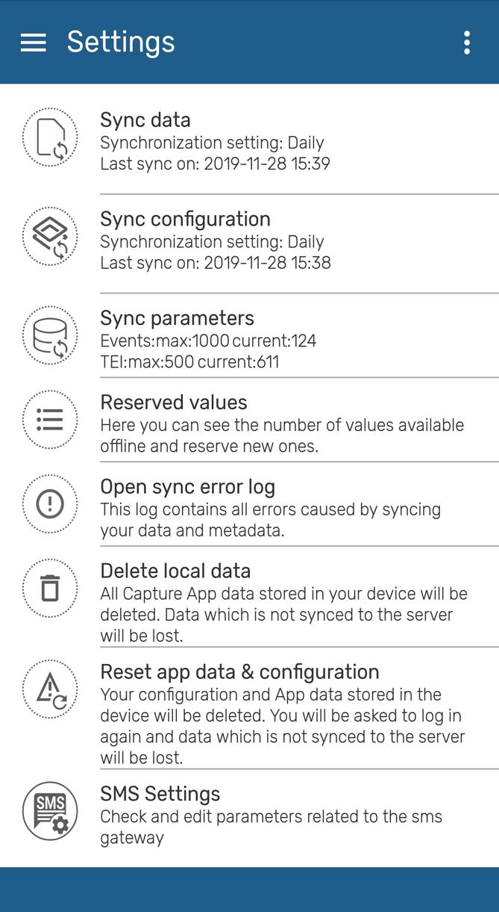
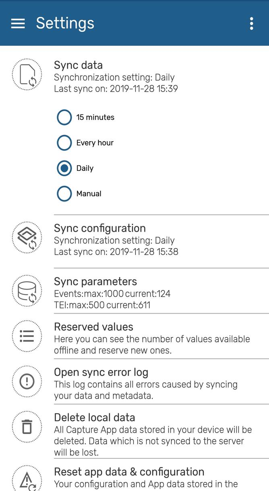
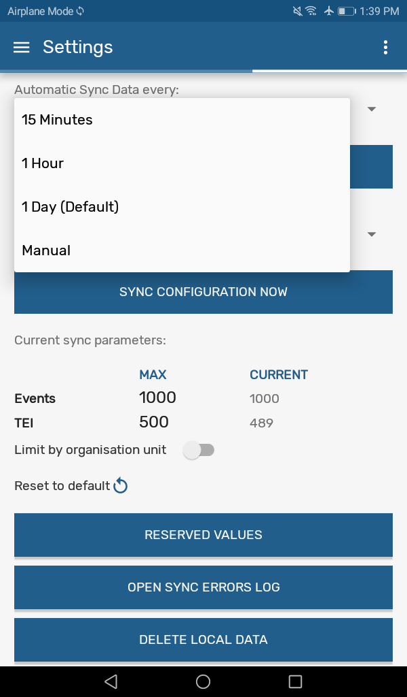

# Settings

{  width=25%}
{  width=25%}
<!-- PALD: I don't think the next image adds to the manual
{ width=35%}
-->

**Data sync process**:  User is able to choose from a drop-down list if the data entered in the app is uploaded to the server manually or scheduled every 15 min, 1 hour or 1 Day. By default the app will sync every 24h. This kind of Syncing includes new and updated events and TEI’s.

**Configuration sync process (Metadata syncing)**: User is able to choose from a drop-down list  if the data entered in the app is uploaded to the server manually or scheduled every day or week. By default the app will sync every 24h.  This sync will update changes in programs or configurations in web.

**Sync Parameters**: these parameters allow the user to specify the maximum number of TEI’s and events that can be stored in the local device. The user can also specify if limits apply per organisation unit or in total. Values can be set to default by clicking on “Reset to default”.

**Reserved Values**: this will specify the number of reserved Id's available in your device and will allow you to refill them.

**Open sync errors log**: The sync error log gives details about the error and is prepared to be shared with admins.

**Delete Data**: this action will delete local data without having to log out.

**Reset App**: this action will log out the user and delete all data and metadata. It is similar to resetting the App.
