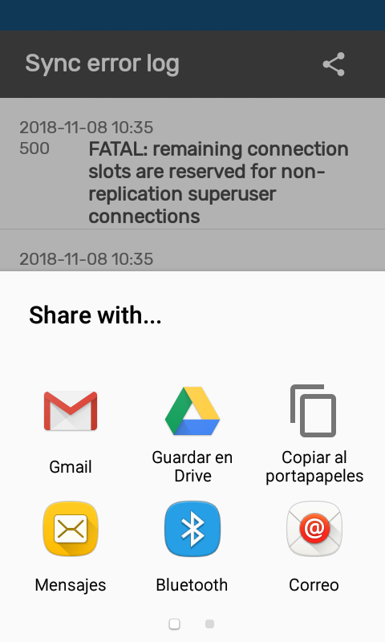

# Visual configurations { #capture_app_visual }

##  Local Analytics (New 2.5)

The android app can now render analytics that have been created in the Data Visualizer app in DHIS2. Analytics to be displayed require to be configured using the Android Settings WebApp where administrators will be able to decide the charts and tables to be displayed for end users.

To configure an analytic in the Android Settings WebApp, follow the steps below:

* Select Home, Program or Data set from the Analytics menu
* Click on the  "Add Visualization" button
* Search by typing the name of the visualization and select it by clicking on it
* Add an alternative title, otherwise, the app will display the name of the visualization

{ width=25%}
{ width=25%}
{ width=25%}

Analytics are created and configured using the web tools, however, the data aggregation happens offline using only data stored in the device.  

{ width=25%}
{ width=25%}
{ width=25%}

### Analytics Filter and Types

For each visualization object, the user will be able to filter in the app by:

* Period: Daily, Weekly, Monthly, Yearly, This Quarter, Last Quarter, Last 4 Quarters and Quarter this year.
* OrgUnit: Select "All" to display all the org units available to the user or "Selection" to specify one or multiple org units.

{ width=25%}
{ width=25%}

A reset button will be displayed if a filter is applied. Select Reset to display the default visualization.

{ width=25%}

Users can also change The anlytics type between chart, table or single value.

{ width=25%}
{ width=25%}

### Groups

All of these visualization can be displayed by group. To configure the group follow the steps below:

1. Open the Android Settings App
2. Click to Add a new visualization in the Analytics Menu (Home, Program or Data set)
3. Select a visualization
4. Mark the "Use a group visualization" checkbox
5. Create or select a created group
6. Save the visualization

The group will be displayed as a button in the top bar of the Analytics screen.

{ width=25%}
{ width=25%}

### Limitations

The android app also has support limitations on chart types, data dimension, period dimension, among others. To see the complete list click [here]().

## Interface language (New 2.5)

The language of the interface will respond to the language set in the user configuration. If the language is not available in the app, it will pick the language of the device. 

If none of the configurations are available, the app will default to English.

Translations set up in DHIS2 for all available objects will also be shown according to the language in the user configuration.

{ width=25%}
{ width=25%}

## Meta data sync error { #capture_app_visual_sync_error }

In case of errors during the sync process, a message is displayed in the settings menu ('Sync data' or 'Sync configuration' section). Also, a red sync icon is displayed next to the program in the Home screen. The sync error log gives details about the error and is prepared to be shared with admins.

{ width=25%}
{ width=25%}

You can also open the sync errors log from **Settings**:

{ width=25%}

## Personalize your Icon { #capture_app_visual_icon }

You can set your icon in the wallpaper using the DHIS 2 App Widget. The icon will be the flag configured in your server.

{ width=25%}

> **Note**
>
> How to add a widget:
>
> - Long press in your wallpaper
> - Select Widgets
> - Look for the DHIS 2 Widget
> - Select
>
> It will add a shortcut to your app.

## Personalise the colour of the App { #capture_app_visual_colour }

You can set the generic theme of the app by configuring the them in our server:

{width=80% }

> **Note**
>
> How to set the server theme and flag:
>
> Go to **System Settings > Appearance > Style**
>
> - Select your style
>   - Green,
>   - India (Orange),
>   - Light Blue,
>   - Myanmar (red),
>   - Vietnam
> - Select your flag
>
>{ width=25%}

## Icon library for metadata { #capture_app_visual_icon_lib }

There are currently 134 icons available that you can choose from. You can search by name in the icon picker widget. Icons are available in positive, negative and outlined shapes. We will be adding many more icons in future releases.

Icons can be associated to programs, stages, data elements and the options of an option set. This is  configurable through the Maintenance App.

> **Note**
>
> This feature is available from DHIS 2 2.30 onwards

{ .center width=80% }

In the Android App icons render in the home screen to illustrate all the programs available to a user, or while adding an stage. For data elements and options, the icons render for single event programs, when a section contains a single DE, showing the option set as a matrix or sequence of images.

{ width=25%}
{ width=25%}

> **Note**
>
> Icons will initially only render in the new Android app. The new web-based Capture App will incorporate them in the near future.

We plan to expand the collection of icons on each future version of DHIS2- for that we need your help: we are seeking ideas for new icons - please submit yours using [this form](https://www.google.com/url?q=https://drive.google.com/open?id%3D1LmfYJQAu3KyDfkY3X6ne7qSsuTa9jXZhoQHzkDxeCdg&sa=D&ust=1557433016147000).

## Colour palette for metadata { #capture_app_visual_colour_palette }

Tracker and Event capture now have the ability to render colours for programs, stages, data elements and options in option sets. A colour picker is integrated in the Maintenance App, which shows as a palette, except for options which allows the selection of any colour.

{ .center width=80% }

In the Android App, the color will be rendered as background color for programs and stages combined with an icon (if selected). For options it renders as the background colour during data entry form for single event programs. When the user selects a program with an assigned colour, that colour becomes the background theme for all screens in the domain of the program.

{ width=25%}
{ width=25%}

> **Note**
>
> Colours will first be available in the new Android app, followed in future releases by the new web-based Capture App.

## Rendering Types for Program Sections (Improved 2.5) { #capture_app_visual_rendering_type }

{width=80% }

**Program Section**: when used in combination with icons, a Program Section with a single data element and associated Option Set can render the options in sequential or matrix layout (see screenshots). If the icon is not found, the app displays the DHIS logo.

{ width=25%}
{ width=25%}

> **Note**
>
> Render type for sections will first be available in the Android app, followed in future releases by the new web-based Capture App UI.

## Calendar { #capture_app_visual_calendar }

Now it is possible to use two different calendars. The one on the left is the first to appear but you can change it by clicking on the calendar icon on the lower left corner.

This is available when:

1. Making a new enrollment.
2. Creating a new event (Programs with and without registration).
3. Using period filters in data sets and programs with and without registration.

{ width=25%}
{ width=25%}

> **Note**
> 
> For Android versions 4.4,  5.1 and small devices, the Accept option is not visible in the second calendar view.

## Render types { #capture_app_visual_render }

The available rendering options have been expanded to include horizontal and vertical radio buttons, checkboxes and toggles. The allowed options depend on the value type.

- Yes Only: can be rendered as radio button or checkbox.

{ width=25%}

- Yes/No: can be rendered as horizontal/vertical radio buttons or horizontal/vertical checkboxes or toggle.

{ width=25%}

- Text: When is linked to an option set can be rendered as horizontal/vertical radio buttons or horizontal/vertical checkboxes. The option set must be configured with value type "Text", any other value type will be displayed as a drop-down list.

{ width=25%}

> **Note** 
>
> The default rendering option will automatically display a search box whenever there are more than 15 elements in the option set to ease the selection.
> 
> { width=25% } { width=60% }

### QR and Barcodes (Improved 2.5) { #capture_app_visual_render_qr }

Data elements or attributes type text can be also configured as QR or barcodes. When a Data Element or Attribute is rendered as QR/Barcode, the app will open the device camera to read the code image. When the QR/Barcode is a TEI attribute configured as searchable, the user will be allowed to scan the code in order to search and identify the Tracked Entity Instance. This will also work for option sets.

Barcodes also allow the user to manually enter the value.

{ width=20%}
{ width=20%}
{ width=20%}
{ width=20%}

#### Export/Share

Users are now able to display a bar or QR code in an image so that it can be shared for printing, take a screenshot or show it on the screen for scanning.

{ width=20%}