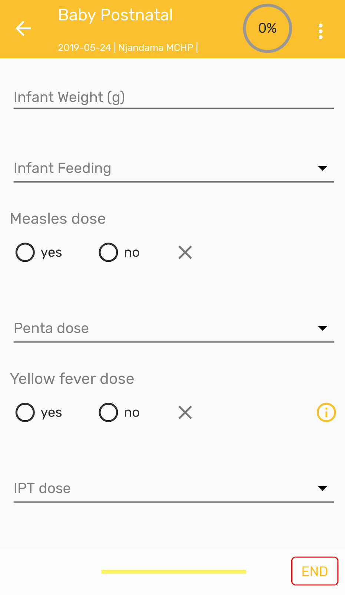
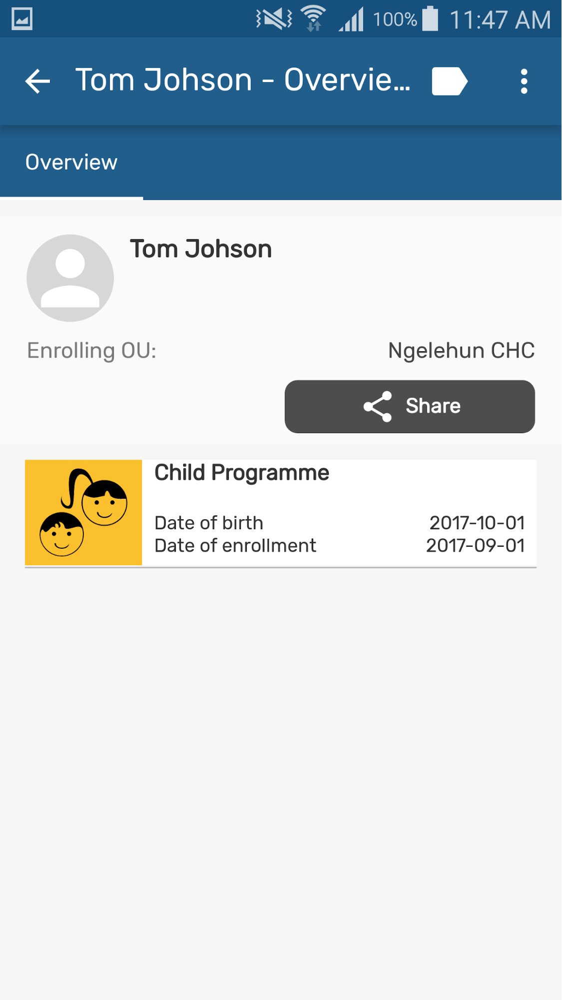

# Programs Specific features

## Program with registration specific features

### Complete/Re-open event

User must enter the event and then click the 'END' button in the bottom right corner.

{ width=25%}
{ width=25%}

Two options will be presented:

1. Finish and Complete
2. Finish

{ width=25%}

> **Note**
>
> To verify if an event is completed look at the color of the box, it must be grey; and also have the label 'Event Completed' on it. It applies the same legend set than the web UI.

> **Note**
>
> The app needs to take into consideration if the user has the correct authority (‘Uncomplete events’) to reopen a completed event.

### Complete/Deactivate Enrollment

To complete or deactivate an enrollment, click on ‘See details’ and actions will be available in the ‘Lock’ icon on the top right corner of the screen. 

{ width=25%}
{ width=25%}

### Reset Search Fields

All tracker programs will take the user to the search screen. The search fields are used to look up for a specific entity, and the circled arrow at the top right corner to reset the search. All fields will be blank for the user to do a new search.

At first, the user is obligated to do a search. if there are no coincidences, the search button will change to an ‘Add’ button for the user to create a new enrollment.

{ width=25%}
{ width=25%}

### Search screen for all Tracked Entity Type

User is able to search across all program of one tracked entity type (TET). In the Search screen there is a drop down which shows all the programs available for the active TET (active TET is defined by the selection of the program in the home screen). That drop down should also have an option with TET name. (for example: person)

When the user selects that option, the search fields available will only be the TET attributes (no program specific attributes).
Search restrictions do not apply, because they belong to the programs.

{ width=25%}
{ width=25%}

The search will return the found TEI's in the local database and also those in the Search OU of the user (when user is online). For those found online, the user will have to select them and the whole record will be downloaded.

> **Note**
>
>  When configuring search org. units, make sure that your capture org. units are contained in your search org. units, to do that capture org. units have to be selected as well as search org. units.

### TEI Dashboard across programs

User can see the TEI dashboard without any program by selecting the TEI in the list if the search was without program.

The dashboards will show the list of active enrollments.

{ width=25%}
{ width=25%}

### TEI enrollment history and new enrollment

User is able to see the complete historical record of the TEI. By clicking on the top right corner icon they will see a list of Active enrollments, followed by a list of past enrollments (completed or cancelled), followed by the programs in which the TEI could be enrolled.
User can also return to the 'TEI Dashboard without any program' by selecting 'All enrollments'.

Users should be able to navigate to the different enrollments from the list.

{ width=25%}
{ width=25%}

### Delete TEI's & Enrollments

To delete a TEI or an enrollment, select In the TEI dashboard, the three dots menu.

Local TEI or Enrollment will be deleted from the database. Records that has been previously synced with the server will be marked for deletion if the user has the authority:

F_ENROLLMENT_CASCADE_DELETE 
F_TEI_CASCADE_DELETE

They will show in the TEI search list, but will not be accessible.

{ width=25%}

## Program without registration specific features

### Complete event and Field completion percentage

The percentage of data completed in each event is shown in the top right corner of an event when it is opened after first registration.

{ width=25%}
{ width=25%}

To complete an event click on the 'END' button. Two options will be offered

1. Finish and Complete
2. Finish

{ width=25%}
{ width=25%}

> **Note**
>
>   The percentages will be adapted according to the effects of the program rules in the forms.
