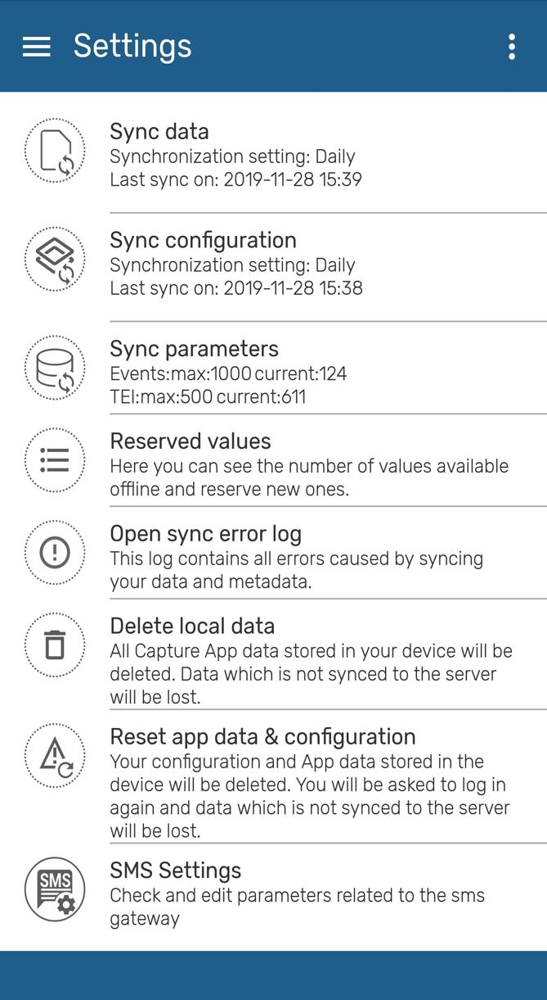

# Settings { #capture_app_settings }

{  width=25%}

Sync data
:	User is able to choose from a drop-down list if the data entered in the app is uploaded to the server manually or scheduled every 15 min, 1 hour or 1 Day. By default the app will sync every 24h. This kind of Syncing includes new and updated events and TEI’s.

Sync configuration (also known as sync metadata)
:	User is able to choose from a drop-down list  if the data entered in the app is uploaded to the server manually or scheduled every day or week. By default the app will sync every 24h.  This sync will update changes in programs or configurations in web.

Sync parameters
: 	These parameters allow the user to specify the maximum number of TEI’s and events that can be stored in the local device. The user can also specify if limits apply per organisation unit or in total. Values can be set to default by clicking on “Reset to default”.

> **Note** 
>
> Sync data, Sync configuration and Sync parameters can be overwritten using the Android Settings Web App as described [in the specific section][#capture_app_andoid_settings_webapp_synchronization]
>
>

Reserved values
:	This will specify the number of reserved Id's available in your device and will allow you to refill them.

Open sync errors log
:	The sync error log gives details about the error and is prepared to be shared with admins.

Delete local data
:	This action will delete local data without having to log out.

> **Warning** 
>
> Using this functionality might lead to data loss if changes have not been previously synced to the server.
>
>

Reset app data & configuration
:	This action will log out the user and delete all data and metadata, this means user and server information is also deleted. It is similar to resetting the App.

> **Warning** 
>
> Using this functionality might lead to data loss if changes have not been previously synced to the server.
>
>

SMS Settings
:	This sections allows to check or edit the parameters related to the sms gateway.
