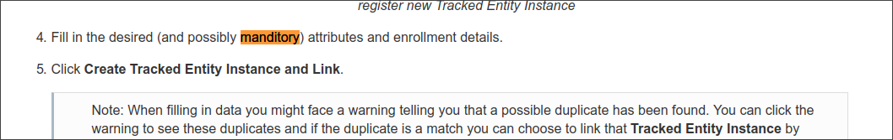
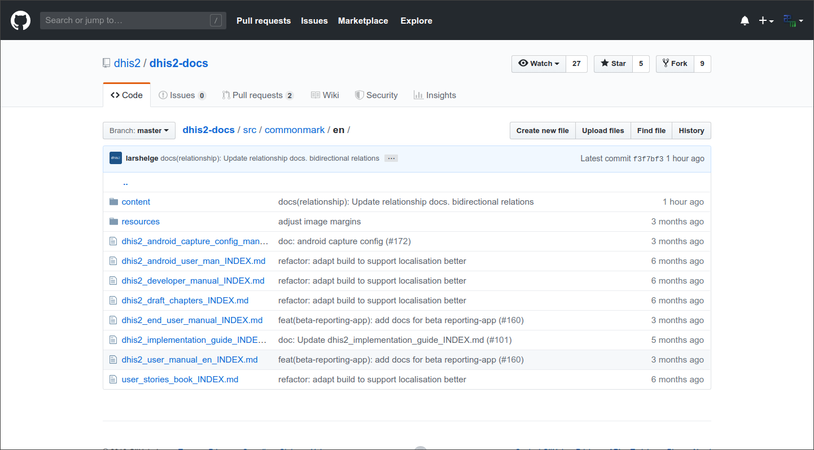
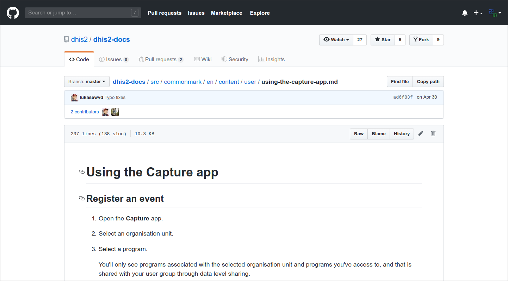
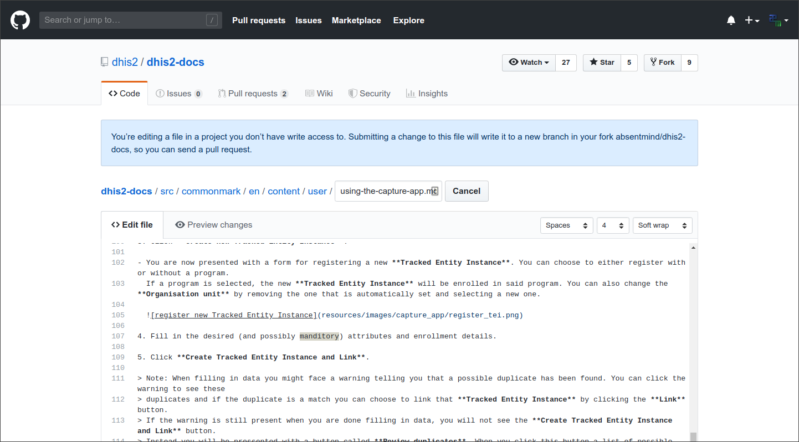
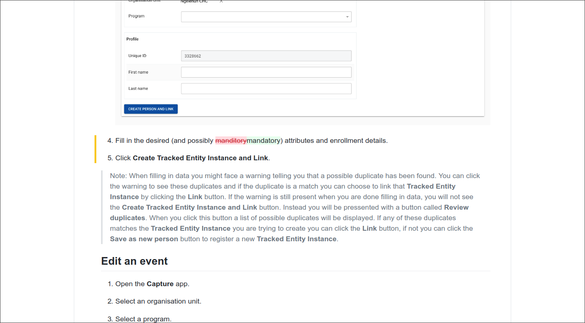
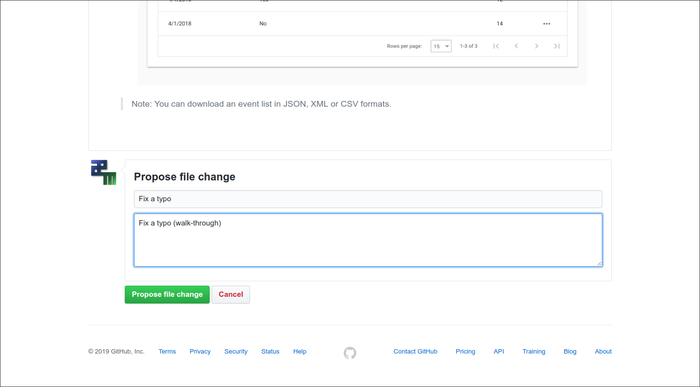
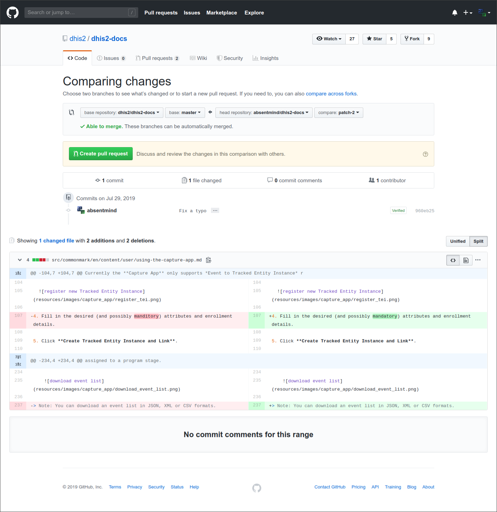
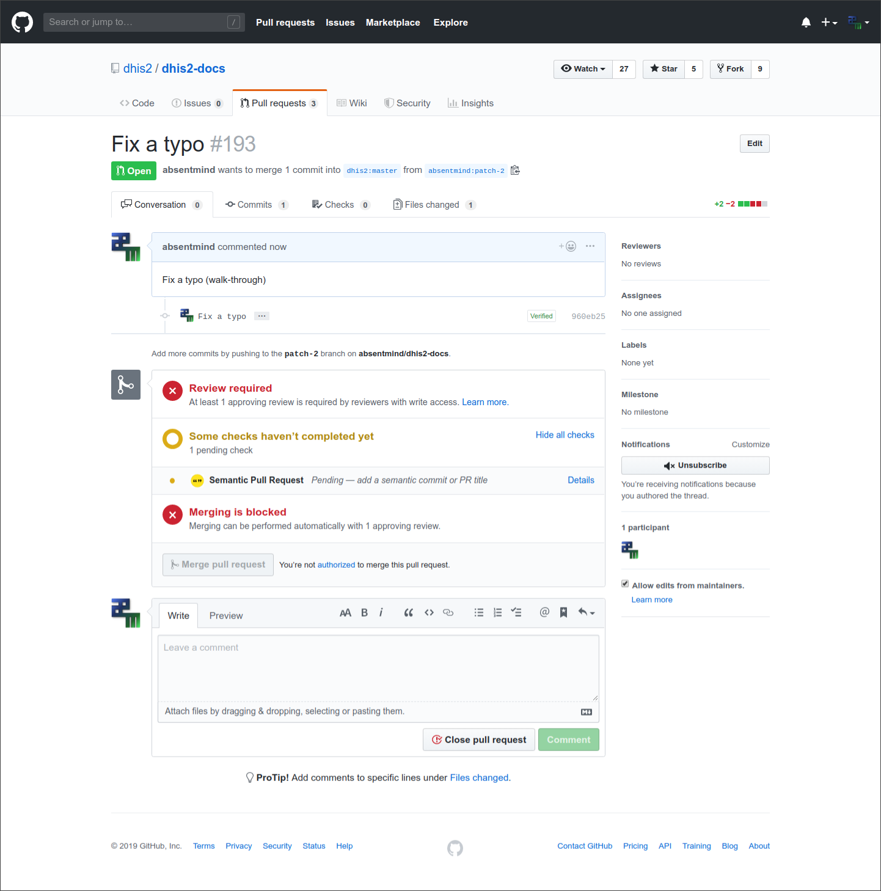

# Submitting quick document fixes

<!--DHIS2-SECTION-ID:submitting_doc_fixes-->

For small changes to the document, it's actually very easy for anyone to
submit changes without going through the whole process of raising a JIRA
issue against DHIS 2. This can be done directly in
[GitHub](https://github.com/dhis2/dhis2-docs) and requires no knowledge of git.
_All you need is a GitHub account!_.

This section is intended as a walk-through guide to making simple changes.

## Typo fix walk-through

In this scenario, we are reading the documentation and find a typo (_the word
"manditory" should be "mand**a**tory"_):

This is in the chapter on "Using the Capture app" in the DHIS 2 User Manual.
We want to fix this, so...

1. We log on to GitHub: https://github.com/dhis2/dhis2-docs

    If you don't have an account, follow the `Sign up` link on the GitHub site  
    (public accounts are free)
    

2. Now we need to find the chapter that we want to change.
    Each chapter is a single file in the GitHub repository, and chapters are
    referenced from an "INDEX" file which represents the full document.

    The index files are here:  https://github.com/dhis2/dhis2-docs/tree/master/src/commonmark/en

    
  
    > You may notice the button near the top right that says "Branch: **master**". This indicates that we
    are looking at the documents for the master branch (i.e. the documentation for the very latest version of DHIS 2).
    If we wanted to edit the document for, say, version 2.29 instead, then we would use that button to select branch 2.29!  
    (_2.29 is the earliest version supported in this markdown format_).

    a. In this case, the chapter we want is in the User Manual
    so we open the `dhis2_user_manual_en_INDEX.md` index file:
    > Select `Raw` or `Edit` mode in order to view the index properly!
    
    

    Here we see that the "Using the Capture app" chapter is referenced as
    `content/user/using-the-capture-app.md`

3. The reference we found above is the path from the current location, so
we need to go to: [https://github.com/dhis2/dhis2-docs/blob/master/src/commonmark/en/**content/user/using-the-capture-app.md**](https://github.com/dhis2/dhis2-docs/blob/master/src/commonmark/en/content/user/using-the-capture-app.md)

    

4. From here we can choose to edit the file (_pencil icon_). An edit
panel is displayed:

  
    Here we have found and highlighted the offending word!
    
    
    > Don't worry about the blue warning at the top that says we don't have
    write access to the file!  
    
    We can make the change and preview it in the `Preview changes` tab if we want.  
    Here is the preview:
    

5. Finally we can submit our change as a _Pull Request_ (PR).
    We add a title for the change (and an _optional_ description) and click
    `Propose file change`
    
    
    a. We see a summary of our changes and click `Create pull request`:
    

6. All done!

A pull request is now in the system, which can be easily reviewed
and accepted by the DHIS 2 team.

Once accepted, the change will appear in the next build of the documentation!    
