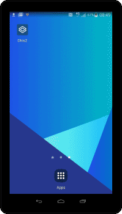
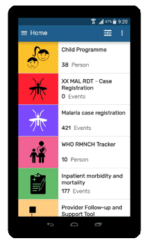
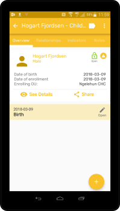
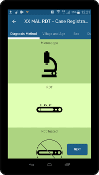

# DHIS 2 Capture Android overview

<!--DHIS2-SECTION-ID:overview-->

This document focuses on mobile implementation which use the new DHIS 2 Capture Android App. To get additional information about the different DHIS 2 Android apps please visit the [App Store](https://www.dhis2.org/app-store) and the [Documentation](https://www.dhis2.org/android-documentation) on the website. The previous set of DHIS 2 Android Apps developed are currently on planned deprecation and under corrective maintenance support only:

* Dashboard App: Deprecated since March 2020
* Tracker and Event App: Deprecated since June 2020
* Data Capture App: Planned deprecation as from September 2020

The new DHIS 2 Capture Android App allows offline data capture across all DHIS 2 data models\*. Data and metadata are automaticallynchronized whenever there is Internet access, always keeping the most relevant data for the logged user in the local device.

## Easier Login and enhanced data protection

<!--DHIS2-SECTION-ID:overview_login-->

Server URL can be set via a QR code. The app will also remember previously used URLs and user names. Once a user is logged, a four digit PIN can bsed to secure the app with a soft log out.

## Configurable App theme and Icon

<!--DHIS2-SECTION-ID:overview_theme_and_icon-->

The appearance of the app, including icon and color is determined by your server configuration. You can create a shortcut to the app with your institutional logo in the home screen of the mobile device by using the App Widget.

{ .center width=25% }

## Attractive, user friendly navigation

<!--DHIS2-SECTION-ID:overview_navigation-->

All programs and datasets\* accessible to the logged user are integrated into the new "Home" screen.. Each program or dataset will be, displayed with their associated icon and colour.

{ .center width=25% }

## Fully functional while offline: intelligent sync

<!--DHIS2-SECTION-ID:overview_sync-->

A local database in the mobile device keeps a synchronized copy of the DHIS 2 programs and datasets available to the logged user. The most relevant data is also automatically synchronized.

* Tracked Entities: by default, up to 500 active enrolments, prioritizing the most recently updated on the user’s assigned data capture Org Unit(s).
* Events & Datasets: by default, the most recent 1,000 events or 500 datasets.

> **Note**
> These parameters are configurable

## Tracker dashboard

<!--DHIS2-SECTION-ID:overview_tracker_dashboard-->

DHIS 2’s powerful tracker data model has been fully implemented in the small screen. The tracker dashboard incorporates feedback, relationships, indicators and notes.

The app implements tracker logic by supporting most program rules, giving the possibility to add, schedule or refer new events, depending on the server configuration.

{ .center width=25% }

## Integrated search for tracker

<!--DHIS2-SECTION-ID:overview_tracker_search-->

Before being able to add a new tracked entity, the app automatically conduct a search. If offline, the search is on the local synchronized database. and when online, it will suggest records for download, based on user’s Organization Unit search configuration. This functionality minimized potential duplicates, even when the user is offline.

## Pictorial Data Entry

<!--DHIS2-SECTION-ID:overview_pictorial-->

Data Entry comes to life - icons and colors can be used to illustrate questions’ answers. Available for data elements with associated options sets in both, single event and tracker programs.

{ .center width=25% }

## Event Completeness

<!--DHIS2-SECTION-ID:overview_event_completeness-->

During data entry, the app will display information about the current status of completion for a program stage. Useful for complex surveys with multiple sections.
