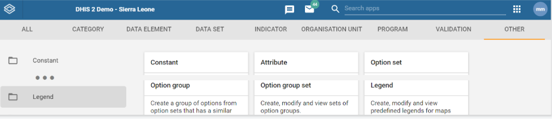
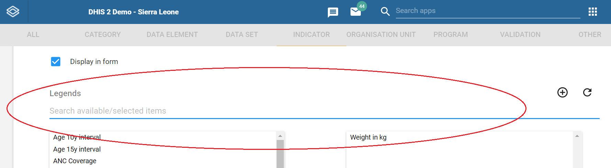

# DHIS2 configuration for using the Android App 

This chapter includes the basic configuration aspects for a successful experience using the Android App to help understanding the implications of using the mobile component of DHIS 2. For a complete and successful implementation, please read the detailed and updated [documentation](https://www.dhis2.org/android-documentation) to get all the information about configuring the DHIS 2 Server for using with the DHIS 2 Android Capture App.

Aspects of the setup of the new DHIS 2 Capture Android App included in this document are:

- Security related considerations
- Creating an Android user
- Visual Configuration
- Setting up the Program Rules
- Defining Program Indicators and Legends
- Reserved IDs

## Security related considerations

### Using DHIS 2 sharing and share restrictions

In this section we will share some tips on how to use DHIS 2 sharing and share restrictions to ensure that only the right users have access to records with identifiable information.

Here is a practical example of granular sharing and search restrictions in the context of a Health Care Center for Maternal and Newborn Care:

Midwife User Role:

- Can search across three programs across all org units in the district
- Can enroll new pregnant women into ANC program
- Can add/edit events to clinical assessment program stage
- Can view all ANC data in own org unit

Lab tech User Role

- Can search across one program org units in the district
- Can add/edit events to lab program stage
- Cannot view clinical assessment stage

MOH Supervisor User Role

- Can view dashboard only

It is very important to have standard operating procedures (SOPs) as part of your Data Protection Strategy.

A SOP is a set of step-by-step instructions compiled by your organization to help you carry out complex routine operations such as those related to data security.

SOPs helps your organization achieving efficiency, quality and consistency, while complying with Data Protection regulations.

When defining your Data Protection SOPs you should address questions such as:

- What is the relevant existing legislation?
- Who is the named controller? Processor? Data Protection Officer?
- Who is tasked with reviewing audit logs?
- What is your process for removing old users?
- Bring your own device?
- Hardware security?
- Mutual Confidentiality Agreements

We include here some SOP Best Practices taken from the [DHIS 2 Community Health Information System Guidelines](https://s3-eu-west-1.amazonaws.com/content.dhis2.org/Publications/CHISGuidelines_version_August29.pdf) document published by the University of Oslo:

1. Harmonize multiple programs into a single data capture protocol.
2. Develop SOPs for each individual community project especially if multiple data flows exist.
3. Turn the SOP into illustrated posters and have the facility staff post them on their walls for public viewing.
4. Print SOPs and make sure all CHWs, facility staff, and district staff have copies
5. Stakeholders to sign the SOPs at the completion of training.
6. Stakeholder participation in the creation and approval of SOPs. The SOPs must institutionalize the best practices and workflow of the actors in the CHIS. Include representation from all relevant stakeholders in the process of developing SOPs.
7. Ensure all data elements and indicators are captured. The CHWs should clearly understand the meaning, and measurement of each data element and indicator to remove ambiguity
8. Use data capture guidelines at trainings. To build accountability, CHWs and facility staff need to know they are part of a larger system. They need to know how their data is used for planning at higher levels and specific actions at lower levels.
9. Have the CHWs explain the data capture guidelines. This teach-back method is an effective adult learning practice. By explaining the data capture guidelines, this elevates the CHW’s credibility with the health committee.
10. Produce, simple-to-use, local language guidelines. CHWs and facility staff need guides and instructions on what to do. Consider making posters or small laminated portable data capture guidelines for CHWs and facilities to put on the wall or carry with them that outline their role and responsibilities based upon the data capture guidelines.
11. Have CHWs, facility, district staff and national staff sign guidelines. This is a symbolic “commitment” measure. The aim is that they have read it, understand their reporting responsibilities as defined in the data capture guidelines, and will carry out these responsibilities.
12. Produce simple videos or audio and upload them to phones. Responsibilities and actions for every event are made easier with a simple, local-language videos or audio guides that facility staff and CHWs can refer to.

### Practical Data Security Guidelines

Ensuring that the personal data stored on mobile devices is only accessible by the authorized health staff starts by educating users on how to use this data and ensure that it is kept secured at all times. The guidelines below are an extract taken from the PSI’s “Monitoring and Evaluation Standard Operating Procedures for Keeping Client Data Secure & Confidential” manual.

{ .center }

System administrators play an important role when configuring user’s access-level, by ensuring that their data access is appropriate and never unnecessarily excessive. The guidelines below are also part of PSI’s “Keeping Client Data Secure & Confidential Administrators Guide” manual

.{ .center }

## Creating an Android User

### Create Role

Before you can create a user, first you need to define a DHIS 2 user role. The DHIS 2 Android Capture App doesn’t require any of the authorities that are encapsulated in a user role. The security for a DHIS 2 program or dataset is set as program or dataset data access.

For the purposes of web debugging problems with your users it is recommended that you create and assign a user role with data capture functionality, which should include:

- Tracker Capture app, Event capture app and/or Data Entry app
- Dashboard (to be able to login)
- Cache Cleaner (you will need to clean the cache)

### Create user

Second, you should create a user, for which you will need to add some basic details such as the user name and assign it the role.

- User Name: name.android
- Example: belen.android
- User Role assignment: assign to the role you created in step one.

### Assign Organisation units

The third step is to assign the Org Units to the user you just created.

There are three types of organisation unit assignment:

- **Data capture:** Datasets and well as program creation of TEI, Enrollments and Events. Data pre-downloaded in the app at first login will be the one belonging to these org units.
	- Mobile users are not expected to access the org. unit hierarchy of a whole country. Maximum number of org units is difficult to set,as the App does not set the limit, but the resources on the device (memory, processor). We could say below 250 org units should be safe, but still believe that is a very big number for a mobile use case.
- **Data output:** for data analysis. Not applicable in Android.
- **Search Org. Units:** Expands TEI search (when online) across further Org Units. Individual records can be downloaded for offline use.
	- When configuring search org. units, make sure that your capture org. units are contained in your search org.units, to do that capture org. units have to be selected as well as search org. units.

{ .center width=80% }

## Visual configuration: Understanding what renders and why

The information displayed and how it is displayed is configurable by the system administrator. There is an icon library of over four hundred images. The icons are assignable to most metadata objects: Options, Data Elements, Attributes, Programs / Data Sets. The images are not downloaded during the metadata sync process - only the icon name is downloaded. All icons already exist as highly efficient vector-based images in the APK of the app.

In the future you will be able to upload your own as gif/ jpeg/ png (50k or less - TBC). The disadvantage of this option will be the bandwidth use & syncing time, since the app will need to download images during metadata sync.

Here is an example of how to assign icons and colors to metadata:

The following table shows where you can use icons today:

| | **Asign** | **Android Rendering** | **Web Rendering** |
|---|:---:|:---:|:---:|
| TrackedEntityType | ✅ 2.30 | soon | |
| Program | ✅ 2.30 | ✅ | ✅(simple events, 2.30) | 
| Program Stage | ✅ 2.30 | ✅ | ✅(simple events, 2.30) | 
| DataSet | ✅ 2.31 | soon | |  
| Data Element | ✅ 2.30 | - | | 
| Attribute | ✅ 2.30 | - | | 
| Indicator | ✅ 2.32 | soon | 
| Prg Indicator | ✅ 2.32 | soon | | 
| Option Set | ✅ 2.30 | ✅ | ✅(simple events, 2.31) | 

For program stages, sections can be rendered in three modes: Listing, Sequential and Matrix. The results of these modes are shown below:

{ .center }

A System Administrator can decide the best way to render the information in each program stage section by setting up the mobile rendering type, as shown on the screenshot below.

{ .center }

### Setting up the Program Rules

We recommend to test the Android App in parallel with the configuration of your program rules, this is to make sure that your changes in the server are properly reflected and working in the app.

The first thing you need to do when setting up the program rules is to define the context and priority for the execution of the rule. The context defines the execution of the rule for a specific program and optionally for a specific stage. The priority defines an order to execute the rules, this helps when the execution of one or more rules depends on the result of other rules.

{ .center }

Once the context and priority have been defined, it is time to write the program rule expression using built-in variables, variables (TEI attributes / PS data elements) and functions. Variables have to be defined by the administrator to be able to evaluate information entered for a TEI attribute or a program stage data element.

{ .center }

Then we need to decide on the action or actions to be executed when the program rule expression is true

{ .center }

When setting up your program rules you should be aware of what is supported by the DHIS 2 Android app. You can check the updated list in the [complete documentation](https://www.dhis2.org/android-documentation).

## Defining Program Indicators and Legends

Indicators to be displayed in the App, can be calculated with the data from the Tracked Entity Instance (TEI) enrollment. Please keep in mind that calculations will apply in the domain of the TEI and the current Enrollment.

Aggregation types are not available, only Last Value can be used in the calculation of the indicator. All DE and constants can be used in the calculations. Variables are supported according to the following table:

{ .center }

You can check the updated information of what is supported when using program indicators in the [complete documentation](https://www.dhis2.org/android-documentation). Analytic period boundaries are not supported, neither planned for future support, as they apply to multiple TEI’s.

In order to display a program indicator in the App, you must select the checkbox “Display in form” in the DHIS 2 server indicator configuration wizard.

Once you have designed your indicator, you can assign a legend to it. In your DHIS 2 Server go to Maintenance > Others > Legends to create an new legend.

<table>
<tbody>
<tr>
<td width="60%"></td>
<td width="40%"></td>
</tr>
</tbody>
</table>

Once you have created the legend you can assign it to the indicator. Alternatively, you can assign an already existing legend. Right underneath the checkbox to display the indicator in the App, you will find the section to search and assign the legend.

<table>
<tbody>
<tr>
<td width="60%">
	{ .center }
</td>
<td width="40%">
	{ .center }
</td>
</tr>
</tbody>
</table>

## Reserved IDs 

If you are working with tracker programs and you use auto-generated unique tracked entity attributes (see [DHIS 2 documentation](https://docs.dhis2.org/master/en/user/html/dhis2_user_manual_en_full.html#create_tracked_entity_attribute)), it is important to understand how the app deals with the generation of values. Values are downloaded in advance from the server, so they are available when the application operates offline. Those values are marked as reserved on the server side.

When the user first syncs the app will download 100 values, which will be marked as reserved on the server side. From that point the user starts using the values as new tracked entity instances are created.

Everytime the user uses a value (registers a tracked entity instance), the app will:

1. Check if there are enough remaining values and refill when needed (if less than 50 values are available).
2. Assign the first available value to the tracked entity instance and remove it from the list of available values.

Whenever the app is synced it will:

1. Delete expired reserved values.
2. Check if there are enough remaining values and refill when needed (if less than 50 values are available).

A value is considered as "expired" when one of the following conditions is true:

- "expiryDate" is overdue. By default, the server sets the expiry period to 2 months.
- If the attribute pattern is dependent on time, i.e., it contains the segment \`CURRENT\_DATE(format)\`, the app calculates an extra expiry date based on that pattern.

On the App, the user can also check the available values and refill them in the settings menu.

<table>
<tbody><tr>
<td width="50%">
{ .center width=50%}
</td>
<td width="50%">
{ .center width=50%}
</td>
</tr>
</tbody></table>

When the app runs out of values and the server cannot provide more, the user will receive a message on the data entry form saying that there are no more available values. Your should fix that on the server side.
