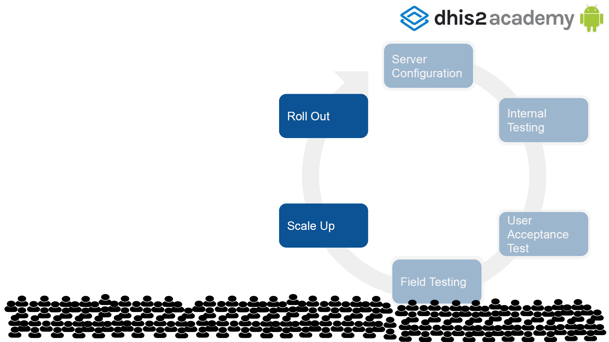

# Rollout

At this stage you should be ready to roll out the devices and the App to your end users. In this step you will have to prepare for the cut-over and coordinate the go-live, you will need to decide if you will keep parallel systems in case you are using other Apps or do a straight replacement. As far as paper and manual processes go, you will also need to decide if you want to eliminate them, replicate them or keep a duplicate. Make sure you pick carefully the time to go live. Pick a time where teams will be available to spend the extra time and effort adapting to using the new App and also make sure extra support is available during the initial stages.

{ .center width=60% }

Following we include recommendations for this phase of the implementation from the DHIS 2 Community Health Information System Guidelines document written by the University of Oslo.

The end users of the newly rolled out App, should have one point of support. Ideally their supervisor can provide this one point of support. Since users know their supervisor and get support for other issues, having the supervisors supporting the App is an advantage.

You might already have in place a multi-tiered support system for the web based DHIS 2 and perhaps you can use it to also provide support with the App. Multi-tiered means simple issues are able to be addressed by lower level supervisors and more difficult or complex issues are move up the tiers until they reach someone who is able to address them. The vast majority of issues requiring support will be simple issues that should be able to be addressed by the first tier of support. Often this first tier is the user’s direct supervisors. This tier should be able to address simple hardware and software issues. If the supervisors cannot resolve the issue that will then have to escalate it to a higher tier. Tier Two requests are often addressed by district level or sub-national information systems officers, who are trained to manage system configuration issues and all advanced issues around the user interface, data imports and exports. Tier Three requests are typically addressed by central level IT support persons. They should be able to respond to any back-end maintenance requests.

The number of tiers of support might vary based on the complexity and size of your project. Regardless of the number of tiers, it is essential that support requests can be submitted by any user directly through either the web, phone or by email. Once a request for support has been sent to the technical team should acknowledges receipt of the request within a short time period like 12 hours (2).

By now you should have a plan on how you are going to keep track of the devices you are handing out to your teams. Here are some best practices you might want to follow when tracking devices (2):

- Number each phone (tablet) box and two copies of the phone agreement (i.e. \#1 on a box and on both agreement forms) and hand both to a community health worker supervisor to fill in the forms against the details of that phone.
- Ensure that the phones and boxes do not get mixed up.
- Collect the agreement forms, and have a council sign and stamp both copies. One copy will remain with the district, and the other will be returned to the partner and kept in the district box file in the office.
- Use a QR code generator to generate a QR code with the phone's information (number, CHW, SIM number, district, etc.). You can then print this QR code onto a heavy-duty label sticker and apply the sticker to the back of the phone or inside the phone in the battery compartment.
- If providing SIM cards with phones, document the associated SIM card and phone.
- To prevent tampering of the SIM card is provided with the phone, glue the SIM into the phone by placing the SIM card in the phone and applying glue to the back.

You should also reflect on Device Ownership and Usage. Right at the time of giving the devices (phones, tables, etc.) to the users, it is important to clarify the ‘ownership’ of the devices along with the responsibilities of maintenance, upkeep and loss. There is often confusion on whether the device is owned by the institution or the individual, and what the respective responsibilities are. However, if the end users are expected to use personal devices, it is all the more important to clarify issues on airtime/data cost along with the reimbursement mechanism (2).
