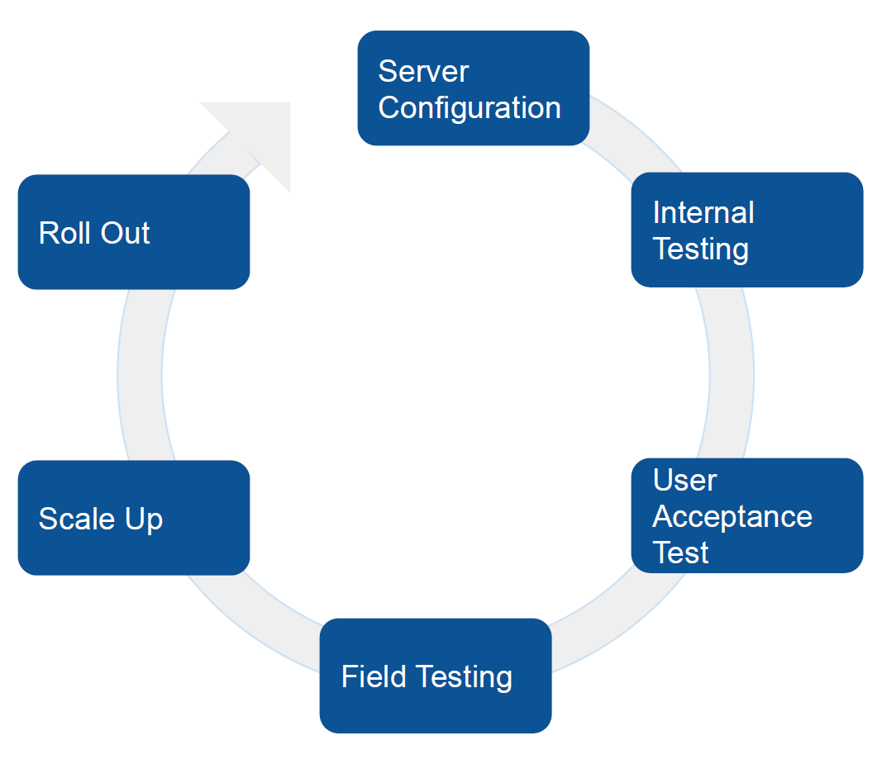
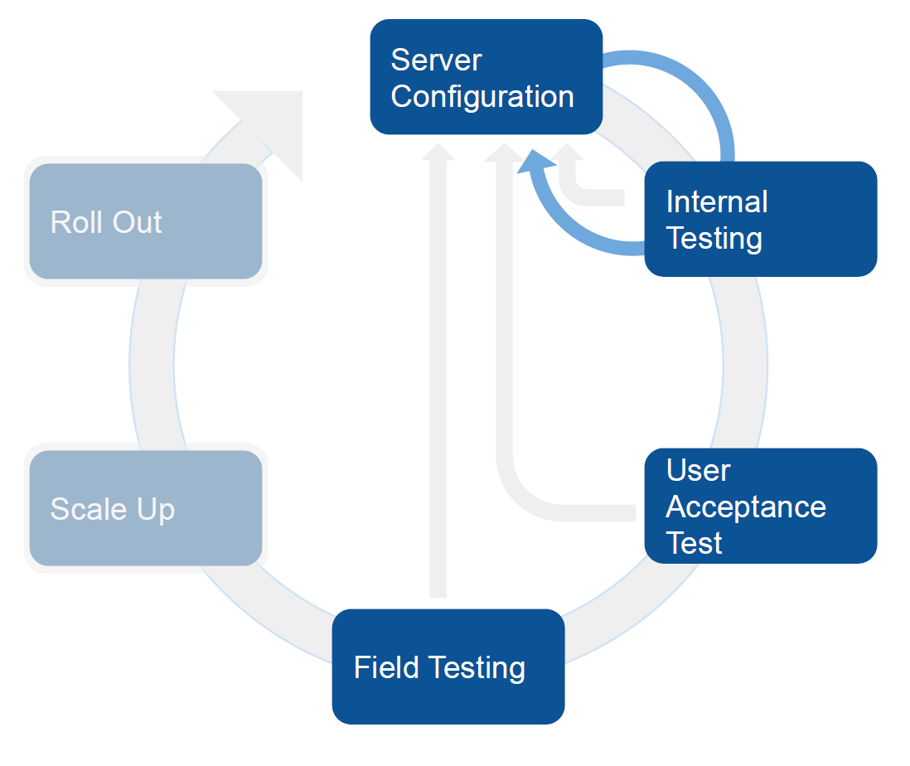
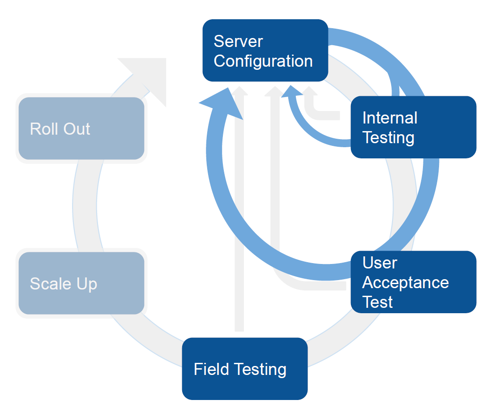
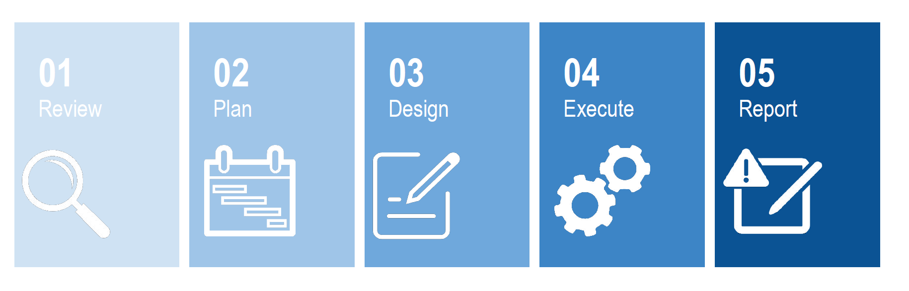
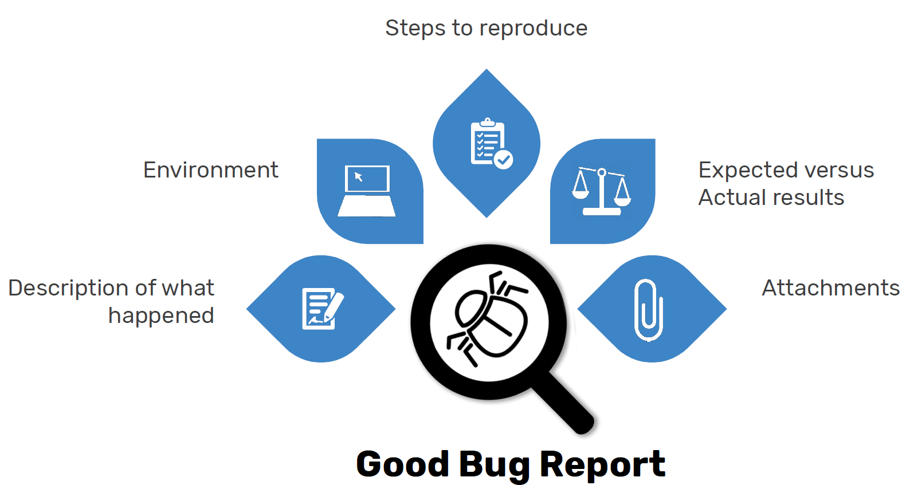

# Testing

Now that the DHIS 2 server has been initially configured and you have installed the App in one or more devices, you are ready to start testing. While you are planning your testing you need to be aware of upcoming releases. It is important to be a part of the community at [https://community.dhis2.org/](https://community.dhis2.org/) and use jira, the software management tool that UiO utilizes. This will allow you to learn about the open issues in terms of features and bug fixing that it is scheduled for future releases.

We recommend to test the Android App in parallel with your configuration, to make sure that your changes in the server are properly reflected and working in the app. This is especially important during the configuration of the program rules. In addition to this step by step testing, there are different types of testing that you should conduct before rolling out the application.

There is an initial set of tests that should be conducted internally with smaller groups to guarantee that the configurations are done correctly, that the functionality is in place and that the look and feel is adequate. As part of this initial phase of testing you will conduct what it is known as internal testing, followed by the UAT (User Acceptance Testing) testing. Later in this section we will elaborate on what these type of tests mean and how to conduct them. After that you will conduct your field testing and pilot. In this phase of the testing you will conduct a set of tests with larger groups to guarantee among other things that your workflows, your infrastructure and architecture is correct. Also later in this section we will elaborate further on these types of tests and how to conduct them.

The following graphs show that the next steps are iterative in nature, including new server configurations based on the results of the testing. You will most likely do several rounds of testing and reconfiguring before you are ready for scale up and roll out.

|||
|---|---|
| { .center } | { .center } |
| { .center } | { .center } |

## General Recommendations for Testing an Android App

Before we go into the different testing phases, we are going to present some general recommendations that can be applied to testing an Android App. In general any process of testing can be summarized in the following steps:

{ .center width=80% }

1. **Review**. The first step is to review information about the application itself by going to [https://www.DHIS 2.org/android-documentation](https://www.dhis2.org/android-documentation). The documentation will provide you with information about the why’s and what's or your testing. It should help you determine if the app meets your requirements, what the app can and can’t do and help you analyze discrepancies. It should also help you identify new features and settings, features supported.

2. **Plan**. In this step you need to identify the time of testing by understanding the timeline for your own implementation. As part of this planning phase you must create a detailed list of requirements and classify them as compulsory (MUST have) or nice to have.

3. **Design**. In this step you must develop the test cases, decide the number of test interactions and the tools you will be using for your testing.
	{ .center width=80%}
	- **Example of testing tools - Jira**
	
	- **Example of testing tool - Excel**
	

	- Every test case should include the following sections. The level of detail and the content of the test to be performed will depend on the level of experience-profile of the user.
		- Identification: Cycle number / ID, Test ID, version, test summary.
		- Description: details, steps to reproduce
		- Status report: Date of execution, executed by, expected vs actual result, execution status report ID.

4. **Execute**. During the execution of your testing please keep in mind two important issues:
	- Metadata Configuration: Verify the program settings on the web and check the documentation to know the behavior of the features in the app. This will help to identify true bugs versus problems derived from the configuration or unsupported features.
	- Matrix of Completion: Check your progress according to the deadlines you have designed in the plan stage. Also make sure notes are being taken rigorously to be able to report a bug.
5. **Report**.There are three important characteristics that your report must have
	- The reported error must be reproducible
	- The information must be specific and informative
	- The report must separate facts from speculations
	 { width=80% }
	- The table below summarises a good Bug Reporting with some examples:
	 { width=80% }

## Internal testing and UAT testing

**What are you testing**

You are testing your DHIS 2 server configuration and the Android App itself.

{ .center width=40% }

**What are you looking for?**

Program Rules, forms, visual UI, indicators… Bugs, improvements, new requirements, etc.

**How?**

Methods and periods for testing vary from group to group, but it has to be iterative, flexible and it must be done in the early stages of the deployment process. You need to spend time deciding who will participate in the test, develop a test plan and have a strategy to gather the feedback. There are different tools available to report and track bugs and issues. Depending on the complexity of your test you can use [trello](https://trello.com/), jira,etc.

Setting the right foundation for your internal testing will increase the quality and the efficiency of the testing sessions. These recommendations apply to any of the different tests that you will need to perform.

### UAT Testing

**What are you testing**  
You are testing your system configuration (input), your visual UI and icons, usability and your outputs. You can also test at this stage the user experience with different devices (smartphone, tablet, external keyboard, chromebook).  

{ .center width=40% }
  
**What are you looking for?** 

Adjustments in the previous items and hardware issues. This is a good time to start identifying champions that will help on future phases. The main purpose of the UAT is having people from different background in agreement with the configuration to execute the field testing. The success of this stage will determine move to the next phase, field testing

**How?**

Use a controlled environment. Find users with little exposure to the technology, who are not necessarily integrated in work practices. Your users could be: 1) Expert in the health area/s, 2) Field officer, 3) Field user.

The size of the group will vary depending on the type of project you are implementing the App for. An average size UAT test group would be between 5 and 10 people.

When deciding who will participate in your test, think about all the different types of users and their roles. With that in mind, select your testers. You should provide your testers with the right onboarding and guidance. They need to be well informed of the methods you will be using for testing, the expectations and the overall objectives and goals of the testing. It is advisable, if at all feasible, to organize testing sessions with one or two leaders, where testers can help each other and have the possibility to ask questions and get help in the spot from the leaders. Another important aspect to consider is test data. You must have enough data in your test server to allow for the testing of different test cases.

## Field Testing/Pilot

**What are you testing**

- You are testing your SoP’s and workflows.
- You are testing your infrastructure/architecture.
- You are testing the different devices.
- You are testing your training procedures & materials.

{ .center width=40% }

**What are you looking for?**

- Adjustments in the previous items.
- Suitability of the selected devices for the work space and environment.
- Evaluate your solution
- Identify champions.

**How?**

20-30 users. Recommended 2 months (plan ahead!). Decide distribution (locations). Do not pick the easiest or the most complex. Keep it simple but challenge your solution.

**Considerations for evaluating your pilot**

You should define your indicators for evaluating your results and decide your strategy for piloting your system You could use your current system and the new system in parallel for a few months or simply replace it. Both strategies have advantages and disadvantages and you should analyze them carefully with your team before pilotin.

Some advantages of having the current and new system in parallel are:

- You can have evidence on how the new system improves in comparison with the old one in terms of timeliness, or data quality for example, this parameters depend on the purpose of your specific project.
- You have your previous system as backup mechanism if something does work as expected
- Builds trust on the users when they compare both results.

Some disadvantages are:

- You are setting a double-reporting mechanism, it duplicates the time and level of effort from your users. IT is important to handle this with sensitivity and prepare potential support human resources when needed.
- The possibility of users to compare both systems in parallel could be a double edged sword, as users tend to resist change.
