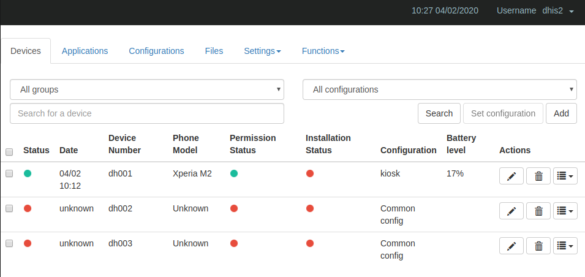
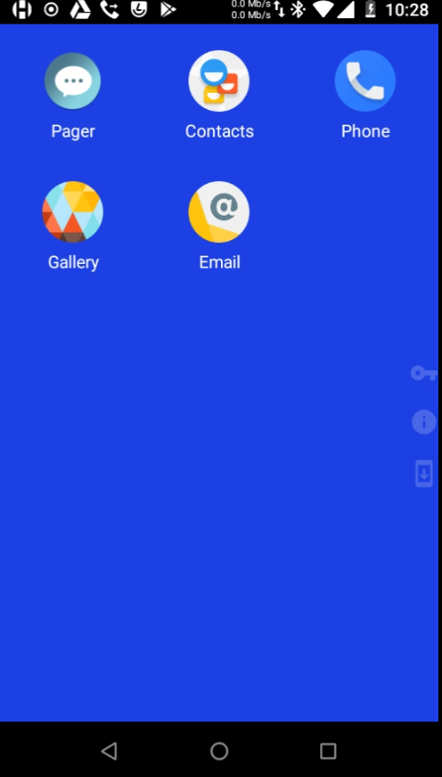

# Annex C - MDM PoC: Headwind 

This annex presents the outcome of the tested MDM: [https://h-mdm.com/](https://h-mdm.com/)

## Installation & Usage

Installation is really easy as the solution provides a script to install. 

A demo on the cloud version can also be requested.

The free version can be enough in certain implementations but for extended features (including Kiosk mode) the professional or extended version may be required.  See [https://h-mdm.com/enterprise/](https://h-mdm.com/enterprise/) for more details.

It is a JAVA/Tomcat application which makes it ideal in terms of compatibility with DHIS2

Console:

Phone:

{ width=25% }

## Issues

No big issues found. Support was really responsive.

The free version does not include Kiosk mode.

## Conclusion 

Interesting Open Source solution (only the server and not the client version, though)
