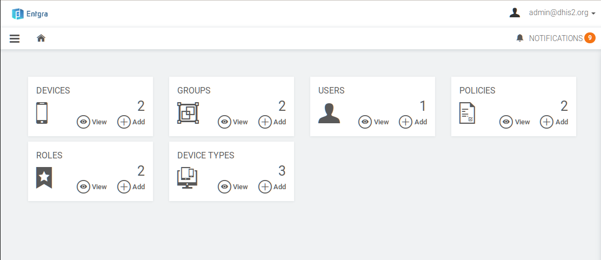
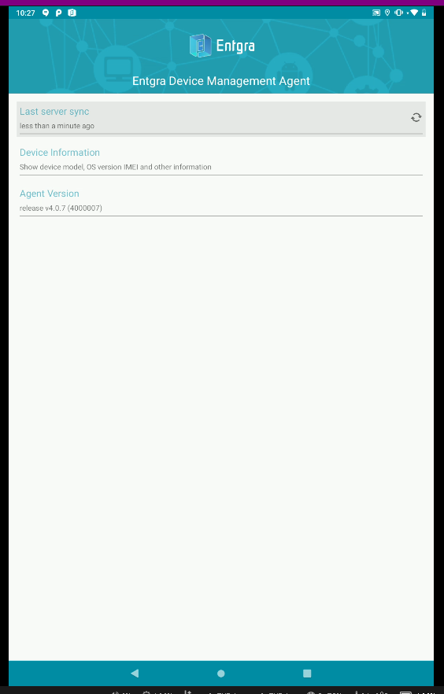

# Annex D - MDM PoC: Entgra.io

This annex presents the outcome of the tested MDM: [https://entgra.io/emm](https://entgra.io/emm)

## Installation & Usage

They provide docker packages for a remote deployment for testing (or even production). For this test the SaaS platform was used.

It is a JAVA/Tomcat application which makes it ideal in terms of compatibility with DHIS2

It covers the whole range of functions defined but the policy definition might be a bit overwhelming due to the amount of options.

This solution allows remote control of the device and so, the manager can see the screen of the device remotely. This might be particularly useful for training and troubleshooting. 

Console

Phone

{ width=25% }

## Issues

Device location didn't work (it seems to be a temporary issue)

## Conclusion

Worked well and support was responsive. The fact that is an Open Source Java application might make administration easier if using the premises option.
