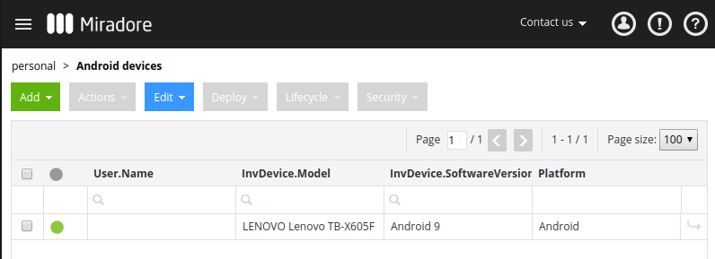
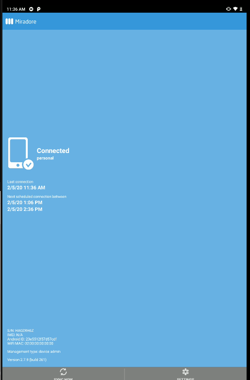

# Annex E - MDM PoC: Miradore

This annex presents the outcome of the tested MDM: [https://www.miradore.com/](https://www.miradore.com/)

## Installation & Usage

No need to install as the solution is a SAAS

Quite easy and clean interface

Console:

Phone

{ width=25% }

## Issues 

In normal mode (BYOD), whenever the MDM manager sends a request the person in charge of the device needs to approve them i.e installation of an App. Thus, the remote management is somehow limited.

## Conclusion

This solution was implemented in Ghana (DHIS2 deployment by the Ministry of Health with ~2700 devices) and ran successfully for several months. However, due to the high costs it was later migrated from the business to the free version.
