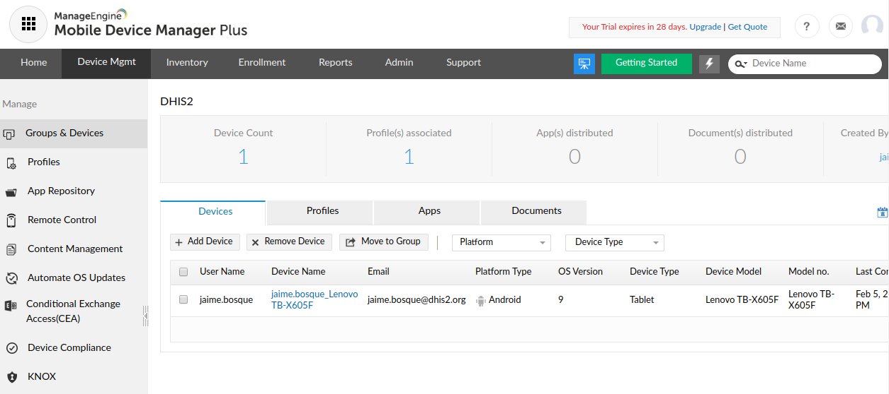
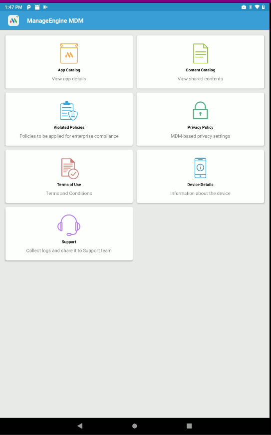

# Annex F - MDM PoC: Manage Engine MDM Plus 

This annex presents the outcome of the tested MDM: [https://www.manageengine.com/mobile-device-management/](https://www.manageengine.com/mobile-device-management/)

## Installation & Usage 

No installation as is a cloud service.

Easy to enroll devices.

This solution allows remote calls and remote control of the device and so, the manager can communicate using VoIP and see the screen of the device remotely. This might be particularly useful for training and troubleshooting. 

Console:

Phone

{ width=25% }

## Issues

Could not upload files nor Apps during the test. Seems to be a temporary issue.

## Conclusion 

Worked really well.
