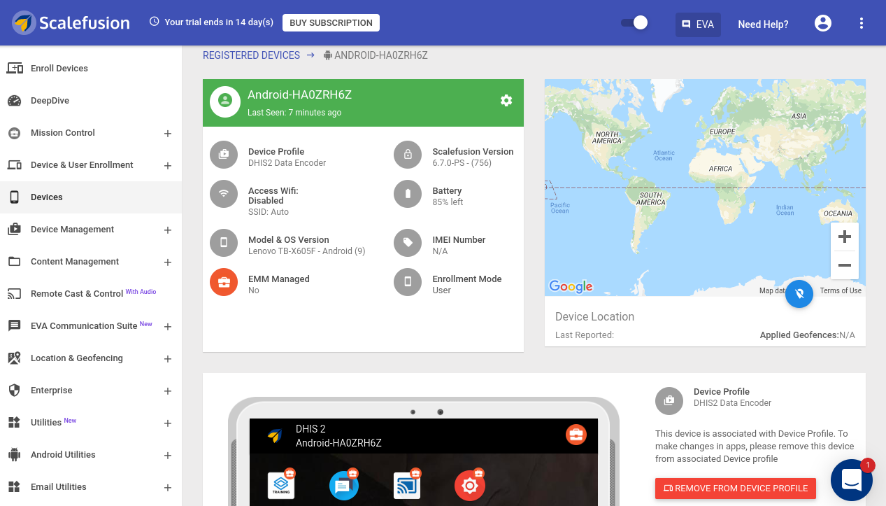
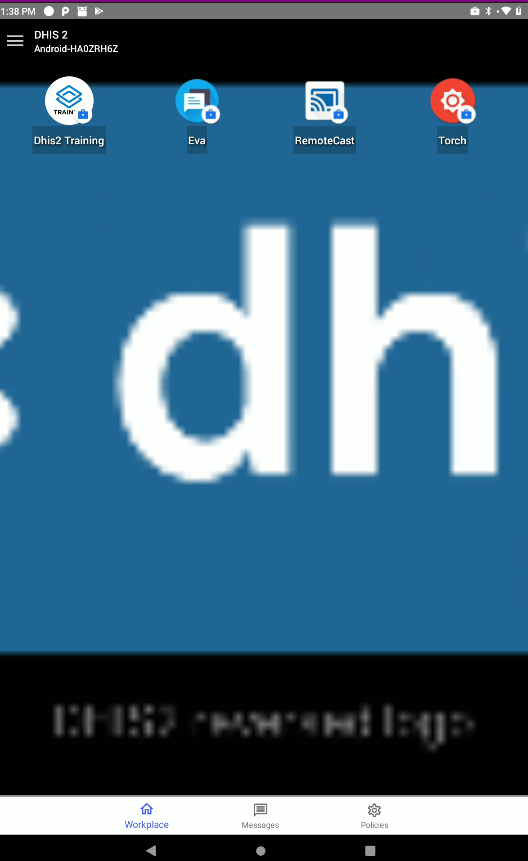
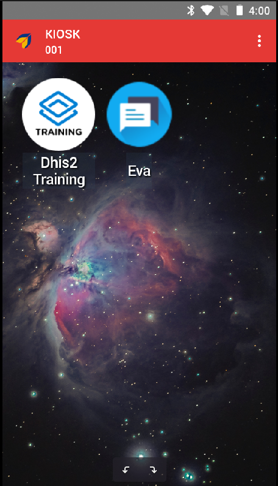

# Annex G - MDM PoC: Scale Fusion (MobiLock) 

This annex presents the outcome of the tested MDM: [https://scalefusion.com/](https://scalefusion.com/)

## Installation & Usage 

No installation as the cloud solution was tested.

Lots of options, maybe too many that might get you lost at the beginning.

The enrollment of the agents was really easy although encryption was mandatory for the Kiosk mode.

This solution allows remote calls and remote control of the device and so, the manager can communicate using VoIP and see the screen of the device remotely. This might be particularly useful for training and troubleshooting. 

Console:

Phone (Normal Vs Kiosk):

{ width=25% } { width=25% }

## Issues 

Mandatory encryption for Kiosk devices (make it slow)

## Conclusion

Nice solution, worked well and can be fully customized.
