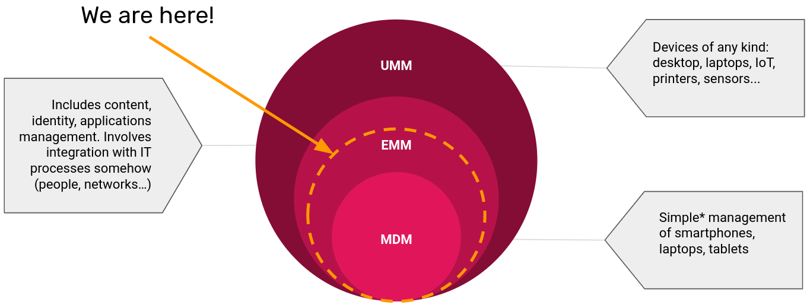
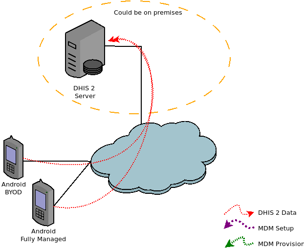
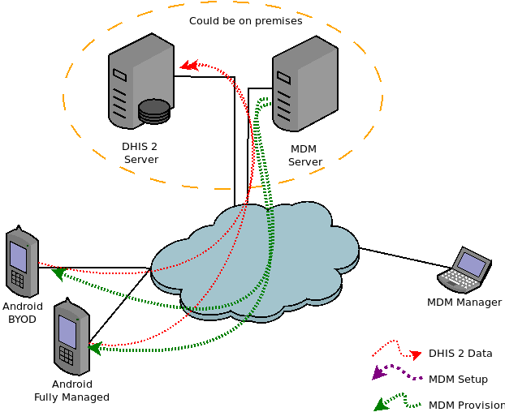

# Considerations

In this document the terms MDM and EMM will be used interchangeably. This is not entirely accurate, but is done to help simplify the document. An MDM per se does not consider the deployment of applications while a EMM involves many more options that are not in the scope of this document. Therefore it can be said that this document covers somewhere in between these two concepts.

## Why an MDM for DHIS2?

Mobile Device Management refers to  software used for the administration of mobile devices. You will most probably want to use an MDM software when you have to support hundreds of devices and it becomes necessary to control the DHIS2 Application distribution across the devices, provide tech support and enforce institutional policies.

For example, if you have a project where 1000 Android devices are going to be used in a distributed way (community workers) using mobile data to send the information to the central DHIS2 server, having an MDM could help you by:

* Being able to update whenever you want the DHIS2 Android application when a new version is released. Notice that by default the devices might be configured to auto-update or you might need to request the manual update from the user. An MDM gives you the possibility to choose if you want to update the devices at that point or you rather waiting (for example until you have given a training explaining the new options of the application).
* Locate and track the devices in case they are lost or to remotely wipe them in case they might contain sensitive information. Although the DHIS2 Android application already includes security measures if the phones are used to collect some pictures out of the application (for example of the individuals, medical reports, etc) it can present a privacy/security risk.
* Disable the usage of the mobile data for any application except DHIS2 Android application, or disable the possibility to use the Wireless Hotspot so the data bundles purchased by the project are only consumed for DHIS2.

## How does an MDM work?

This section explains really briefly how an MDM/EMM works and how it might impact the current infrastructure of a DHIS2 implementation.

In an implementation without an MDM the devices communicate uniquely and directly with the DHIS2 server as shown in the image below.

Adding an MDM will impact the infrastructure as a new server will be added. This server can be either on premises (when the solution supports it) or on the cloud. Although it is not recommended in really specific cases (small deployments or budget constraints) the server used for hosting DHIS2 could also be used so that only one server would be needed.

Adding an MDM also requires adding the position of MDM manager, meaning that a person needs to be assigned to set up and manage this MDM. This manager implements the specific configuration on the MDM server and might need to configure the mobile devices.

The configuration implemented in the MDM server is retrieved by the devices, this implies applying specific policies to the devices that might restrict the way the device can be used. It can also allow remote tracking or wiping of the device if needed.

The image below presents these steps combined in a single chart.

