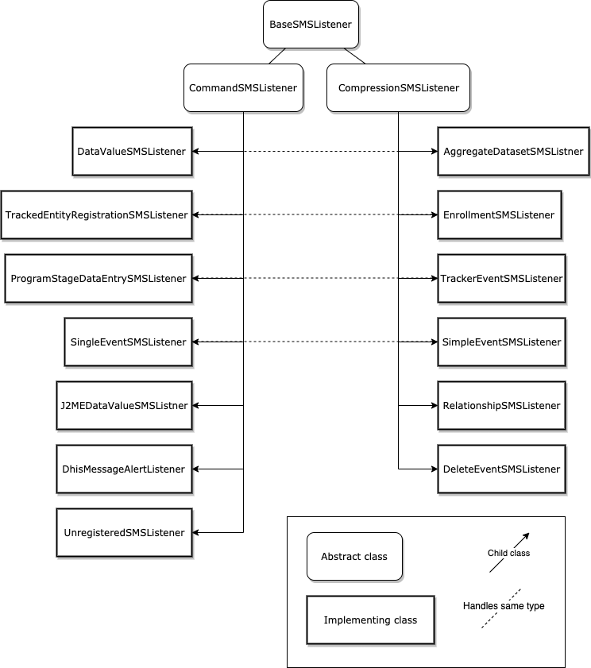

# DHIS2 SMS Compression

## Overview

This document is meant to explain the details of the new compressed SMS format used in the latest Android app. It is split into three parts, explaining the details of the format itself, the handling of the format server side (dhis2-core) and the details of the shared compression library.

## Compressed SMS Format for DHIS2

### Overview

This section is intended to describe the new compressed format of SMS submissions which can be sent to a DHIS2 server. It will be used by the new DHIS2 Android application.

The new compressed SMS format has a number of improvements from the old SMS format:

* The new format is heavily compressed, which means it requires far fewer SMS to send submissions.
* Metadata for the submission such as user ids and organisation unit ids was inferred from the phone number of the submission in the old format. The new submission format explicitly gives these ids in the submission itself.
* The old format required the user to create an SMS command themselves, with custom names and keys. The new format is intended to make SMS submissions as easy and seamless as possible for the user.

See the following JIRA issues for more details:

* JIRA Issue: (https://jira.dhis2.org/browse/DHIS2-3827)[https://jira.dhis2.org/browse/DHIS2-3827]
* JIRA Epic: (https://jira.dhis2.org/browse/DHIS2-3814)[https://jira.dhis2.org/browse/DHIS2-3814]

For a discussion of the server side handling of the incoming SMS, please see the Server Side SMS Design section at the end of the document.

### Discussion of differences with the old format

#### Compression

SMS submissions, when sent, will be compressed into a binary format which is encoded as Base64. This compression should result in submissions via SMS which are around 1/8th of the size of the original format.

It is more important to be as verbose and explicit as possible when specifying information so that we can ensure when the SMS is decompressed on the server side, the expected message is retrieved.

See the last section for more information about the details of compression. 

#### Shared Compression Library

As the compression library will be used by both the app and server side, we can simply share a model in this library of each of the submission types. The app will instantiate a copy of the required submissions type, fill out the details of the submission within it and then hand it to the compression library which will return the compressed format ready for submission. Likewise the server will essentially do the reverse upon receiving the submitted SMS, using the same compression library. Details of the required fields on each of these submission types is given below. 

#### No SMS commands

The new SMS format will not use SMS commands at all. All information required for understanding the submission will be included in the submission itself, i.e. UIDs for all metadata involved.

The existing SMS commands will only remain in the codebase as long as we support the old format with the legacy listeners.

#### Allowing for updates

The new format will allow for updates of existing data, i.e. for new registrations of Tracked Entity Instances, it will also allow for updates of an existing instance.

#### Checksum

The compression library will include a checksum in the submission in order to check for errors. These could come about from a missing part in a multipart SMS or from an error in the decompression process.

##### Checksum calculation

The checksum will be an MD5 digest of the full submission, added to the front of the submission itself.

#### Additional metadata

The old SMS format consisted of simply the command name, followed by an optional date, then the key value pairs. It determined things such as organisation unit and user id based on the phone number used to submit.

The new format will be more explicit in specifying this information. The user id and org unit ID will be included in the submission itself.

#### UID list and last sync date required for compression

In order to better compress the UIDs of metadata in submissions it is useful (but not necessary) to provide the full list of known UIDs for each metadata type specified in the submission to the compression library. To see more information about why this is necessary, see details in the compression library section.

Also, so the server can get an accurate idea of which UIDs are relevant in each submission, it is necessary that the submission also include the last date the app was able to synchronize this list of UIDs from the server. This way the server knows to ignore all elements that were created after this date.

Something that has to be considered is that the user’s view of metadata from the API is limited by sharing settings, i.e. for certain metadata types they can only see the UIDs of things they’ve explicitly been given access to.


### Submission Type Class details

The fields of each of the submission types will differ slightly however they will always share the standard header, as well as the user UID.

Along with the standard header, the subsequent parts will look quite similar. All but the Aggregate Dataset type will follow a very similar pattern, giving a unique ID to identify which program we’re submitting for, a newly generated UID for the new event/entity, a timestamp and then the key value pairs. The Aggregate Dataset submission doesn’t require a new UID to be generated for submissions and uses a period instead, which will be different depending on the period type.

#### Submission Header

Each submission will start with a header which contains the following fields:

|Key|Description|
|--- |--- |
|CRCCheckSum|A checksum calculated of the entire submission to ensure there are no errors|
|type|The SubmissionType of this submission|
|version|The version of the SubmissionType, in case there are changes to the schema|
|lastSyncDate|A Date which indicates the last time the app synced SMS related metadata from the server|
|submissionID|The ID of this particular submission. Used by the app when reading a response SMS to tell which submission the response refers to.|

Directly after the header, each submission will also contain the user ID of the user reporting this submission. This is not part of the header as it is a UID which needs to be read after the reader has had a chance to read the lastSyncDate in the header and provide metadata for a UID hash lookup.

|||
|--- |--- |
|Key|Description|
|username|The UID of the submitting user|

#### Submission types

Following the above, the rest of the submission will take one of the following forms based on the submission type.

##### AggregateDatasetSMSSubmission (aggregate dataset)

|Key|Description|
|--- |--- |
|orgUnit|The organisation unit UID|
|dataSet|The UID of the data set being reported|
|complete|A boolean which indicates whether this should complete the dataset for this period and orgUnit|
|attributeOptionCombo|The UID of the attribute option combo for this event|
|period|The period for this submission, i.e. 2018W34 for Week 34 2018|
|values|An array of values, which will consist of data element and category option combo UIDs and the values for each.|


##### SimpleEventSMSSubmission (simple event without registration)

|Key|Description|
|--- |--- |
|orgUnit|The organisation unit UID|
|eventProgram|The UID of the Event Program for which this event applies|
|eventStatus|The status to update the event to, i.e. ACTIVE, COMPLETE e.t.c.|
|attributeOptionCombo|The UID of the attribute option combo for this event|
|event|The UID of this event (newly generated for a create or an existing one for an update or delete).|
|eventDate|The date of the event, i.e. 20180910T19:00:00|
|dueDate|The date this event is due, i.e. 20180910T19:00:00|
|coordinates|The coordinates of this event, only POINT format is supported, i.e. two floating point numbers, e.g. (6.1789, 9.3334)|
|values|An array of values, which will consist of data element and category option combo UIDs and the values for each.|


##### EnrollmentSMSSubmission (of Tracked Entity Instance in a program)

|Key|Description|
|--- |--- |
|orgUnit|The organisation unit UID for this enrollment|
|trackerProgram|The UID of the Tracker Program for which this Tracked Entity Instance is being registered.|
|trackedEntityType|The UID of the Tracked Entity Type of this Tracked Entity Instance|
|trackedEntityInstance|The ID of this Tracked Entity Instance (newly generated for a create or an existing one for an update).|
|enrollment|The ID of enrolment, as each TEI can be enrolled multiple times in a program (newly generated for a create or an existing one for an update).|
|enrollmentDate|The date of enrollment, i.e. 20180910T19:00:00|
|enrollmentStatus|The status of the enrollment (ACTIVE, COMPLETED or CANCELLED)|
|incidentDate|The date of the incident, i.e. 20180910T19:00:00|
|coordinates|The coordinates of this enrollment, only POINT format is supported, i.e. two floating point numbers, e.g. (6.1789, 9.3334)|
|values|An array of values, which will consist of data element and category option combo UIDs and the values for each.|
|events|An array of events for this Enrollment. The schema for an event (SMSEvent) is given below. Note: The array may be empty.|

##### SMSEvent (a subtype used in EnrollmentSMSSubmission above)

|Key|Description|
|--- |--- |
|orgUnit|The organisation unit UID for this event|
|programStage|The ID of the Program Stage for this event|
|eventStatus|The status to update the event to, i.e. ACTIVE, COMPLETE e.t.c.|
|attributeOptionCombo|The ID of the attribute option combo for this event|
|event|The ID of this event (newly generated for a create or an existing one for an update or delete)|
|eventDate|The date of the event, i.e. 20180910T19:00:00|
|dueDate|The date this event is due, i.e. 20180910T19:00:00|
|coordinates|The coordinates of this event, only POINT format is supported, i.e. two floating point numbers, e.g. (6.1789, 9.3334)|
|values|An array of values, which will consist of data element and category option combo UIDs and the values for each.|


##### TrackerEventSMSSubmission (Tracker event)

|Key|Description|
|--- |--- |
|orgUnit|The organisation unit UID|
|programStage|The ID of the Program Stage for this event|
|eventStatus|The status to update the event to, i.e. ACTIVE, COMPLETE e.t.c.|
|attributeOptionCombo|The ID of the attribute option combo for this event|
|enrollment|The ID of the Tracked Entity Instance which is already registered in this program|
|event|The ID of this event (newly generated for a create or an existing one for an update or delete)|
|eventDate|The date of the event, i.e. 20180910T19:00:00|
|dueDate|The date this event is due, i.e. 20180910T19:00:00|
|coordinates|The coordinates of this event, only POINT format is supported, i.e. two floating point numbers, e.g. (6.1789, 9.3334)|
|values|An array of values, which will consist of data element and category option combo UIDs and the values for each.|


##### RelationshipSMSSubmission (Submit a new one-way relationship between objects)

|Key|Description|
|--- |--- |
|relationshipType|The UID of the relationship type, this will tell us what the type of the ‘from’ and ‘to’ objects are (it could be TEI, event or enrollment).|
|relationship|The newly generated UID of the relationship itself|
|from|The UID of the ‘from’ object in the relationship, either a TEI, event or enrollment|
|to|The UID of the ‘to’ object in the relationship, either a TEI, event or enrollment|


##### DeleteSMSSubmission (Delete an entity or event)

|Key|Description|
|--- |--- |
|event|The UID of the event or entity to be deleted|


## Server side SMS Handling

### Overview

This section is intended to describe the server side (dhis2-core) implementation to handle the new inbound compressed SMS functionality which is included in the new DHIS2 Android App.

The detailed specification for the new SMS format can be found in the first section.

### Old Server Side Handling For SMS

The old server side handling for inbound SMS uses a number of SMS listener classes to parse the incoming SMS depending on which SMS command type is being used. The following SMS Listener types already exist:

|Listener|Submission Purpose|Parser|
|--- |--- |--- |
|BaseSMSListener|Abstract base class that all parsers inherit from||
|DataValueSMSListener|Adding/updating an aggregate dataset; used for reporting data (text-based)|KEY_VALUE_PARSER|
|DhisMessageAlertListener|Send alerts to DHIS2 users (text-based)|ALERT_PARSER|
|J2MEDataValueSMSListener|Adding/updating an aggregate dataset; used for reporting data (mobile app-based)|J2ME_PARSER|
|ProgramStageDataEntrySMSListener|Used to enter program stage related data for a specific tracked entity instance|PROGRAM_STAGE_DATAENTRY_PARSER|
|SingleEventListener|Used to register anonymous event into the system based on the data collected through SMS|EVENT_REGISTRATION_PARSER|
|TrackedEntityRegistrationSMSListener|Used to enroll a tracked entity into the system|TRACKED_ENTITY_REGISTRATION_PARSER|
|UnregisteredSMSListener|Send alerts to DHIS2 users (mobile app-based)|UNREGISTERED_PARSER|

#### Legacy Support for listeners

In an effort to keep the existing code as much as possible “as is”, after the addition of the new SMS listeners for the compressed format, the existing listeners above have remained unchanged. This means there is backwards compatibility for any projects that are currently using the existing SMS commands for reporting in the newer versions. 

At a point in the future when it is unlikely that people are using the old listeners they can be removed.

### Handling The New SMS Format

The following table lists the new SMS listeners for the compression format, their purpose and whether they replace any existing listeners.

|Listener name|Equivalent legacy listener|Type handled|
|--- |--- |--- |
|AggregateDatasetSMSListener|DataValueSMSListener|Aggregate data set submissions|
|EnrollmentSMSListener|TrackedEntityRegistrationSMSListener|Enrollment of new tracked entities|
|TrackerEventSMSListener|ProgramStageDataEntrySMSListener|Tracked events for existing tracked entities|
|SimpleEventSMSListener|SingleEventSMSListener|Simple events without tracking|
|RelationshipSMSListener|N/A|Relationships between entities in programs|
|DeleteEventSMSListener|N/A|Deleting events|

#### Separation of command and compression SMS

In the original implementation, each of the command based SMS listeners inherited from a parent class called BaseSMSListener. In an effort to separate the old set of listeners from the new ones, two new intermediate classes have been created, which both inherit from BaseSMSListener now - CommandSMSListener, which is used for the existing listeners and CompressionSMSListener which is used for the new ones. 

See the following diagram.




#### SMS Parser/Listener Implementation for New SMS Format

The existing parser and listener implementation for incoming SMS uses an SMSConsumerThread class which loops through a list of SMS Listener classes to see which of them accepts the current incoming SMS. The intention is that each of the listener classes will check the format of the incoming SMS and say whether they can handle it or not. This process is kept up in the new implementation as well.

The existing set of SMS listeners are based on SMS commands. They assume the SMS is in a specific parseable text format with the SMS command at the front of the SMS. This way it’s possible to map it to a specific SMS command that exists on the server. In the new implementation the SMS will be in Base64 format. This means it’s quite easy to tell the difference between the new and old SMS. 

Each of the command listeners will attempt to find an SMS command at the start of the text, if they do they continue to process it, in the case that it’s in Base64 format this will fail and they’ll skip it. 

For the compression listeners they first look to see that it’s in Base64 format, if not they skip it. If it is, they’ll attempt to read the header of the message and check what type it is, again if the type of the submission doesn’t match that of the listener it is skipped, otherwise they’ll process it.

### Using Compression

The compression of SMS is handled by using a library which is shared by both the app and the server code. See details of the SMS compression library in the last section.

To make things simple for both app and server, the complexities of compressing and decompressing each submission is handled within this library. Server side, all that is needed is to convert the Base64 submission to binary and pass it to the compression library.

Firstly, the header of the submission is read, which contains the submission type (i.e. aggregate, tracker event e.t.c.), the submission ID (explained below in SMS responses), the version and finally the last sync date (the last time the app synced with the server). It’s important that the last sync date is given in the header, before reading the actual submission, as the last sync date is used to filter the list of metadata required to read the submission (more details can be found in the SMS format document).

After the header is read, the listener then passes a copy of the submission to the compression library which instantiates and returns a copy of the submission type class for this submission. The listener then proceeds to process the submission similarly to the existing code. A key difference here is that when the listener has finished processing, no matter if it was successful or not, it will return a response SMS to the app to update it on the status of the submission. Details of this are explained below.

### SMS responses

In an effort to provide more feedback to the app after processing SMS submissions, the new SMS handling allows for SMS responses. This is for either the case of a successful submission or one that fails. If it fails, details of the error will be given in the response so they can be given to the app user. The format of the SMS response is not intended to be readable directly by the user but interpreted by the app itself (although a human readable response message is included in the text of the response).

#### SMS response format

The following explains the elements that make up the response SMS and gives an explanation of what those elements are.

```
submission_id:status_code:error_elems:description
```

* **submission_id**: 
In order to prevent confusion when the app may send multiple SMS submissions, when creating the submission the app will give it a submission id. When the server responds it will give this submission id so the app knows which submission it refers to.

* **status_code**: 
A code which indicates the status of the submission, either successful or failed. If it failed, the status code will indicate why. A full list of status codes is given below.

* **error_elems**: 
UIDs of the relevant metadata for the submission which had problems, i.e. if a user doesn’t exist the UID of the user that was not found.

* **description**: 
A human readable status message for the response, which is hard coded according to the status code of the message. This could be displayed directly to the user.

**Example**
```
1:0::Submission has been processed successfully
1:201:Hjv6Xja80xc:User [Hjv6Xja80xc] does not exist
```

#### Missing UIDs

It is possible that when the server receives the submission, they receive a hash for a certain UID which cannot be found (e.g. if the metadata has since been deleted). In this case it’s not possible for the server to know what the original UID was as they only have the hash for the UID. In this case the SMS response will contain a Base64 formatted copy of the hash, with a ‘#’ preceding it. When the app receives this, it can hand this hash to the compression library to see which UID it is that the server cannot find.

#### List of status codes

##### SUCCESS( 0, "Submission has been processed successfully" ),

##### Warnings (<100)
```
WARN_DVERR( 1, "There was an error with some of the data values in the submission" ),
WARN_DVEMPTY( 2, "The submission did not include any data values" ),
WARN_AVEMPTY( 3, "The submission did not include any attribute values" ),
```

##### Errors (> 100)
```
UNKNOWN_ERROR( 101, "An unknown error occurred" ),
HEADER_ERROR( 102, "An unknown error occurred reading the header of the SMS" ),
READ_ERROR( 103, "An unknown error occurred reading the SMS submission" ),

INVALID_USER( 201, "User [%s] does not exist" ),
INVALID_ORGUNIT( 202, "Organisation unit [%s] does not exist" ),
INVALID_PROGRAM( 203, "Program [%s] does not exist" ),
INVALID_TETYPE( 204, "Tracked Entity Type [%s] does not exist" ),
INVALID_DATASET( 205, "DataSet [%s] does not exist" ),
INVALID_PERIOD( 206, "Period [%s] is invalid" ),
INVALID_AOC( 207, "Attribute Option Combo [%s] does not exist" ),
INVALID_TEI( 208, "Tracked Entity Instance [%s] does not exist" ),
INVALID_STAGE( 209, "Program stage [%s] does not exist" ),
INVALID_EVENT( 210, "Event [%s] does not exist" ),
INVALID_RELTYPE( 211, "Relationship Type [%s] does not exist" ),
INVALID_ENROLL( 212, "Enrollment [%s] does not exist" ),
INVALID_ATTRIB( 213, "Attribute [%s] does not exist" ),

USER_NOTIN_OU( 301, "User [%s] does not not belong to organisation unit [%s]" ),
OU_NOTIN_PROGRAM( 302, "Organisation unit [%s] is not assigned to program [%s]" ),
OU_NOTIN_DATASET( 303, "Organisation unit [%s] is not assigned to dataSet [%s]" ),
ENROLL_FAILED( 304, "Enrollment of TEI [%s] in program [%s] failed" ),
DATASET_LOCKED( 305, "Dataset [%s] is locked for period [%s]" ),
MULTI_PROGRAMS( 306, "Multiple active program instances exists for program [%s]" ),
MULTI_STAGES( 307, "Multiple program stages found for event capture program [%s]" ),
NO_ENROLL( 308, "No enrollment was found for tracked entity instance [%s] in program stage [%s]" ),
NULL_ATTRIBVAL( 309, "Value for attribute [%s] was null" ),
```

## SMS Compression Details

### Overview

With the addition of the new SMS functionality in the upcoming DHIS2 Android App, submissions can be made to the DHIS2 server via SMS, which is especially handy in areas with low internet connectivity. Unfortunately, large submissions, such as those for Aggregate Data Sets, can sometimes be several SMSs. This can be costly for the sender and can cause technical issues if any one of the SMS fails to send due to poor signal.

For that reason, it is important that a typical DHIS2 SMS submission is compressed down to the smallest possible size. This document details a compression method which is designed for this. It does this by converting the plain text submission into a custom binary format, using only as many bits as necessary to describe the submission. This binary format can then be converted to Base64 so it uses printable characters which can be sent by SMS.

It is intended that this library is used both on the mobile app side for compression and on the server side for decompressing the received message.

The format of the submission that this compression library takes as input is described in the first section. This ‘intermediary’ format is specifically designed to be as explicit as possible, without taking shortcuts or implying any information indirectly, so it comes out as quite long. It is intended that this compression library can then help minimize the size of the final submitted SMS.

The compression library takes advantage of a number of principles in order to save space. 

### Converting values to binary with adaptive bit lengths

When specifying values, we convert all numbers and dates (epoch time) to the binary equivalent, which saves quite a lot of space. The bit length of an integer is either fixed or variable - fixed for those less than 17-bits and variable for those in the range 17-31. 

For fixed length integers, the largest integer less than 17-bits is used to give the size of all other fixed ints. The length of all fixed length ints is then given in each submission only once.

For variable ints, the length of each int is given immediately before the integer.

### Removal of separator characters

The submission will use fixed bit lengths for fields, hence it is not necessary to include the separator characters themselves in the submission.

### Grouping of category option combos

For key value pairs it’s quite common to only have either 1 category option combo (the default) or only 2 or 3, and to use them for each data element. Typically we explicitly give the category option combo with each data value, but this is redundant. For compression, we can group all data elements using the same category option combo together so we don’t have to repeat it for each value.

### Compression of UIDs

A lot of space is taken up in the submission by UIDs of the various metadata objects. In some cases we will not be able to compress these at all, i.e. when they are newly generated UIDs on the app side. But in many others, there will be some amount of shared knowledge between the server and app, where the context of where the UID is being used can help to limit the possible UIDs that are potentially in scope.

Given that we have a limited search space for each UID we’re trying to discover, it isn’t necessary to use the full 11 character UID, i.e. the possible combinations of an 11 character UID with 62 possible characters would be 11 ^ 62 which is 3.6 x 10 ^ 64. If we only have 4 possible UIDs in our search space it doesn’t make sense to use such a long ID.

#### Variable length MD5 hash of UID

Given the above, we will solve this by simply getting an MD5 hash of the actual UID we’re trying to specify, finding the context of the UID to get the total search space of possible UIDs we could be referring to on the compression and decompression side and then getting the first n-bits of the MD5 hash, where n is big enough so as to ensure there are no collisions.

**Example** we’re compressing an aggregate dataSet submission which contains 10 dataElements. When specifying the dataElement UIDs in the key value pairs, we first get the MD5 hash of a certain dataElement:

```
UID = Ae7a6d9ada0
MD5 = 3a07f4daaf9ccaefba0876f62ec40dcf
```

To cover the 10 dataElements, we would need a bit length of at least 4 (2^4 = 16). To ensure there are no collisions, we would then run through the complete list of UIDs comparing hashes at this length. If there are any collisions, we simply increase the bit length by 1 until there are no more.

#### Total UID set information in SMS submission

Given the above, if we intend to hash a certain UID, it is necessary for the compression library to know the full list of UIDs for a particular metadata type, so it can calculate the required bit length to express each UID as a hash whilst ensuring there are no collisions with other UIDs in the set. For this reason, the compression library can be initialised (and updated periodically) with the full list of UIDs in the set for every metadata type.

However, if a certain metadata element’s UID can not be found in the metadata file given to initialise the library, it will simply write out the UID explicitly as a String.

Additionally, if there is no UID set given for a certain metadata type on initialising the library, it will also simply write out the UID as a String.

#### Ensuring app is in sync with server

To ensure that the list of UIDs that are being considered for both compression (app side) and decompression (server side) remains the same, it is important that they are kept in sync between app and server. However, due to the fact that the nature of using SMS implies that there is limited internet connectivity for the app, it is likely that there will be times when it cannot fully remain in sync with the server for long periods of time. During this period, it may be that there are a lot of elements either added to or deleted from the set server side. 

If the server was then to consider these additional UIDs, which the app was not aware of when compressing, when decompressing the given SMS it may then either extend the bit length or cause a collision that the app was not aware of.

To solve this problem then, it is necessary that the server knows when the last time the app managed to sync with the server. This way the server can simply ignore any elements in the set which have a creation date which are after the last sync time. Therefore, the SMS compression library must always be aware of the lastSyncDate with the server. Each submission then includes a timestamp which is the lastSyncDate.

A similar problem occurs with deletions, if there is metadata server side which has been deleted since the last sync date, the server is unaware that the app did not include these in the hashing set, this leads to two issues. The first is that the app may use metadata that the server has since deleted, hence the submission cannot be processed. In most cases this would result in an error for the submission, in which case the server will respond to the app via SMS as such. In some cases where it is simply one attribute or data element that no longer exists, it may be possible to ignore and continue reading the rest of the submission. The second issue is that the server would incorrectly guess the set size and hence the bit length required for the hash. For this reason the bit length is explicitly given.

To prevent potential issues like this then it is useful for the app to periodically sync a full list of UIDs with the server for all metadata types it needs to submit via SMS, and then record the latest time when this was completed successfully.

#### Specifying bit lengths

For the metadata types in a submission which will only be expressed once, such as user id, org unit id e.t.c. the bit lengths are given explicitly before each UID. However, for repeated UID types, such as data element UIDs and category option combo UIDs, the bit lengths are given once at the start of the list.

### Extensions

The following is a list of improvements that might make sense to implement at a future date

#### Repeated values

Commonly with submissions there is one value which is repeated often, i.e. a '0'. This is a prime candidate for compression, with a number of methods that can be used to save these repeated values from being explicitly written out each time. Lookup tables or Huffman coding.

#### CRC check for UIDs

One of the most likely sources of issues in the future would be when hashing is used for UIDs - when the server attempts to recover the original UID it may do so incorrectly. The existing CRC value is calculated once the submission has been fully formed, including any hashing of UIDs, i.e. it won’t detect any incorrect conversion of hash to UID. 

A useful addition then would be to somehow run the CRC check on the original UIDs before they are hashed so that when the server recovers them, it will know if there are any problems.

#### Special handling for Options

Options are currently written out as Strings, which take up a lot of space. Given that there are only a fixed amount of Options in an OptionSet, it would make sense to consider hashing these to save space, similar to the way UIDs are hashed.

#### Compression of Strings

Strings in the submission will take up by far the most space and their use is limited as much as possible. However, if a submission does contain a large amount of text, it might make sense to use more conventional text compression techniques like zipping e.t.c.Repeated values
Commonly with submissions there is one value which is repeated often, i.e. a '0'. This is a prime candidate for compression, with a number of methods that can be used to save these repeated values from being explicitly written out each time. Lookup tables or Huffman coding.
CRC check for UIDs
One of the most likely sources of issues in the future would be when hashing is used for UIDs - when the server attempts to recover the original UID it may do so incorrectly. The existing CRC value is calculated once the submission has been fully formed, including any hashing of UIDs, i.e. it won’t detect any incorrect conversion of hash to UID. 

A useful addition then would be to somehow run the CRC check on the original UIDs before they are hashed so that when the server recovers them, it will know if there are any problems.
Special handling for Options
Options are currently written out as Strings, which take up a lot of space. Given that there are only a fixed amount of Options in an OptionSet, it would make sense to consider hashing these to save space, similar to the way UIDs are hashed.
Compression of Strings
Strings in the submission will take up by far the most space and their use is limited as much as possible. However, if a submission does contain a large amount of text, it might make sense to use more conventional text compression techniques like zipping e.t.c.
Handling for unsigned ints
Ints are currently signed, i.e. there is support for positive and negative values. However, this requires an extra bit per value. As almost all values are positive, a small addition would be to add unsigned ints as a value type, so this bit can be saved.
Reactive compression
With a number of different techniques that can be used for compression, i.e. repeated values or compressing of text, it may be useful for the compression to attempt a number of different combinations of the above until it finds the smallest format for each submission.


#### Handling for unsigned ints

Ints are currently signed, i.e. there is support for positive and negative values. However, this requires an extra bit per value. As almost all values are positive, a small addition would be to add unsigned ints as a value type, so this bit can be saved.

#### Reactive compression

With a number of different techniques that can be used for compression, i.e. repeated values or compressing of text, it may be useful for the compression to attempt a number of different combinations of the above until it finds the smallest format for each submission.

